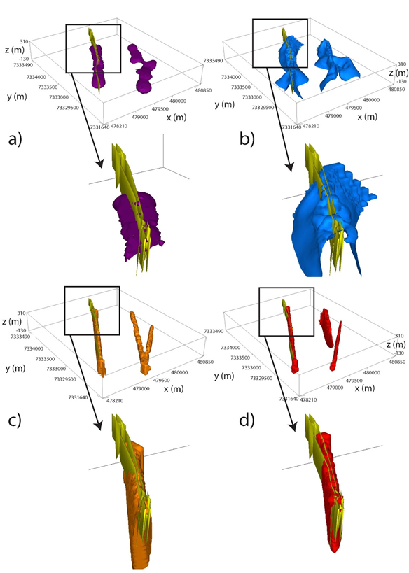
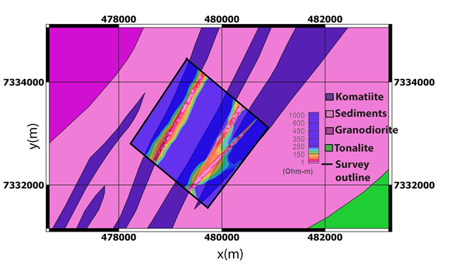

.. _westplains_interpretation_synthesis:

Interpretation and Synthesis
============================

Three different inversions were run for each data set over the West Plains area: a voxel, a parametric and a hybrid inversion, bringing the total number of potential models to interpret to six. One potential solution not addressed here is to perform a cooperative inversion :cite:`McMillan2014` where one model is sought that satisfies all possible observations. However, this technique brings other questions into play such as whether the data sets are compatible and provide complementary information. 

To evaluate and compare the inversion models to ground truth information, :numref:`westplains_synthesis_model` displays conductive zones from the West Plains inversions in the form of a 30 ohm-m iso-surface along with 1 g/t gold mineralization within the Western conductive komatiite unit. Almost no drilling exists in the Eastern conductors, and the focus shifts primarily to the Western anomaly. A rock model of the komatiite unit itself does not exist, therefore, the 1 g/t gold shape that is known to reside within the komatiite will act as a proxy for highly conductive zones. A full model view and a closeup of the Western conductor is provided at y = 7333300 m. :numref:`westplains_synthesis_model` :math:`\! a` shows the frequency-domain voxel iso-surface, which provides a broad spatial correlation with the gold shape but no clear dip information. :numref:`westplains_synthesis_model` :math:`\! b` displays the time-domain voxel inversion iso-surface where a better sense of the dip is achieved but the anomaly is still much broader compared to the thin nature of the mineralization. The frequency and time-domain hybrid parametric inversion iso-surfaces are displayed in :numref:`westplains_synthesis_model` :math:`\! c` and 12d respectively. Both of these inversion demonstrate an excellent match with the compact dipping nature of the gold mineralization within the conductive komatiite, although the time-domain model achieves a slightly tighter spatial correlation. Therefore the time-domain hybrid model is chosen as the best model for which to make further interpretations.

    30 ohm-m iso-surfaces from voxel and hybrid inversions from West Plains field data. 1 g/t gold shapes from drilling in the West conductor are shown in yellow and correspond with the conductive komatiite unit. a) Frequency-domain voxel. b) Time-domain voxel. c) Frequency-domain hybrid parametric. d) Time-domain hybrid parametric.

:numref:`westplains_synthesis_geology` shows a constant elevation slice through the VTEM hybrid model at z = 190 m. This image demonstrates how the three conductors are now imaged with a tighter spatial resolution compared to the original geology map. From cross-sections in :numref:`westplains_inversion3` :math:`\! b`, we also have dip information to these units, where the Western conductor has a near-vertical dip, the central conductor is steeply dipping to the West, and the Eastern conductor is a rounded near-surface feature. :numref:`westplains_synthesis_geology` clearly illustrates how 3D AEM inversion is able to tighten the spatial boundaries of the komatiite units of interest in addition to providing valuable dip information. These new interpretations are hugely beneficial for future geologic interpretations and drill programs.

    Final VTEM hybrid parametric inversion at West Plains. Elevation slice at z = 190 m overlaid on simplified geology map.

