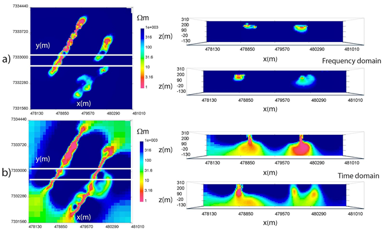
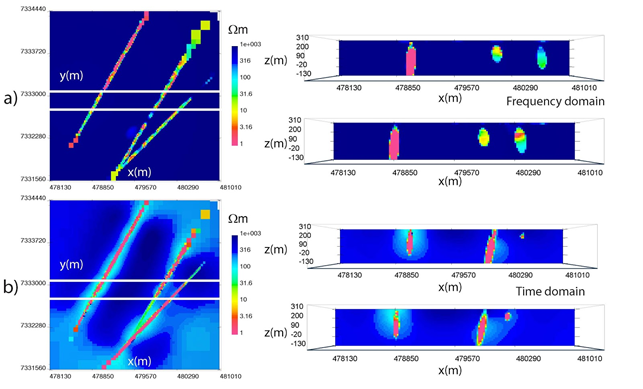
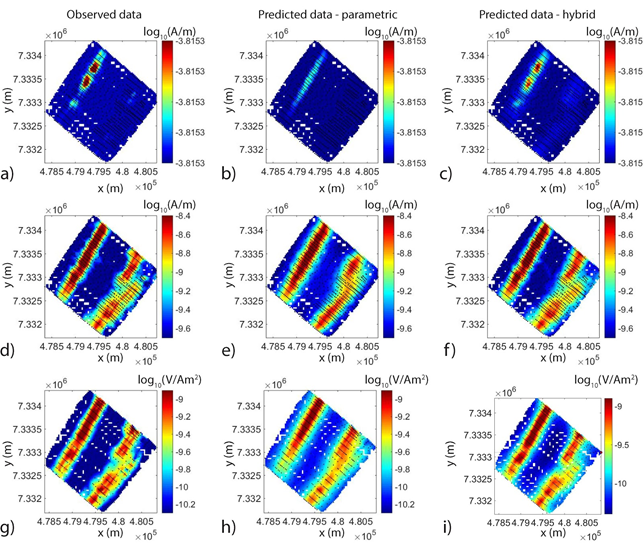
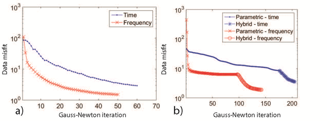

.. _westplains_processing:

Processing
==========

First, the data sets are inverted in 3D using voxel-based methods. The inversion mesh consists of 289,979 cells with a finest dimension size of 20 x 20 x 20 m in x,y,z respectively, and the forward meshes contain roughly 10,000 cells per mesh. Inversion uncertainties are assigned as 3% of the observed data plus a noise floor that is one order of magnitude below the response from a 1000 :math:`\Omega m` half-space, to weight each time channel as equally as possible. In order to reduce the size of the system to speed up numerical computations, the data are down-sampled using a total horizontal gradient method of sampling. This technique computes the horizontal gradient amplitude for a given frequency or time and uses this information to discard data in regions with slowly varying responses while preserving measurements where the response is rapidly changing.

The voxel inversions (:numref:`westplains_inversion1`) recover a linear Western conductor and two Eastern conductors although the distinction between the two conductive units in the East is not consistently clear. In cross-section, the two inversions bare few similarities, as the conductors in the frequency-domain are compact near-surface objects while the time-domain result produces anomalies that are larger and extend to depth. This discrepancy could be expected due to the difference in sensitivity between the two surveys discussed in the previous section. To quantify this effect, the skin depth from observed frequencies ranges from 47 m to 810 m, whereas the diffusion distance from observed time channels varies from 487 m to 2247 m, using a 1000 :math:`\Omega m` background.

    Frequency and time-domain West Plains voxel inversions in plan view at  z = 190 m (left) and cross-section across solid white lines at  y = 7333080 m and  y = 7332780 m (right). a) Frequency domain. b) Time domain.

At this point, we turn to a parametric approach to the AEM inverse problem :cite:`McMillan2015` where instead of solving for the conductivity in every mesh cell, we solve for a set of parameters that describes the shape of the anomalies of interest. In this example, we use a Gaussian ellipsoid parameterization, although other options are possible :cite:`Aghasi2011`.

Therefore, to complement the voxel models, parametric inversions are computed to image the three conductive komatiite units at West Plains (:numref:`westplains_inversion2`). Appropriately, the parametric algorithms are set to recover three conductors, with the Western conductor chosen to have its own resistivity value and the Eastern units sharing a best-fitting resistivity. :numref:`westplains_inversion2` :math:`\! a` shows the frequency-domain field parametric inversion, with a plan view slice through the model at z = 190 m in the left panel. The solid white lines represent two East-West cross-sections displayed in the right panel at  y = 7333080 m and y = 7332780 m. The dashed white lines indicate the spatial outlines of the 1 :math:`\Omega m` starting guesses centrally located at a depth of z = 150 m. The recovered target resistivities in the frequency-domain are 0.15 :math:`\Omega m` and 7.28 :math:`\Omega m` with a background of 12,609 :math:`\Omega m`. Comparatively, the time-domain model, which is shown in plan view and cross section in :numref:`westplains_inversion2` :math:`\! b`, recovers resistivities of 0.28 :math:`\Omega m` and 0.11 :math:`\Omega m` with a background of 495 :math:`\Omega m`. This drastic difference in best-fitting background values could potentially be due to the unknown waveform in the off-time, where a small decaying non-zero current could play a large role in changing the observed data. 

.. figure:: images/westplains_inversion2.png
    :align: center
    :figwidth: 100%
    :name: westplains_inversion2

    West Plains parametric inversions in plan view at an elevation of z = 190 m (left) and cross-section across solid white lines at y = 7333080 m and y = 7332780 m (right). Dashed white lines represent starting guess locations for parametric anomalies. a) Frequency domain. b) Time domain.

In plan view, the frequency and time-domain models have many spatial similarities, although the absolute recovered resistivities are much lower in the time-domain for the Eastern conductors and the background. This suggests that there is a potential disagreement between the two AEM data sets. In cross-section, the Western conductor has a similar shape and steep dip to the West in both inversions; however, the Eastern conductors appear different. In the frequency domain, the Eastern conductors are rounder compared to the time-domain results, with a steep dip to the East. In contrast, the time-domain model has a thin central conductor that steeply dips to the West, and a small near-surface Eastern conductor. Rectangular blocky anomalies in the North-East corner of the parametric models are outside the observed data area, within padding cells, and should be ignored.

We now combine the parametric and voxel methods through a hybrid parametric inversion, which incorporates the parametric result as an initial and reference model for a voxel inversion. This hybrid process allows information from the parametric stage to be passed to the voxel stage, which then inserts complexities into the model not possible with Gaussian ellipsoids only. The hybrid method is applied to West Plains AEM data and results are displayed in :numref:`westplains_inversion3`. :numref:`westplains_inversion3` :math:`\! a` displays the frequency model, and in plan view it is evident that the voxel stage alters the resistivity within the three conductors in an attempt to concentrate areas of high conductivity in certain places. In cross-section, this effect is even more apparent as the Eastern conductor now has a concentrated near-surface conductivity high similar to the time-domain result. :numref:`westplains_inversion2` :math:`\! b` shows the hybrid time-domain inversion, which only has minor deviations from the parametric result. The voxel inversion places diffuse conductive zones around the main anomalies, but does not change the resistivity distribution within the conductors to any large degree.

    West Plains hybrid parametric inversions in plan view at an elevation of z = 190 m (left) and cross-section across solid white lines at y = 7333080 m and y = 7332780 m (right). a) Frequency domain. b) Time domain.

Observed and predicted field data are shown in :numref:`westplains_dobs_dpre`. Real-component z-component H-field data at 385 Hz are shown in :numref:`westplains_dobs_dpre` :math:`\! a` along with parametric predicted data in :numref:`westplains_dobs_dpre` :math:`\! b` and hybrid predicted data in :numref:`westplains_dobs_dpre` :math:`\! c`. Observed z-component H-field data are displayed in :numref:`westplains_dobs_dpre` :math:`\! d` with parametric predicted data in :numref:`westplains_dobs_dpre` :math:`\! e` and hybrid predicted data in :numref:`westplains_dobs_dpre` :math:`\! f`. Time-domain observed z-component dB/dt data at 150 us are shown in :numref:`westplains_dobs_dpre` :math:`\! g` with parametric predicted data in :numref:`westplains_dobs_dpre` :math:`\! h` and hybrid predicted data in :numref:`westplains_dobs_dpre` :math:`\! i`. The parametric predicted data closely resemble the observed data, but further improvements are made with the hybrid stage. This is especially noticeable in the real-component data where two amplitude highs shown in red in :numref:`westplains_dobs_dpre` :math:`\! a` are missing in the parametric predicted data but are captured in the hybrid predicted data. These additional modifications to the parametric models to fit detailed features is a primary benefit of the hybrid parametric method.

    Observed and predicted field data from parametric and hybrid inversions with locations shown as black dots. a) Observed data - real z-component H-field at 385 Hz. b) Predicted parametric data - real z-component H-field at 385 Hz. c) Predicted hybrid parametric data - real z-component H-field at 385 Hz. d) Observed data - imaginary z-component H-field at 385 Hz. e) Predicted parametric data - imaginary z-component H-field at 385 Hz. f) Predicted hybrid parametric data - imaginary z-component H-field at 385 Hz. g) Observed data - z-component dB/dt at 150 :math:`\mu s`. h) Predicted parametric data - z-component dB/dt at 150 :math:`\mu s`. i) Predicted hybrid parametric data - z-component dB/dt at 150 :math:`\mu s`.

Data misfit curves for voxel, parametric and hybrid inversions are displayed in :numref:`westplains_convergence`, where :numref:`westplains_convergence` :math:`\! a` shows the voxel misfit progressions while :numref:`westplains_convergence` :math:`\! b` shows the parametric and hybrid data misfit curves for both frequency and time-domain data. In :numref:`westplains_convergence` :math:`\! b`, the initial part of the curve represents the parametric inversion, while the latter half is the voxel stage of the hybrid method.

    West Plains data misfit progression. a) Voxel inversions. b) Parametric and hybrid parametric inversions.
