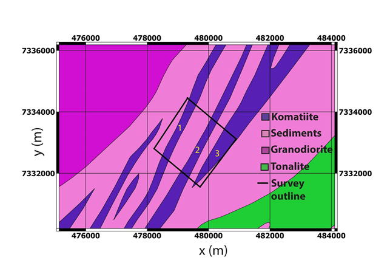

.. _westplains_properties:

Properties
==========

At West Plains, the komatiite units are highly conductive compared to the surrounding sediment and intrusive units shown in :numref:`geology_westplains_properties`. As such they are prime candidates to be imaged with AEM surveys, which are sensitive to electrical conductivity. The komatiites are are also moderately to highly magnetic, but this case study will focus primarily on their 3D conductivity distributions.

    Simplified West Plains geology map with major lithology units defined and location of overlapping frequency and time-domain AEM surveys outlined in black. Conductive komatiite units of interest are numbered in yellow.
