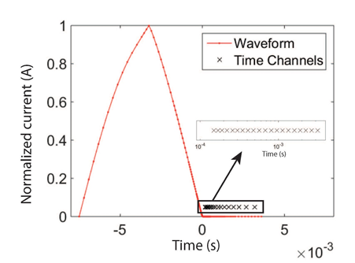
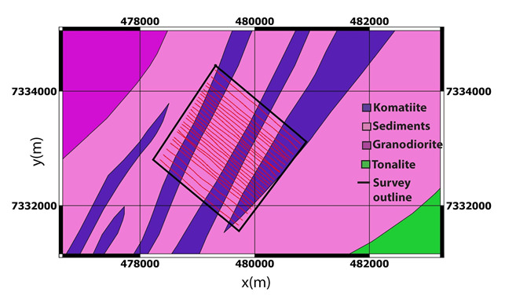

.. _westplains_survey:

Survey
======

    West Plains VTEM survey locations over simplified geology map.

In 2003, a time-domain VTEM survey was flown over West Plains with largely a 120 m line spacing with a few 60 m spaced lines in the North to image some preliminary targets. The lines are shown in black in :numref:`VTEMlines_westplains_survey` along with the geology map for reference. The line direction of 310 degrees was chosen in order to cross the komatiite units in a roughly perpendicular fashion. The system used a coincident loop setup with a transmitter coil diameter of 18.5 m, a peak current of 110 A, and z-component dB/dt measurements were collected from 26 time channels ranging from 110 :math:`\mu s` - 6340 :math:`\mu s`. The waveform used a 7.5 ms on-time pulse as shown in :numref:`VTEMwave_westplains_survey`, but the precise waveform after current shut-off was not recorded. The average terrain clearance of the system was 26 m, which is quite low for a time-domain system, and was only achieved due to relatively flat topography in the area. In this case study, 20 time channels are analyzed from 150 :math:`\mu s` - 3180 :math:`\mu s`.

.. figure:: images/VTEMlines_westplains.png
    :align: center
    :figwidth: 80%
    :name: VTEMlines_westplains_survey

    West Plains VTEM survey locations over simplified geology map.

In 2005, a frequency-domain RESOLVE survey was flown over the same region of West Plains with largely a 60 m line spacing in order to obtain more resolution over the main region of interest. The lines are shown in red in :numref:`RESOLVElines_westplains_survey` along with the geology map for reference. Once again a line direction of 310 degrees was chosen. The system collected co-planar measurements at five frequencies (385, 1500, 6200, 25,000 and 115,000 Hz) as well as co-axial measurements at 3300 Hz. The average terrain clearance of the system was 30 m. This case study focuses on the co-planar measurements, although with some noise removal and filtering, the co-axial data could provide valuable information.

    West Plains RESOLVE survey locations over simplified geology map.

