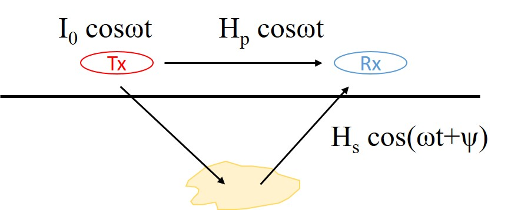
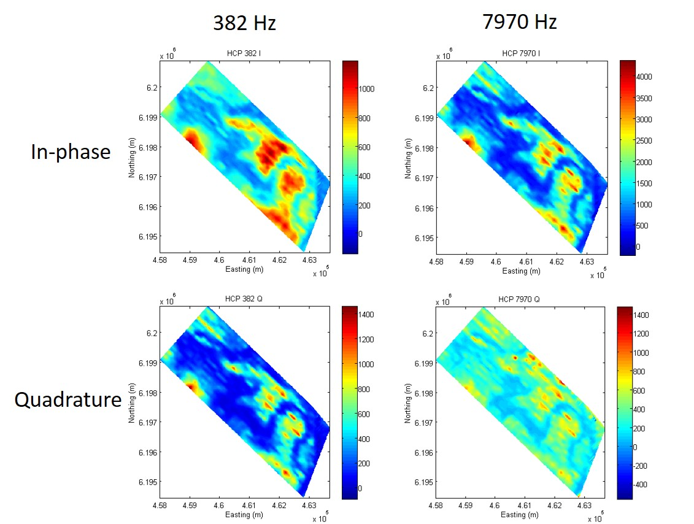
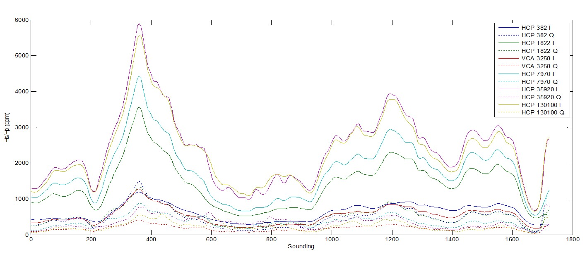
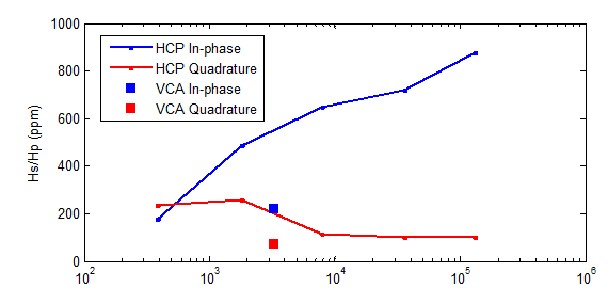

.. _airborne_fdem_data:

Data
====

Definition
----------

A harmonic current in the transmitter loop is used to generate a primary time-
harmonic magnetic field. This induces secondary currents in the subsurface,
which in turn produce secondary magnetic fields. Both the primary and
secondary magnetic fields reach the receiver, but the primary is usually
cancelled by a bucking coil, leaving only the secondary field. The (secondary)
time-varying magnetic flux through the receiver loop induces currents which
act to oppose the change in flux. The voltage in the receiver loop is what we
use to define a datum.

    A time varying current ( :math:`I_0 \cos \omega t`) generates a primary
    magnetic field :math:`\mathbf{H_p} \cos \omega t` which induces secondary
    currents in the subsurface and intern, creates secondary magnetic fields
    (:math:`\mathbf{H_s} \cos(\omega t + \psi)`). Both the primary and secondary
    fields reach the receiver.

A freq-domain system still transmits signal in time domain, so the voltage in
the receiver loop is measured as a function of time, defining a time-series.
This is converted to a time-derivative of magnetic flux density. To obtain a
datum defined in the frequency domain, a Fourier transform of these must be
taken. To accomplish this, the time-series is segmented into windows, for
example, a 0.1 s window, and a discrete Fourier transform of the data in this
window is taken to provide a single complex number defining the harmonic at
the transmitter frequency. This can be done in real-time. :cite:`slattery2012`

The field data usually contains noise. For example, there can be spheric
pulses from lightning in narrow bandwidth and strong magnitude. Additional
processing, like spheric rejection median and Hanning filter, are often
applied to the raw data. There can be other flight-relevant corrections. The
final delivered data are expected to be as if they are the measurements in the
idealized three-loop model. The numerical simulation is also built on this
assumption.

The data in a AFEM survey is a relative measure of the secondary field with
respect to the primary field, calculated as a ratio Hs/Hp in ppm or percent.
Although the transmitter moment is usually not explicitly discussed because of
the normalization, it is important to know which primary field (analytic or
measured or nominal) is used to calculate the ratio in a numerical modeling.

Visualization
-------------

Upon receipt of the delivered data, visualization is usually the first step in
understanding the data. Every datum point in an airborne EM survey can be
specified using three parameters: the horizontal sounding location (easting
and northing) and the time(t)/frequency(f). Using easting and northing as x
and y respectively and time/frequency as z, a 3D data volume can be formed. So
there are three ways of plotting data for airbrone EM survey:

- Map: contouring a particular time/freq as a function of the horizontal location. Slice the data volume horizontally and examine the horizontal variation of data.

    Map view of airborne FDEM data

- Profile or transverse: plotting all or select time/freq along a flight line
  as a function of one horizontal dimension. Slice the data volume vertically
  and examine the horizontal vairation and the relation between times or
  frequencies.

    Profile view of airborne FDEM data

- Sounding: plotting data at a particular horizontal location as a function of
  time/freq. Drill the data volume vertically and examine the responses as
  function of time/freq (pseudo-depth).

    Sounding view of airborne FDEM data

By visualizing the data, we can answer the following questions:

- Understanding the underlying physics. Do the real and imaginary parts
  present the pattern we expect in the 3-loop model? Does the system operate
  in the resistive or inductive limit? Are the signs in the data compatible
  and consistent with the numerical modeling codes?

- Data quality control. Can we see any suspecious data or outliers? Is there
  interference from cultural noise? What is the approximate noise floor in the
  data?

- Qualitative interpretation. Does the relative highs and lows in the data
  match the general geology or other a prior information we know? Is there any
  indication of the sought target in the data? What is the likelyhood of
  making a informed decision?

- Help inversion. What is the resolution of the data? What physical model is
  appropriate for this data set? Does the predicted data from the inversion
  model acceptably match the observed feild data? Is there any important
  feature in the observed data that is not duplicated by the inversion?

