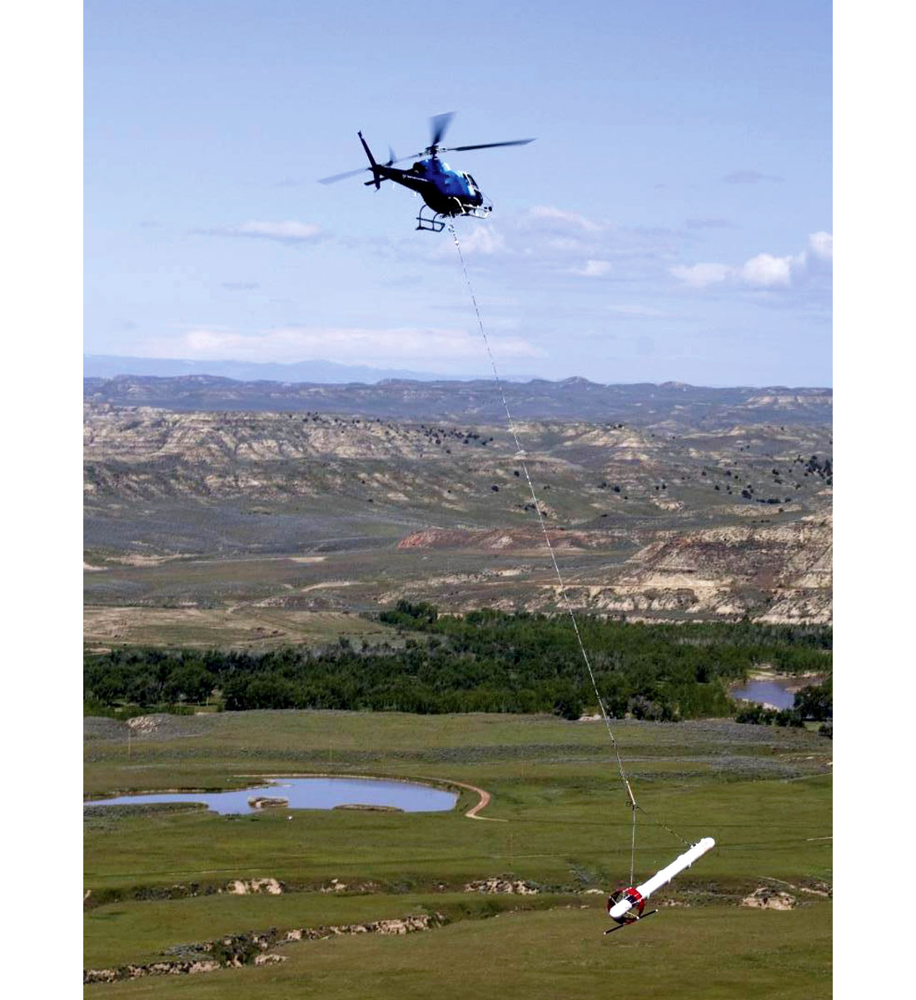

.. _airborne_fdem_index:

Airborne FDEM
=============

   
.. Source: Jean M. Legault, 2015, Airborne Electromagnetic Systems – State of the Art and Future Directions, CSEG RECORDER, VOL. 40, No. 06.

Motivation
----------

DC resistivity can measure the ground conductivity, but it requires direct
connection between the instrument and the earth through cables and electrodes.
An airborne EM survey considers another type of measurement that relies on the
inductive coupling between the instrument and the ground, a mechanism more
suitable for portable or towed systems. Because it uses a loop as the
transmitter and another loop as the receiver, it is sometimes referred to as
"loop-loop" system.

Basic idea
----------

In such a survey, the transmitter loop carries a time-varying current, which
generates a time-varying primary magnetic field everywhere in a whole space.
According to Faraday's law and Lenz's law, this changing magnetic field can
induce a time-varying secondary current in the ground to resist the change of
magnetic field. Then this secondary current can generate a time-varying
secondary magnetic field that induced an electromotive force in the receiver
loop. The capability of generating the induced current is determined by the
ground conductivity, and possibly the magnetic permeability. Generally
speaking, more conductive ground tends to be more responsive. Mounting
transmitter and receiver on an aircraft, the system can quickly probe the
earth's conductivity over large areas.

.. todo::
    statement and link to :ref:`going_between_time_and_freq`

Examples
--------

Airborne EM is ideal for surveying a large area, so it has been used in
geological mapping and regional assessment for groundwater, mineral/petroleum
exploration and geothermal resource. Compared to ground-based surveys,
airborne EM may have higher level of noise due to the instability of the
platform, which limits its depth penetration. For the case histories using
airborne EM in this website, please refer to:

- Bookpurnong: groundwater salinization evaluation
- Tli Kwi Cho: kimberlite exploration

.. toctree::
    :maxdepth: 1

    governing_equations
    example
    transmitters_and_receivers
    systems
    survey_design
    data
    interpretation
    practical_considerations

