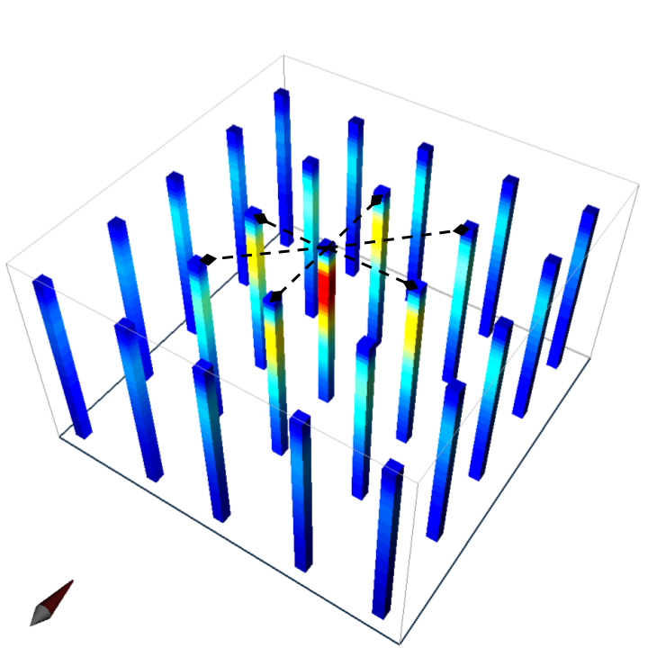

.. _airborne_fdem_interpretation:

Interpretation
==============

.. purpose::

    To show how airborne FDEM data are processed and inverted to reveal meaningful information about the earth structure.

Interpretation is the process that extracts information in the delivered data
to make decisions or to derive geologic knowledge. Depending on the specific
geologic questions asked, and the resources available, geophysicists can
choose from a wide spectrum of approaches ranging from trivial and low-
resolution to sophisticated and high-resolution.

Preliminary interpretation
--------------------------

Preliminary interpretation include a range of procedures and approaches that
deal with the data before sophisticated numerical modeling or inversion. It can achieve the
following goals:

(1) Quality control (QC). Data without quality or uncertainty assessment mean
    nothing. So it is important to know the overall quality of a data set. A data
    set may be deemed not suitable for interpretation if the noise level is too
    high. For most data sets, preliminary QC is carried out during acquisition.
    So the delivered data can still show useful signals in decent quality. But we
    still have to identify the "bad data".

(2) Uncertainty analysis. Uncertainty is a quantitative way of assessing the
    data quality. Data with greater noise may be assigned larger uncertainty.
    Most inversion programs need this information to decide how well the
    inversion wants to fit a particular datum.

(3) Data preparation. A data set can be difficult to interpret because of its
    size and noise. For example, the numerical modeling time is roughly
    proportional to the number of measurements in an airborne survey that has
    significant data redundancy. So it may be desired to down-sample the data set
    without losing information. And high-frequency noise associated with non-
    geologic objects can be effectively removed by low-pass filtering and other
    smoothing methods.

(4) Model parameterization. Any interpretation is based on models. By
    processing the data, we may choose more proper models. For example, negative
    transients in a central loop TEM survey indicate the existence of induced
    polarization. So we know at some places a real and time-independent
    conductivity model is not enough to explain the data. Another example is the
    variation of data in space may indicate the dimensionality of the model and
    the scale of EM induction, which helps the design of discretization for
    numerical modeling.

.. _FDEM_sphere_example:

Data plotting
*************

Significant amount of information, especially the relative distribution of
conductivity, can be obtained by just plotting the data. Sometimes simple data
transform techniques can also be used to isolate the anomaly and aid the
interpretation. This type of approach can include: direct data plotting, data-
conductivity transform, empirical template method, etc. Those simple methods
were once the mainstream, but have shown drawbacks in complex geological
setting and lack the ability to decode the conductivity values from the data.
However, it still has its value in data quality control and preliminary
interpretation.

We use a simple sphere in a halfspace model similar to the :ref:`sphere in a resistive halfspace <FDEM_resistive_sphere_example>` example, but this time using a larger halfspace conductivity (:math:`10^{-2}` S/m). Notice that the response away from the sphere varies greatly between frequencies due to the response from the ground.

 .. raw:: html
    :file: images/Data_slice.html

Apparent conductivity
*********************

Apparent conductivity is another semi-qualitative method that further ties the
data to the conductivity of the ground. It is defined as the conductivity of a
uniform half-space that would generate the same data at a particular time or
frequency. It can be considered as a lumping averaging of the conductivities
around the measurement location. Despite its blending effect, it provides
qualitative insight about how the conductivity varies from shallow (high
frequency) to deep (low frequency). In combination with a depth estimation
using skin depth, apparent conductivity forms the basis of a host of imaging
methods, referred to as conductivity-depth transform (CDT) or imaging (CDI).

Quantitative Inversion
----------------------

1D layered earth inversion
**************************

  1D layered earth inversion of FDEM data.

This approach assume the earth’s conductivity only varies as a function of depth. At each measurement location, the inversion find a layered model that explains the data at all the observing frequencies. :numref:`FEM_1D_Colm` presents such 1-D models in a 3-D space for the :ref:`sphere example<FDEM_sphere_example>`. While each separate inversions can provide information about local changes in conductivity, the lack of lateral continuity makes it difficult to interpret. Many layered models at multiple locations then can be stitched together to form a pseudo-3D volume for model visualization. Advanced techniques also consider the correlation between adjacent locations by imposing lateral constraints.

Here we use the synthetic data set generated for the sphere model as an example to demonstrate the 1D inversion technique. The earth is horizontally divided into 20 layers from the surface to the basement. The top layer is 0.5 m thick, and the layers are gradually thickened at a rate of 1.2 toward the depth. The data are noise-free, but we require the FDEM data to be fit within 2% of the observed magnitude in both in-phase and quadrature. The animation below compares the true (top) and recovered (bottom) pseudo-3D conductivity model obtained by stitching the individual 1D layered models. The sphere is reasonably imaged on the cross section. Although the sphere’s geometry is distorted and its conductivity value is underestimated, the inversion still gets the horizontal location and the depth to the top correct.

.. _FEM_1D_model:

 .. raw:: html
    :file: images/Inv1D_slice.html

2D/3D inversion
***************

2D/3D inversion
Although the layered earth assumption in 1D inversion has provided a reasonable inversion model, the artifacts and distortion due to the 2D or 3D lateral variation of conductivity can significantly complicate the interpretation in practice. In the synthetic inversion of the sphere, the object is horizontally stretched on the cross section of the :ref:`1D stitched model<FEM_1D_model>`, because the soundings away from the sphere can still sense the high conductivity of the sphere. The underestimated conductivity value is the result of spreading the conductive material belonging to a compact body to an infinite layer in the 1D model.

The solution to overcome the drawbacks of 1D inversion is to consider the lateral variation of conductivity by using a 2D or 3D model. A 2D/3D inversion discretizes the entire earth to many discrete cells, each of which has a constant conductivity. Then the Maxwell’s equations are numerical solved on the mesh. The obtained images of the subsurface are then in 3D voxel format. 3D inversions provides the best resolution and works for any complicated models in reality, but it is more computationally expensive. 3D inversion is a very involving topic, so we present it in another part of EM.GeoSci.

Hypothesis testing
******************

In addition to getting a conductivity image, the inversion technique also allows advanced interpretation to be carried out. For example, if we are in doubt of a particular feature in a model, we can run another inversion to test the “what if” hypothesis. One important application is to estimate the depth of investigation. In order to quantify the credibility of the deep structure in a model, another inversion can be run using a very different starting/reference model, effectively asking what if the background is another value. The two inversions would have similar values at shallow depth as that portion is constrained by the data, but may differ at depth. The discrepancy between the two models at different depths indicate whether the data are sensitive to that part of the earth.

