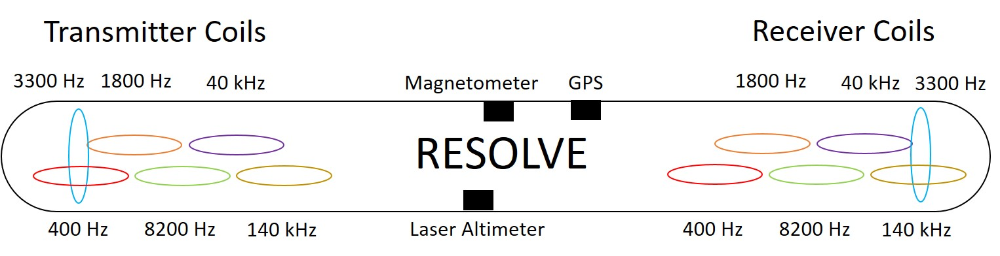

.. _AFEM_survey_RESOLVE:

RESOLVE
```````
.. figure:: ./images/resolve_view.jpg
    :align: center
    :figwidth: 50%
    :name: resolve_view

    A RESOLVE system in operation. A base station is also deployed for DGPS and magnetometer. 
    Source: `USGS <https://pubs.usgs.gov/of/2011/1304/OF11-1304.pdf>`_.


RESOLVE is a frequency-domain multi-coil system operated by CGG. The system has evolved over years, 
but here we describe the basic specification of the system based on RESOLVE III system.

Coils
^^^^^

.. list-table:: : RESOLVE III system specifications
   :header-rows: 1
   :widths: 1 1 1 1 1 1 1
   :stub-columns: 0
   :name: RESOLVE

   *  - Frequency (Hz)
      - 400
      - 1.8k
      - 3.3k
      - 8.2k
      - 40k
      - 140k
   *  - Configuration
      - HCP
      - HCP
      - VCA
      - HCP
      - HCP
      - HCP
   *  - Separation (m)
      - 7.86
      - 7.86
      - 8.99
      - 7.86
      - 7.86
      - 7.86


The system consists of six pairs of coils operating at six discrete frequencies and in horizontal 
coplanar (HCP) or vertical coaxial (VCA) configurations as listed above. The actual operating 
frequencies can be slightly different from the nominal frequencies in the table.The relative 
geometry of the coils are illustrated in :numref:`resolve_bird`. The measured data is the secondary 
magnetic field (Hs) normalized by the primary field (Hp) in part per million (ppm).



    A RESOLVE bird and the coils.


Flight
^^^^^^

RESOLVE has a nominal terrain clearance of 30 m and a nominal aircraft speed of 30 m/s. The aircraft is 
positioned using post-processed differential GPS in processing, and real-time satellite differential GPS 
in flight. A typical sampling rate of data is 10 Hz (approximately 3 m sounding spacing).
