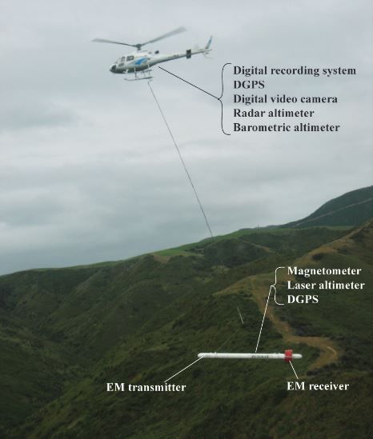
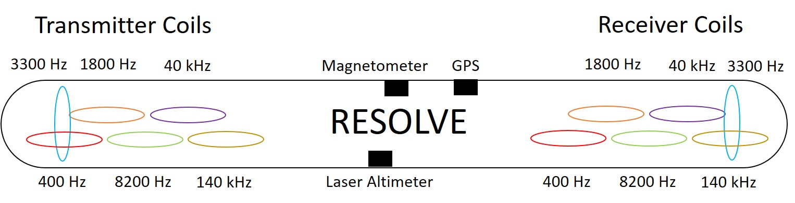

.. _airborne_fdem_systems:

Systems
=======

.. _resolve:

RESOLVE
-------

	A RESOLVE system in operation. A base station is also deployed for DGPS and magnetometer.
.. Source: http://pubs.usgs.gov/of/2011/1304/OF11-1304.pdf

RESOLVE is a frequency-domain loop-loop system operated by CGG (previously Fugro Airborne). The system has evolved over years, we describe RESOLVE III system (2008) here.

Coils
*****

It operates five pairs of horizontal co-planar (HCP) coils at nominal frequencies 400, 1800, 8200, 40000, 140000 Hz, and one pair of vertical co-axial (VCA) coil at a nominal frequency of 3300 Hz. The operating frequencies can be different. For the HCP configuration, the separation between transmitter and recevier is 7.86 m. For the VCA configuration, the separation between transmitter and recevier is 8.99 m. The measured data is the secondary magnetic field (Hs) represented as the ratio to the primary field (Hp) in part per million (ppm).

A RESOLVE bird and the coils.

Flight
******

A nominal terrain clearance is 30 m. A nominal aircraft speed is 30 m/s. The aircraft is positioned using post-processed differential GPS in processing, and real-time satellite differential GPS in flight. A typical sampling rate is 10 Hz (approximately 3 m sounding spacing).

Corrections
***********

The service provider usually carry out corrections after the raw data are downloaded from the instruments. Those can include: base level correction, internal q-coil calibration, lag correction, moving window median and Hanning filter, and leveling for the final EM channels. The laser altitude data may also be corrected for dropouts and altitude variation. If magnetic data are acquired, it may be lagged, diurnally corrected and then IGRF removed before the delivery of the data to clients.

.. _dighem:

DIGHEM
------
