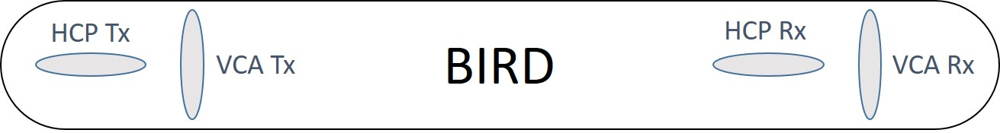

.. _airborne_fdem_bird:

Transmitters and Receivers
==========================

.. todo::

    **Here is some content, some of this may go in data**

    If the current waveform in the transmitter loop is sinusoidal at a certain
    frequency, this system is said to operate in frequency domain. For this case,
    the received waveform is also sinusoidal at the same frequency, but likely
    with altered magnitude and a phase shift. It is convenient to decompose the
    receiver waveform to two orthogonal sinusoidal components: one entirely in-
    phase (real) and the other entirely out-of-phase (imaginary or quadrature). A
    loop-loop system in frequency domain can be understood with a demonstrative
    3-loop model, please read the tutorial (link). You may find the following
    concepts useful. Click the links to learn more in Geophysical Surveys.

Transmitter
-----------

A transmitter loop in a FEM system is usually some kind of coil, connected to a generator that outputs a regulated sinusoidal signal at a certain frequency.

- Current. The actual current that goes through the coil may vary depending on the power of the generator and other constraints. 

- Moment. A coil in practice can be multiple-turned and is dozens of centimetres in radius. The product of current, number of turns and the area makes the magnetic dipole moment of the transmitter. This moment is used as a scalar in the calculation of the primary field. Because a FEM system measures the secondary field in terms of primary-seconday ratio, the actual moment of a transmitter coil is usually not very imporatnt to know.

- Multi-frequency. Because one transmitter coil carries a sine wave at a fixed frequency, in order to gain depth resolution through frequency, an airborne FEM system often uses multiple pairs of transmitter-recevier operating at multiple frequencies. 

Receiver
--------

- Coil. The current in the transmitter loop and the induced current in the earth can both generated time-varying magnetic field. At the receiver coil, an electromotive force (measured in Volt) can be induced along the loop. The rate of change of the magnetic field (dB/dt) is proportional to the measured voltage.  

- Primary removal. The measured emf due to the transmitter and due to the earth are not likely to be in-phase, and the former can be orders of magnitude greater than the latter. So it is desirable to remove the effect of the primary and only measure the secondary fields from the earth. This is mostly achieved by another buckling coil with a fine-tuned current that exactly cancels the primary field at the position of the receiver coil. Then we assume the measured emf is only from the secondary field.

- Measurement. If the transmitter waveform is a sinusoid at a certain frequency, the received waveform due to the secondary field is also sinusoidal at the same frequency, but likely with altered magnitude and a phase shift. It is convenient to decompose the receiver waveform to two orthogonal sinusoidal components: one entirely in-phase (real) and the other entirely out-of-phase (imaginary or quadrature). 

.. figure:: ./images/real_imaginary.jpg
   :align: center
   :scale: 80%
   :name: real_imaginary

   An example of deriving airborne FEM data. (a) The transmitter loop carried a time-harmonic current at a fixed frequency. (b) The receiver measures a time-harmonic secondary magnetic field at the same frequency, with phase lag. The signal in (b) can be uniquely decomposed to two orthogonal signals in (c) and (d). (c) The in-phase part is synchronized with the transmitter phase. (d) The out-of-phase part is 90 degree lag with respect to the transmitter.

Configurations
--------------

- Orientation. A transmitter-receiver pair can be oriented to two commonly-used geometries: horizontal co-planar (HCP) or virtical co-axial (VCA). They provides different ways of coupling with the ground. 

- Separation. In a transmitter-receiver pair, the two coils are separated a few meters. For low-induction number, this separation may be negligible, but for high frequency or very conductive ground, the separation should be considered when interpreting the data.

A diagram of a possible arrangement of HCP and VCA coils in a towed bird.

