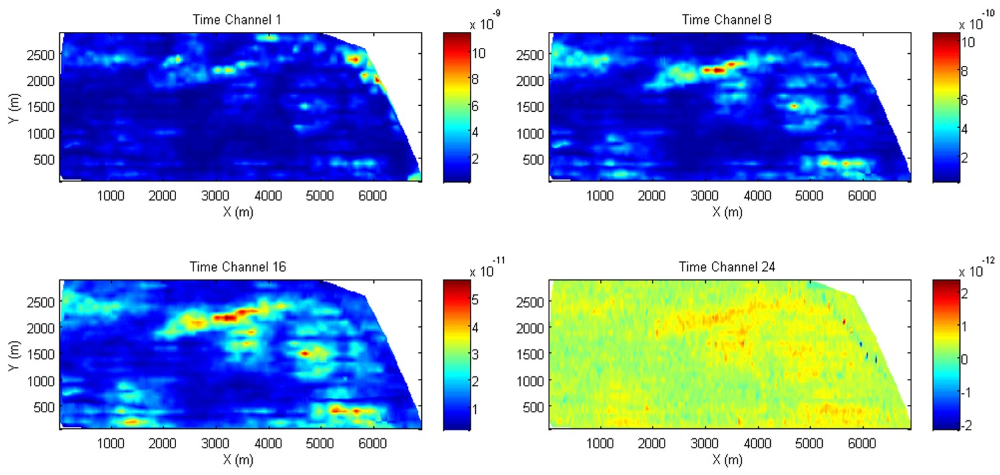
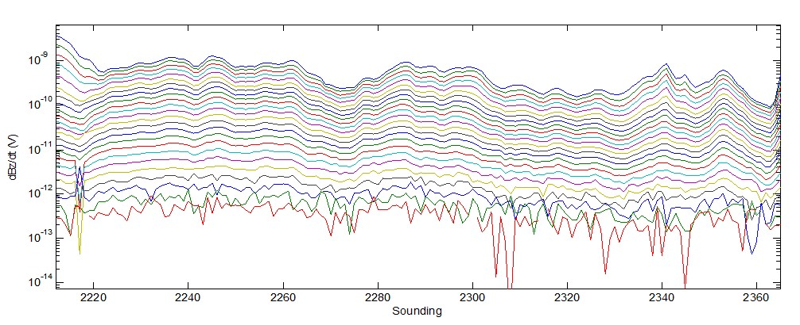

.. _airborne_tdem_data:

Data
====

An abruptly-changing current in the transmitter loop is used to generate a
primary time-harmonic magnetic field. This induces secondary currents in the
subsurface, which in turn produce secondary magnetic fields. Both the primary
and secondary magnetic fields reach the receiver. The (secondary) time-varying
magnetic flux through the receiver loop induces currents which act to oppose
the change in flux. The voltage in the receiver loop is what we use to define
a datum.

The actual ATEM measurement is a continous time series at a certain sampling
rate when the periodical source current is transmitted. During the raw data
processing, the contractors often stack the opposite polarities, apply digital
filters, and re-sample the time series.

An ATEM receiver measures the sum of the primary and secondary field of dB/dt.
Because the primary is usually many orders of magnitude greater than the
secondary, and the primary field cannot be precisely calculated for an
airborne TEM system, the ATEM data mostly concern the off-time when the
transmitter current is off, leaving only the secondary field in the receiver.
Because the EM responses exponentially decay after the turn-off, the off-time
is usually divided into some intervals (called time gates, which exponentially
expand as moving from early to late time), and the samples within each time
gate are averaged to produce time channel data. The averaging over time
further smooths out outliers and other noise, making the data more robust for
interpretation.

Unlike an AFEM system that delivers relative reading for the secondary field,
an ATEM system makes an absolute measurement. It becomes important for the
users to know the convention of normalization of data. Using the rule of
superpositin, ATEM responses can be scaled by the transmitter moment (product
of current, number of turns, and area) and the receiver effective area
(product of number of turns and area). Such information is usually available
in the survey report or reflected in the unit (e.g. V/A or V/A/m^2 or
V/A/m^2/m^2). Interpreters have to ensure the data is properly normalized or
de-normalized when carrying out numerical modeling.

Visualization
-------------

Upon receipt of the delivered data, visualization is usually the first step in
understanding the data. Every datum point in an airborne EM survey can be
specified using three parameters: the horizontal sounding location (easting
and northing) and the time(t)/frequency(f). Using easting and northing as x
and y respectively and time/frequency as z, a 3D data volume can be formed. So
there are three ways of plotting data for airbrone EM survey:

- Map: contouring a particular time/freq as a function of the horizontal
  location. Slice the data volume horizontally and examine the horizontal
  variation of data.

    Maps of time channel

- Profile or transverse: plotting all or select time/freq along a flight line
  as a function of one horizontal dimension. Slice the data volume vertically
  and examine the horizontal vairation and the relation between times or
  frequencies.

    Profile plot of time channels along a flight line

- Sounding: plotting data at a particular horizontal location as a function of
  time/freq. Drill the data volume vertically and examine the responses as
  function of time/freq (pseudo-depth).

.. figure:: ./images/atem_visual_sounding.jpg
    :align: center
    :scale: 80%
    :name: atem_visual_sounding

    TEM sounding at a particular location

By visualizing the data, we can answer the following questions:

- Understanding the underlying physics. Does the rate of decay imply a
  conductor or resistor at depth? Are the signs in the data compatible and
  consistent with the numerical modeling codes?

- Data quality control. Can we see any suspecious data or outliers? Is there
  interference from cultural noise? What is the approximate noise floor in the
  data?

- Qualitative interpretation. Does the relative highs and lows in the data
  match the general geology or other a prior information we know? Is there any
  indication of the sought target in the data? What is the likelyhood of
  making a informed decision?

- Help inversion. What is the resolution of the data? What physical model is
  appropriate for this data set? Does the predicted data from the inversion
  model acceptably match the observed feild data? Is there any important
  feature in the observed data that is not duplicated by the inversion?

.. _TDEM_sphere_data:

Visualizing data
----------------

We create a synthetic airborne TDEM data set and illustrate how the acquired data are visualized in practice. The synthetic earth model is a 1 S/m conductive sphere of a 30 m radius buried 20 m deep in a 0.01 S/m uniform half-space. Airborne TDEM soundings are measured along 9 survey lines covering a 300 x 300 m area centered at the sphere. The line spacing and in-line sounding spacing are both 40 m. At each sounding, the TDEM system measures the changing magnetic field :math:`\partial B_z \\ partial t` 20 m above the surface over 13 time channels, between :math:`25\;\mu s` to :math:`8\;ms`. The synthetic data are generated by a 3D frequency-domain EM modeling code that approximates the sphere by small voxels.

Map
^^^
An airborne FDEM data map is produced by contouring data at a particular frequency as a function of the horizontal location. Click the [Play>] to go through a sequence of maps at different frequencies for both the in-phase and quadrature components. The maps are useful in identifying the horizontal location of the sphere. Realistic data are more complicated than the single peak anomaly in this example, but a map is still a good method for general assessment. The variation of the responses at different frequencies shows that the data at higher frequencies are more sensitive to near surface.

 .. raw:: html
    :file: images/Data_slice.html

Profile and sounding
^^^^^^^^^^^^^^^^^^^^

An airborne TDEM profile is produced by plotting the data of the same
time from all the soundings along a flight line. :numref:`afem_Profile_Sounding` (a) shows one profile
directly over the sphere. A profile plot can be used to locate the object
along the line. Analysis of the profile curves is sometimes used to infer the
geometry and orientation of the object. The data can also be plotted as a
function of frequency at individual soundings. The sounding plot is
particularly useful in indicating whether the system is in resistive limit or
inductive limit.

 .. raw:: html
    :file: images/Time_slice.html
