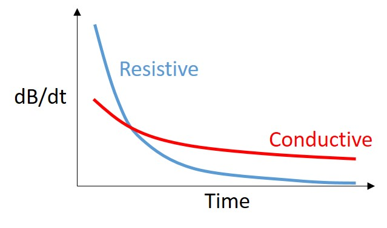

.. _airborne_tdem_interpretation:

Interpretation
==============
Interpretation is the process that extracts information in the delivered data to make decisions or to derive geologic knowledge. Depending on the specific geologic questions asked, and the resources available, geophysicists can choose from a wide spectrum of approaches ranging from trivial and low-resolution to sophisticated and high-resolution. 

Preliminary interpretation
--------------------------

Preliminary interpretation includes a range of procedures and approaches that deal with the data before numerical modeling or inversion. It can achieve the following goals:

(1) Quality control (QC). Data without quality or uncertainty assessment mean nothing. So it is important to know the overall quality of a data set. A data set may be deemed not suitable for interpretation if the noise level is too high. For most data sets, preliminary QC is carried out during acquisition. So the delivered data can still show useful signals in decent quality. But we still have to identify the "bad data".

(2) Uncertainty analysis. Uncertainty is a quantitative way of assessing the data quality. Data with greater noise may be assigned larger uncertainty. Most inversion programs need this information to decide how well the inversion wants to fit a particular datum.

(3) Data preparation. A data set can be difficult to interpret because of its size and noise. For example, the numerical modeling time is roughly proportional to the number of measurements in an airborne survey that has significant data redundancy. So it may be desired to down-sample the data set without losing information. And high-frequency noise associated with non-geologic objects can be effectively removed by low-pass filtering and other smoothing methods.

(4) Model parameterization. Any interpretation is based on models. By processing the data, we may choose more proper models. For example, negative transients in a central loop TEM survey indicate the existance of induced polarization. So we know at some places a real and time-independent conductivity model is not enough to explain the data. Another example is the variation of data in space may indicate the dimensionality of the model and the scale of EM induction, which helps the design of discretization for numerical modeling.

Data plotting
*************
Significant amount of information, especially the relative distribution of conductivity, can be obtained by just plotting the data. Sometimes simple data transform techniques can also be used to isolate the anomaly and aid the interpretation. This type of approach can include: direct data plotting, data-conductivity transform, empirical template method, etc. Those simple methods were once the mainstream, but have shown drawbacks in complex geological setting and lack the ability to decode the conductivity values from the data. However, it still has its value in data quality control and preliminary interpretation.

For a time domain system, the voltage measured off time at the receiver is roughly an exponentially decaying function of time. The decay rate is an indicator of the overall conductivity of the ground: good conductors have slower decays (greater time constant) and poor conductors have faster decays (smaller time constant). Time constant method offers a first-order interpretation of the overall conductivity of the ground. For example, we can infer the overall conductivity by examining how fast the dB/dt response decays in time. Using delay time (time channel) as a proxy of depth, we can estimate the variation of conductivity as a function of depth.

A conductive terrain has a slowly-decaying dB/dt response. For most time (except very early time), a high value in dB/dt indicates the existance of conductive objects. 

.. figure:: ./images/atem_visual_sounding.jpg
 :align: center
 :scale: 80%
 :name: atem_visual_sounding1

Example sounding showing variation of conductivity at depth. A slowly-decaying dB/dt from time channel 7 to 15 indicates a more conductive layer underneath. 

Apparent conductivity
*********************
Apparent conductivity is another semi-qualitative method that further ties the data to the conductivity of the ground. It is defined as the conductivity of a uniform half-space that would generate the same data at a particular time or frequency. It can be considered as a lumping averaging of the conductivities around the measurement location. Despite its blending effect, it provides qualitative insight about how the conductivity varies from shallow (high frequency) to deep (low frequency). Using the concept of diffusion distance, apparent conductivities calculated at time channels can be assigned a pseudo-depth, so a depth image can be generated for a preliminary interpretation. This technique is usually referred to as conductivity-depth imaging/transform (CDI/CDT).

Inversion
---------

Plate modeling
**************
Some geologic targets can be characterized as conductive thin plates that give rise complicated EM responses due to the geometry and mutual coupling. Plate modeling method attempts to find the geometry and conductivity of a few conducting plate in a simple background that is responsible for most of the anomalous data. It has the advantages of being able to handle the 3D coupling effect efficiently, but may have trouble dealing with too many plates in more complex situations. 

1D layered earth model inversion
********************************
This approach assume the earth's conductivity only varies as a function of depth. At each measurement location, the inversion find a layered model that explains the entire decay curve in time or the entire spectrum in frequency-domain. Many layered models at multiple locations then can be stitched together to form a pseudo-3D volume for visualization. Advanced techniques also consider the correlation between adjacent locations by imposing lateral constraints, etc. 

2D/3D inversion
***************
The previous interpreting methods all assume the earth has a particular structure so simplified calculations can be used. Any violation of those assumptions would result in failures. A 3D inversion discretizes the entire earth to many discrete cells, each of which has a constant conductivity. Then the Maxwell's equations are solved on the mesh. The obtained images of the subsurface are in 3D voxel format. 3D inversions provides the best resolution and works for any complicated models, but it is more computational expensive. A 2D inversion is similar to a 3D inversion, except that the physical property along the strike direction is constant, so there are fewer variables in the model. 

Hypothesis testing
******************
1D/2D/3D inversion allows advanced interpretation to be carried out. For example, if we are in doubt of a particular feature in a model, we can run another inversion to test the "what if" hypothesis. One important application is to estimate the depth of investigation. In order to quantify the credibility of the deep structure in a model, another inversion can be run using a very different reference model, effectively asking what if the background is another value. The two inversion would have similar values at shallow depth as that portion is constrained by the data, but may differ at depth. The discrepancy between the two models at different depths indicate whether the data are sensitive to that part of the earth.

