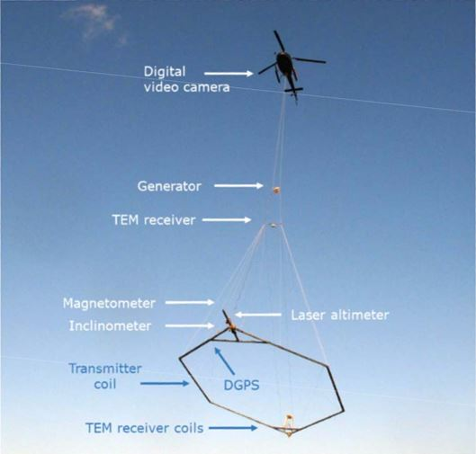
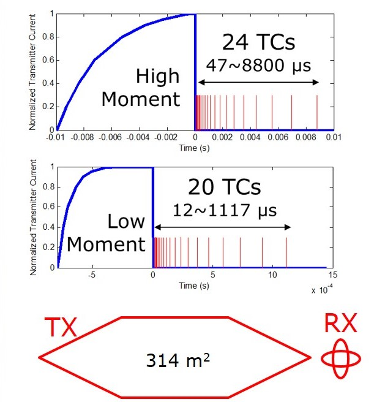

.. _AFEM_survey_SKYTEM:

SkyTEM
``````



    A SkyTEM system in operation.

SkyTEM is a time-domain electromagnetic system family operated by SkyTEM
Surveys ApS in Denmark. The system is best known for its performance in
hydrological and environmental applications. SkyTEM has many different
variants using different specifications. Here we describe the system
used in our hydrological case studies (2006).

Coils
^^^^^

The multi-turned transmitter loop is winded on a rigid horizontal hexagonal
frame that is towed about 30 m above the surface by a helicopter during a
survey. The area of the frame is 314 :math:`m^2`. The receiver contains two orthogonal
coils at the tail of the frame with their normal vectors in the vertical (for
dBz/dt data) and in-line (for dBx/dt data) directions. The z-coil 12.40 m
behind and 2.09 m above the transmitter frame centre, and the x-coil is 13.69 m
behind and 0.0 m above the transmitter frame centre. Those are the positions where
the z-coil and x-coil are null coupled with the cooresponding components of the 
primary field. Both coils have an effective area of 31.4 :math:`m^2`.

Waveform
^^^^^^^^

.. list-table:: : SkyTEM (2006) system dual-mode specifications
   :header-rows: 1
   :widths: 1 1 1 1 1 1 1 1 1
   :stub-columns: 0
   :name: SKYTEM 

   *  - Mode
      - Turns
      - Peak current
      - Base freq
      - Half peroid
      - On-time
      - Off-time
      - Turn-off time
      - Data range
   *  - HM
      - 4
      - 90 A
      - 25 Hz
      - 20 ms
      - 10 ms
      - 10 ms
      - 0.029 ms
      - 0.047 - 8.8 ms
   *  - LM
      - 1
      - 40 A
      - 222.22 Hz
      - 2.25 ms
      - 0.8 ms
      - 1.45 ms
      - 0.004 ms
      - 0.012 - 1.1 ms


SkyTEM is capable of operate in a dual mode, using high moment (HM) and low
moment (LM) alternatively in a flight. HM and LM have different shapes of 
waveform. LM can turn off the transmitter current rapidly, so it allows 
reliable measurement of early data for shallow imaging, while the HM mode can 
penetrate deeper with higher source moment and longer off-time.




    Configuration of SkyTEM system and its transmitter waveforms.

Data
^^^^

The received voltage is averaged over the time windows, and then normalized by
the receiver effective area and the transmitter moment to yield delivered data 
in the unit of :math:`V/(A N m^4)`. Both the vertical (z-coil) and in-line (x-coil)
data are delivered.


Flight
^^^^^^

- SkyTEM has a nominal transmitter terrain clearance of 30 m and a nominal aircraft speed of 30 m/s.

- The pitch, yaw and roll of the frame are monitored during flight.

- The system is positioned using GPS.

- The flight height is measured by a laser altimeter on the frame, and the flight height data are corrected by the inclination of the frame.


