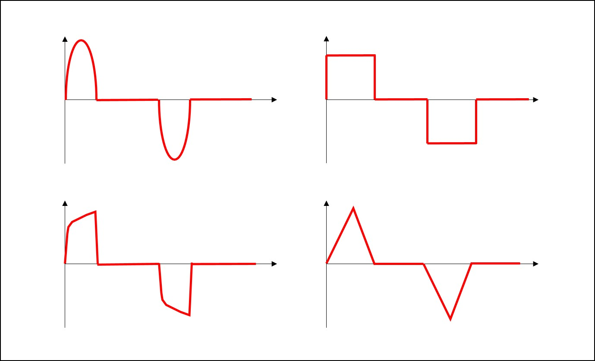
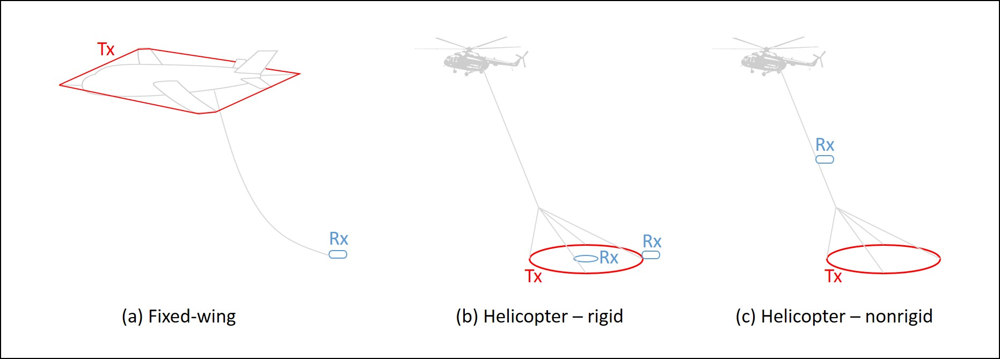

.. _airborne_tdem_survey:

Survey
======

.. purpose::

    To provide an overview of the basic airborne TDEM system configuration and
    commonly used instrumentation.
    
System Configuration
--------------------

Transmitter
^^^^^^^^^^^

- **Loop**: Because an ATEM system covers a wide bandwidth using rapid change in the
  transmitter current waveform, only one transmitter loop is needed in a system.

- **Platform**: If using a helicopter, the transmitter loop is usually attached to
  a round frame towed after the helicopter through a cable. If using a fixed-
  wing airplane, the transmitter loop is shaped as a diamond attached to the
  nose, tail and wingtips of the plane.

- **Peak current**. The actual peak current that goes through the coil may vary depending on
  the power of the generator and other constraints. A transmitter loop mounted
  on a fixed-wing aircraft usually carries larger peak current thanks to the
  lifting capability of a fixed-wing for more powerful generators.

.. figure:: ./images/source_moment.png
    :align: right
    :figwidth: 30%
    :name: source_moment_atem

    Moment of an airborne EM loop source.
    
- **Moment**: The strength of a magnetic dipole source is specified by dipole moment, 
  a quantity defined as the product of the effective area and the peak current (:numref:`source_moment_atem`). 
  A high moment can generate greater excitations and thus 
  improves the quality of data in a noisy environment, but the actual area and 
  current of the loop are limited by the power supply and other practical restrictions. 
  Modern ATEM systems are equipped with a dipole moment over 1 million Am:math:`^2` to 
  achieve a depth of penetration down to a couple of kilometers.

- **Waveform**: An ATEM source induces a time-dependent EM fields underground by 
  making rapid change in the transmitter current. An ATEM waveform usually consists 
  of on-time (current is turned on and changing) and off-time (current is turned off 
  and not changing). ATEM waveforms are usually bipolar, so some systematic errors 
  can be stacked out. The shape of an ATEM system's waveform is fixed, but how often 
  a on-time pulse appears can be tuned by a parameter called base frequency (typically 
  from 20 to 90 Hz). A lower base frequency allows a larger transmitter moment, 
  measuring at later delay times, and thus detection of deep geology. 

    Common ATEM waveforms.

Receiver
^^^^^^^^

- **Loop**: ATEM uses another loop to measure the time-derivative of the magnetic
  field (dB/dt), in a way similar to AFEM. At the receiver coil, an electromotive 
  force (measured in Volt) can be induced by the primary field from the source 
  and the secondary field from the earth. When the transmitter current is turned 
  off during the off-time, only the secondary field is measured. The coils can be 
  multi-turned to increase the effective area for better SNR.

.. figure:: ./images/receiver_emf_atem.png
    :align: right
    :figwidth: 30%
    :name: receiver_emf_atem

    The EMF measured at the receiver loop is proportional to dB/dt data.
    
- **Measurement**: The induced EMF is proportional to the rate of change of the 
  magnetic flux through the area enclosed by the loop 
  (:math:`\varepsilon = - \frac{d \Phi}{d \mathbf{t}}`). Because the loop is much 
  smaller than the wavelength of the magnetic field in an airborne TDEM survey, 
  the magnetic field at the receiver can be considered uniform. The total magnetic 
  flux is then approximated by the product of magnetic flux intensity and the 
  effective area of the receiver loop. Then the measured EMF can be used to 
  calculate the dB/dt at the receiver 
  (:math:`\varepsilon = - \frac{d \Phi}{d \mathbf{t}} = - \frac{d A N \mathbf{B}}{d \mathbf{t}} = - A N \frac{d \mathbf{B}}{d \mathbf{t}}`), as the effective area is known. Conventionally, a time-domain 
  system only measures dB/dt during off-time when the primary is zero, but in practice 
  both on-time and off-time data are acquired as time series. In some cases, the 
  on-time data can be particularly diagnostic.

Configuration
^^^^^^^^^^^^^

- **Orientation**: The transmitter loop in an ATEM system is usually a horizontal
  loop, which is relatively easier to manufacture and implement in the field
  operation. The receiver loop can be much smaller, and three loops can be
  oriented orthogonally to measure three-component dB/dt.

- **Separation**: Basic physical model for ATEM is a configuration called
  "coincident loop" or "central loop", in which the recevier is at the center
  of the transmitter loop. This has been strictly used in same ATEM systems,
  but there are variants. For example, the receiver can be mounted to the tail
  of the transmitter loop or suspended above the transmitter loop. In a fixed-
  wing system, the receiver is usually towed a couple of hundreds
  meters after and below the transmitter loop. Such separation is negligible
  for low induction number, but must be taken into account when interpreting
  early time channels or over conductive region.

    Common ATEM configurations.

Field Operation
---------------

During production, a frame or bird is towed by a helicopter flying along lines 
and the EM data are measured during the flight.

Flight
^^^^^^

- **Clearance**: A helicopter-towed bird is typically at least 20 or 30 metres above the surface. A fixed-waing system flies about 100 m above the surface. Although a higher spatial resolution is desirable by flying the system as close to the ground as possible, a sufficient clearance must be maintained for safety and piloting reasons. In mountainous regions or over tall trees, the system may need to fly higher.

- **Line spacing**: An airborne TDEM survey usually consists of a group of flight lines that are straight and parallel to each other. The spacing between lines is determined by the resolution requirement of the survey and also the geology. Typically an ATDEM system has a line spacing from 50 to 500 meters for applications from geotechnical to resource reconnaissance.

- **Speed**: A slow-flying TDEM system can measure more sounding samples per line-kilometre. However, a higher spatial resolution comes at the cost of spending more time in air. As a trade-off, a helicopter TDEM system typically flies at a speed of about 30 m/s and a fixed-wing system at about 100 m/s.

Positioning
^^^^^^^^^^^

- **GPS**: Differential Global Positioning System (D-GPS) units are used to collect the location of the helicopter and the bird during the flight. Location data is also collected with a base station so post-survey correction to, for example, clock error and satellite orbit are possible.

- **Altimeter**: There are two types of altimeter that determine the actual flight height. A radar altimeter sends radio waves that reflect from the ground back to the helicopter, and times the travel time to calculate the distance. This type of altimeter is usually located in the helicopter, because it has a longer range. A laser altimeter uses a laser beam instead of radio waves. It is more sensitive in the low range than the radar, so it is often located in the bird. The altitude is measured several times in a second during a flight.

- **Orientation**: The inertia measurement unit (IMU) is used to record the orientation of the bird. It records g-force and angular rate of the bird using accelerometers and gyroscopes.

Post-processing and corrections
^^^^^^^^^^^^^^^^^^^^^^^^^^^^^^^

The processing and correction implemented by the service providers before data delivery may include:

- Base level correction
- Lag correction
- Moving window median and Hanning filter
- Laser altitude correction for dropouts and variation
- Magnetic data lag and diurnal correction and IGRF removed

Systems
-------

This section presents commercial airborne TEM systems.

.. toctree::
    :maxdepth: 1

    skytem
..    vtem
.. - :ref:`RESOLVE<AFEM_survey_RESOLVE>`
.. - :ref:`DIGHEM<AFEM_survey_DIGHEM>`

Call for contributors
^^^^^^^^^^^^^^^^^^^^^

If you are a service provider, or have experience with a specific AFEM system and would like to contribute, please :ref:`contact us<contibutors>`.

.. raw:: html

   

      <a href="http://github.com/ubcgif/em"><i class="fa fa-wrench fa-4x" aria-hidden="true"></i></a>
   

