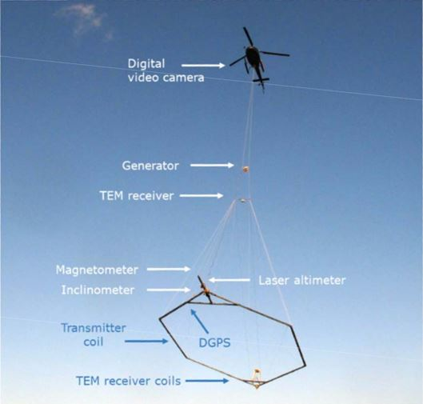

.. _airborne_tdem_systems:

Systems
=======

.. _skytem:

SkyTEM
------

A SkyTEM system in operation.

SkyTEM is a time-domain electromagnetic system family operated by SkyTEM Surveys ApS in Denmark. The system is best known for its performance in hydrological and environmental applications. SkyTEM has many different variants using different specifications. Here we only describe the system typically used in hydrological studies.

Coils
*****

The multi-turned transmitter loop is winded on a rigid horizontal hexagonal frame that is towed about 30 m above the surface by a helicopter during a survey. The area of the frame is 314 m^2. The receiver contains two orthogonal coils at the tail of the frame with their normal vectors in the vertical (for dBz/dt) and in-line (for dBx/dt) directions. The z-component coil is 12.40 m behind and 2.09 m above Tx loop centre, and the x-component coil is 13.69 m behind and 0.0 m above Tx loop centre. Both coils have a effective area of 31.4 m^2.

Waveform
********

SkyTEM is capable of operate in a dual mode, using high moment (HM) and low moment (LM) alternatively in a flight. HM uses all the transmitter loop turns on the frame, a peak current of 90 A, and a lower base frequency at 25 Hz. LM uses only one turn of the loop, a peak current of 40 A, and a higher base frequency at 222.22 Hz. HM and LM have different shapes of waveform. LM can turn off the transmitter current rapidly, so it allows reliable measurement of data as early as 12 us, while the HM mode can measure as late as 8800 us. 

.. figure:: ./images/skytem_config.jpg
	:align: center
	:scale: 80%
	:name: skytem_config

Configuration of SkyTEM system and its transmitter waveform.

Corrections
***********

The received voltage is averaged over the time windows, and then normalised by the receiver effective area and the transmitter moment (product of current, area and number of turns) to yield delivered data in the unit of V/(A.turns.m^4). The inclination of the frame is monitoered during flight, but the data are not corrected for the inclination. 

.. _VTEM:

VTEM
----

.. _HeliTEM:

HeliTEM
-------

.. _Spectrum:

Spectrum
--------
