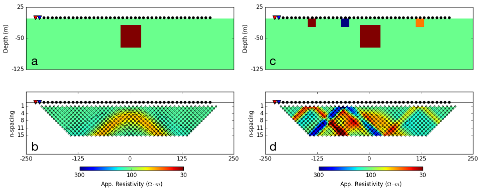

.. _dcr_interpretation:

Interpretation
==============

.. topic:: Purpose
  
   To show how DCR data are processed and inverted to reveal meaningful information about the earth structure. This is demonstrated on the data generated from the :ref:`two-sphere problem<two_sphere_setup>`. The synthetic models and data presented in this page can download :ref:`here<dcr_synthetics>`

.. _dcr_interpretation_appRes:

Apparent Conductivities
-----------------------

Plotting apparent conductivities, as pseudosections or in plan-view maps, is informative. The images are useful for  recognizing data `outliers`, bad electrodes, and validating normalizations that might have been applied to the data. In addition, they sometimes provide valuable information about possible structure. 

As an illustration, :numref:`DCR_DpDp_Simple` (a) shows an earth model consisting of a single prism (:math:`\sigma=0.1` S/m) buried in a uniform halfspace (:math:`\sigma=0.01` S/m). A dipole-dipole survey is carried out directly above the conductive prism. The resulting pseudosection is shown in :numref:`DCR_DpDp_Simple` (b). The prism is manifested as a region of lower resistivity in the center of the image and has `wings` extending outwards and downward. The apex of the image can be used to estimate the horizontal location of the prism but the depth to the body is less evident since the vertical scale of the pseudosection is in `n-values` and not in meters. This example can be download :ref:`here<dcr_synthetics>`

Despite the above success, the situation worsens if the earth is more complex. This is illustrated in :numref:`DCR_DpDp_Simple` (c) where some near-surface inhomogeneities are added. The same dipole-dipole survey is carried out and resultant pseudosection is shown in :numref:`DCR_DpDp_Simple` (d). The response of the prism is masked and attempting to infer existence and location of the prism is extremely challenging. 

    : (a) Vertical section through a simple conductive prism (:math:`\sigma=0.1` S/m) buried in a homogeneous halfspace :math:`\sigma=0.01` S/m. Source and receiver locations for a dipole-dipole survey are shown for reference.
    (b) Pseudosection of apparent conductivity calculated from the synthetic DCR survey.
    (c) Vertical section through a more complicated conductivity model with near-surface inhomogeneities added and (d) resulting pseudosection of apparent resistivity. 

This example can be download :ref:`here<dcr_synthetics>`.

:ref:`Gradient array surveys<dcr_survradiobuttons>` are often used in reconnaissance modes and it is insightful to repeat the above analysis with a representative example. A plan view of the resistivity of the model and electrode geometry is shown in :numref:`DCR_Grad_Simple` (a). The survey consists on a 13 x 13 receivers grid, 20 meters dipole, located in the center of a large 450 meters dipole source. The corresponding apparent resistivity map is shown in :numref:`DCR_Grad_Simple` (b). 
An estimate of the horizontal location of the center of the prism can be obtained, but again there is no quantitative information about the depth.

.. figure:: images/DCR_Grad_Simple.png
    :align: center
    :figwidth: 100%
    :name: DCR_Grad_Simple

    : (a) Bird-eye view of gradient array survey over a simple conductive prism model (:math:`\sigma=0.1` S/m) buried in a uniform halfspace (:math:`\sigma=0.01` S/m) and (b) corresponding apparent conductivity map. By simple inspection of the data map, it is easy to locate the center of the conductive anomaly.
    (c) The experiment is replicated with a more complicated conductivity model with near-surface inhomogeneities added. Direct interpretation of the resulting apparent resistivity map (d) is challenging.

Contaminating the model by adding some conductive and resistive features (:numref:`DCR_Grad_Simple` c) leads to an apparent resistivity map that is very complicated and in which the signal of the prism is masked (:numref:`DCR_Grad_Simple` d). 
To obtain information about the electrical conductivity we need to invert the data. 

.. _dcr_interp_inversion:

Inversion of DCR data
---------------------

The DCR data are inverted using a standard Gauss-Newton framework. This is outlined in :ref:`Inversion<inversion>`. The data are the measured voltages and the goal is to find an electrical conductivity that satisfactorily reproduces these data and agrees with a priori geologic structure and petrophysical constraints. 
    
To illustrate the importance of inverting the data we return to the thematic :ref:`2-sphere problem<two_sphere_setup>`. Although the geology is 3D, we first invert the data using a 2D inversion algorithm.
Parameters used for the inversion of the dipole-dipole data (:numref:`DCR_TwoSpheres_Simple` b) are provided in :numref:`twospheres_inv_table`. 

.. list-table:: : 2D Inversion parameters
   :header-rows: 0
   :widths: 5 5
   :stub-columns: 1
   :name: twospheres_inv_table

   *  - Number of sources
      - 43
   *  - Number of data
      - 540
   *  - Data uncertainties
      - :math:`2\%\times|d| + 2 \times 10^{-5} V` floor
   *  - Mesh Size
      - :math:`10 \times 10 \times 10` meters
   *  - Reference conductivity
      - :math:`0.01` S/m
   *  - Regularization Scales ( :math:`\alpha_s, \alpha_x,\alpha_y,\alpha_z` )
      - :math:`0.01, 1, 1, 1`

:numref:`DCR_TwoSpheres_Simple` (c) presents the recovered 2D conductivity model after convergence of the algorithm. 

**Important comments:**

(a) Eventhough we do not have contaminating near-surface conductivity blocks the pseudosection do not clearly indicate two bodies. This is in contrast to :numref:`DCR_DpDp_Simple` (a) where a single prism was clearly identified in the pseudosection.

(b) The two spheres are recovered but they have lower conductivity contrasts with respect to the halfspace than do the true spheres. This occurs for three reasons: (i) the inversion generates smooth models and this extends structures and reduces amplitudes. (ii)the spherical structures are extending into the limits of depth of investigation; (iii) the 2D inversion is assumes that the structures are cylindrical.

.. figure:: images/DCR_TwoSpheres_Simple.png
    :align: center
    :figwidth: 100%
    :name: DCR_TwoSpheres_Simple

    : (a) Vertical section through a two-sphere model (:math:`\sigma_1=0.1` S/m ; :math:`\sigma_2=0.001` S/m) buried in a homogeneous halfspace (:math:`\sigma_0=0.01` S/m). (b) Corresponding pseudosection of apparent conductivity acquired from a dipole-dipole survey layout, 20 meter dipole spacing. (c) Recovered conductivity model from a 2D inversion. (d) A similar experiment is carried out on a more complicated conductivity model with near-surface inhomogeneities added. While the interpretation of the corresponding (e)pseudosection  is challenging, the (f) 2D inversion result  recovers both the spheres and near surface anomalies.   

Similar to the prism model (:numref:`DCR_DpDp_Simple`), we repeat the experiment with the same survey setup but using a more complicated conductivity model with near surface inhomogeneities added (:numref:`DCR_TwoSpheres_Simple` d). The resulting pseudosection (:numref:`DCR_TwoSpheres_Simple` e) is challenging to interpret due to the combined signal coming from the two spheres and near surface anomalies. Using the same inversion method, we recover a 2D conductivity model presented in :numref:`DCR_TwoSpheres_Simple` (f).

**Important comments:**

(a) The pseudosection of data is complicated and dominated by the near-surface conductors.

(b) The inversion recovers the contaminating surface conductors. It also recovers the two spheres with about the same fidelity as in the simple case. 

This example can be download :ref:`here<dcr_synthetics>`.

.. _depth_of_investigation:

Depth of Investigation
----------------------

An important component of geophysical inversion is to determine the level of
confidence in the recovered model. It is recognized that the inverse problem
is nonunique and that the  DCR data are sensitive to conductivity only in a
region in the vicinity of the electrode array.  There has been several methods
proposed in the literature to quantify the resolving power of a given DCR
experiment. The following example uses the Depth of Investigation (DOI) method
proposed by :cite:`LiDWO1999`.

.. figure:: images/DCR_TwoSpheres_DOI.png
    :align: right
    :figwidth: 50%
    :name: DCR_TwoSpheres_DOI

    : (a) Conductivity model obtained using a conductive halfspace reference model (:math:`0.1` S/m) and (b) the 
    calculated DOI index. The :math:`80^{th}` percentile
    is chosen as a cut-off value, below which the model is deemed unreliable.
    (c) Preferred conductivity model presented in :numref:`DCR_TwoSpheres_Simple` (c) after applying the DOI mask.

In its simplest form, the DOI analysis requires the data to be inverted twice
with slightly different assumptions. Back to the two-sphere example shown in
:numref:`DCR_TwoSpheres_Simple` (c), the synthetic data is inverted a second
time with a reference halfspace conductivity of :math:`0.1` S/m.
:numref:`DCR_TwoSpheres_DOI` (a) shows the recovered 2D conductivity models
obtained after convergence of the algorithm. Note that the region away from
the electrode locations returns to a uniform conductivity value close to the
reference model.
    
We now have a discretized volume of the Earth and two conductivity models that
can equally reproduced the observed data. Let :math:`\sigma_1, \sigma_2` be
the conductivity values recovered at some location (*x,z*), a DOI index is calculated as:

.. math::
   DOI(x,y) = 1 - \big| \frac{\sigma_1(x,y) - \sigma_2(x,y)}{\sigma_1^{ref} - \sigma_2^{ref}} \big|\;,

where the DOI index will approach 1 for similar model values obtained with
both inversions regardless of the chosen reference models
:math:`\sigma_1^{ref}, \sigma_2^{ref}`. Conversely, the ratio will approach 0
where the recovered models diverge to their respective reference conductivity.
:numref:`DCR_TwoSpheres_DOI` (b) presents the calculated DOI index for the two-
sphere problem, showing a lower confidence over the bottom half of the domain.
We then apply the DOI mask to our preferred 2D model as presented in :numref:`DCR_TwoSpheres_DOI` (c), with transparency applied proportionally to the DOI index.

.. _dcr_synthetics:

Downloads
*********

Data, model and inversion files used in this page can be downloaded below:

 `Prism <https://storage.googleapis.com/simpeg/em_geosci/DCR_Interp_Prism.zip>`_

 `Two_Spheres <https://storage.googleapis.com/simpeg/em_geosci/DCR_Interp_TwoSpheres.zip>`_

Utilities: UBC-DC2D `data viewer <http://gif.eos.ubc.ca/sites/default/files/dcip2d-data-viewer.zip>`_ and `model viewer <http://gif.eos.ubc.ca/sites/default/files/dcip2d-model-viewer.zip>`_
