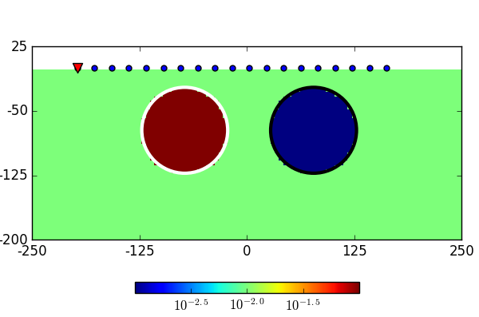

.. _dcr_physics:

Physics
=======

.. topic:: Purpose

    Demonstrate the fundamental physical principles governing the DC
    resistivity experiment

In a DC resistivity survey, a generator is used to inject current into the
subsurface. Currents flow, and the path they follow depends on the
conductivity structure of the subsurface. Charges build up on conductivity
interfaces and these change the electric potentials that are measured on the surface or in boreholes.

.. raw:: html
    :file: images/physics_radio_buttons.html

.. _two_sphere_setup:

Two-sphere problem
******************

    Pole-dipole DCR experiment over a synthetic model made up of a conductive
    (:math:`10^{-1}` S/m) and a resistive (:math:`10^{-3}` S/m) sphere
    embedded  in a uniform half-space (:math:`10^{-2}` S/m).

We illustrate the DCR experiment with a synthetic pole-dipole survey as
illustrated in :numref:`DCR_TwoSpheres`. This simple
:ref:`conductivity<electrical_conductivity_index>` model is made up of two
spheres in a uniform half-space Earth. Currents are injected into the ground
from the source, and potentials are measured at different locations. Using
:ref:`numerical methods<solving_maxwells_equations>`, we can model the currents
and accumulation of charges due to conductivity contrasts as shown in the
animation below. The arrows denote the :ref:`current
density<current_density_J>`, while the color indicates the strength and sign
of :ref:`accumulated charges<bound_charge_Q>`. The source location is marked
by a triangle.

`[Press play]` Note the behaviour of the current lines as the point source passes over the
conductor. The current density increases inside the sphere but
decreases around it; this is often referred to as :ref:`current channeling<dc_e_field>`.
Conversely, current lines get deflected around the resistor.

`[Pause]` The accumulation of charges occurs at the interface between
conductivity contrasts. Note that the difference in polarity between
the conductive and resistive anomaly is as predicted by the :ref:`theory<bound_charge_Q>`.
Also note how the spatial distribution of charges on the spheres changes
as the current source is moved.

 .. raw:: html
    :file: images/TwoSphere_Current_Anim.html

