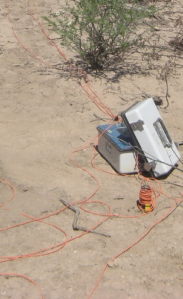

.. _dcr_receivers:

Receivers
=========

**DC resistivity**: Two receiver electrodes are used to measure the voltage difference in a DC/IP
survey. Non-polarizing electrodes are commonly porous pots composed of a solid
metal wire in a salt solution. It is also common to use lead wire in a lead-
chloride mix or copper wire in a copper-sulphate solution. This eliminates
self potential between the wire and the ground, and it improves the quality of
the data. The voltage potential is measured between any combination of
receiver electrodes due to super-position theory, as long as the data was
collected simultaneously. An example of a porous pot receiver electrode for a
DC/IP survey with a copper sulphate solution is shown in
:numref:`porous_pot_receiver`.

   A single porous pot electrode in the ground connected to a receiver.

