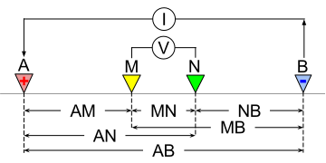
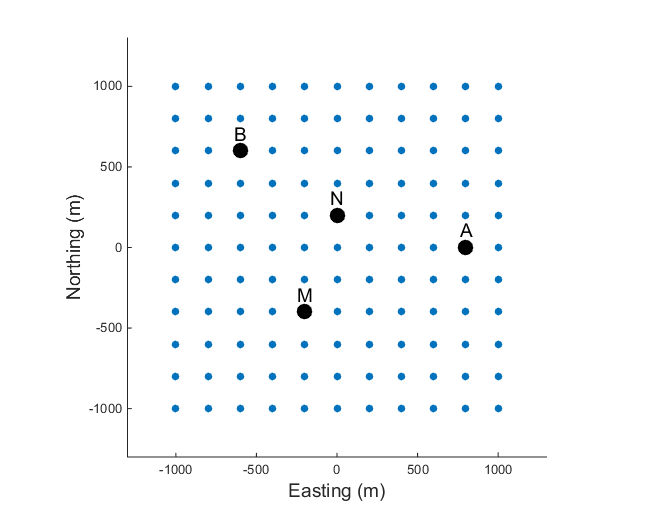
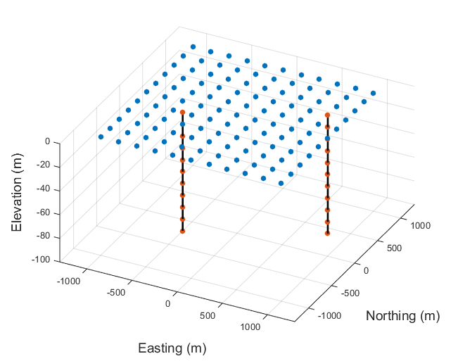

.. _dcr_survey:

Survey
======

.. purpose::

   To provide an overview of common survey set-ups and instrumentation used in
   DC resistivity surveys.

.. _dcr_survey_basic:

Basic Survey Setup
------------------

    The basic DC resistivity array using 4 electrodes. A and B are the
    current electrodes while M and N are the potential electrodes.
    Distances between the electrodes are used to calculate :ref:`the
    geometry factor and apparent resistivity <dcr_data>`.

    Schematic showing a general electrode layout in a grid. Each of the
    electrodes can be the current electrodes or the potential electrodes.

The basic DC resistivity (DCR) survey requires a generator that inputs
electrical current into the ground and a voltmeter to measure the potential
difference between two locations. The basic 4-electrode array is shown in
:numref:`dcr_surv_5`. Various configurations of electrodes are possible.

The current waveform provided by the generator can be harmonic (for a
frequency-domain survey), a full-duty bipolar pulse,  or a waveform composed
of an "on-time" and "off-time".

.. _dcr_survey_config:

Survey configurations
---------------------

.. .. figure:: images/MIMDASlayout.jpg
   :figwidth: 40%
   :align: right
   :name: MIMDAS_layout

..   Overview of the `MIMDAS layout <http://www.austhaigeophysics.com/A%20Comparison%20of%202D%20and%203D%20IP%20from%20Copper%20Hill%20NSW%20-%20Extended%20Abstract.pdf>`_

There are many geometries of electrodes that can be used in the field. The
electrodes can be co-linear or they can be in an arbitrary configuration.
Current and potential electrodes can be on the surface or in boreholes. The
choice of which survey geometry to use is governed by: (1) what conductivity
structure is sought, (2) field constraints for laying out electrodes, and (3)
which equipment is used.

Modern acquisition systems populate an area with electrodes and use different
pairs as currents and potential electrodes. :numref:`dcr_2dgeneral` shows a
general schematic showing electrode positions on a grid. Since each electrode
can be a current or potential electrode, this electrode layout allows for a
large set of measurements. It's generally not feasible, nor desirable, to
collect all possible data. Arrays are selected to achieve specific goals. For
instance:

- Profiling: a fixed array is moved along a line. The data  provide
  information about lateral variations to a depth that is determined by the
  length of the array.

- Sounding: a fixed geometry of electrodes is expanded symetrically about a
  central point of the array. The data provide information about how the
  electrical structure varies with depth. The data curve is often called a
  "sounding" and a single sounding can be inverted to produce a 1D
  conductivity model. If multiple soundings are available they can be inverted
  in 2D or 3D. The most common sounding configurations are the Wenner and
  Schlumberger arrays.

- General configuration: These are combinations of profiling and sounding
  arrays. They are often obtained by defining an electrode array and expanding
  and translating it along a line. In practice, this is achieved by laying out
  a line of electrodes, each of which can be used as a current or potential
  electrode. The most common acquistion arrays are dipole-dipole, pole-dipole,
  or pole-pole arrays.

- Gradient array: This is a reconnaissance array that uses a fixed location
  for the A and B electrodes which are far apart. Measurements are taken in an
  area between the current electrodes. Potential differences in orthogonal
  directions can be acquired but usually only potential differences between
  electrodes aligned in the same direction as the A and B electrodes are
  obtained.

Traditionally, data have been collected using co-linear electrodes. Depending
upon the relative placement, the geometries have been given specific names.
The interactive figure below shows how electrodes are placed for various named
arrays. Electrodes placed on lines imply that the array is usually used for
profiling. A circle at the array's center implies that the array is generally
expanded symmetrically about its center for acquiring sounding data.

.. _dcr_survradiobuttons:

 .. list-table:: : Common DC resistivity arrays (double-click)
   :header-rows: 0
   :widths: 10
   :stub-columns: 0

   *  - .. raw:: html
            :file: ./images/survey_radio_buttons.html

    Electrodes can be placed at the surface or along boreholes.

.. _dcr_survey_3d:

**Three dimensional data acquisition**

The general DCR problem can be stated as follows: Given a volume of the earth,
collect DCR data and invert them to generate a 3D conductivity model. With
modern technologies, data can be collected in three dimensions, using
electrodes on the surface and in boreholes (:numref:`dcr_3dgeneral`). Any
datum from a specific electrode placement produces some information but, as
aquistion continues, some electrode placements may not provide new independent
information.
.. The choice of what data to collect is addressed in the section
.. :ref:`Survey Design <dcr_survey_design>`.

Here we outline some basic principles about survey design and provide some
acquistion strategies that are currently used.

**Some basic principles for designing DCR Surveys**

- **Excite the target of interest**:
  This requires positioning source electrodes so that significant current flows
  through the target. This sets up the electrical charge distribution.

- **Measure a signal**:
  The potential electrodes must be close enough to the electrical charges, and
  configured so that they can measure a potential difference that is above the
  noise level.

**Some general rules**

For co-linear arrays, the depth of penetration depends upon the size of the array.
The depth to which significant current flows depends upon the distance between the source electrodes.
A target at depth can be excited only when the current electrodes are significantly farther apart than the depth of the target.
Since a datum is a potential difference, and since deeper targets are associated with smaller electrical charges (there's only small currents going through), detecting meaningful signal requires that the potential electrodes have significant separation.

Assembling the above information leads to a general statement that depth of
penetration progressively decreases as one proceeds from pole-pole, pole-
dipole, to dipole-dipole. This is a reasonable rule of thumb and is applicable
for surface arrays or for colinear arrays in borehole measurements.

**Some 3D Designs**

Some common 3D acquistion geometries are outlined below:

- Multiple lines of co-linear acquisition, or offset acquistion: An example of
  a multiple line co-linear survey is shown in :numref:`dcr_colinear`. Off-
  line profiling involves moving the current electrodes along one survey line
  and recording potentials using electrodes planted along a different (usually
  parallel) line, as shown in :numref:`dcr_offset`

- E-Scan: The E-Scan technique (:numref:`dcr_escan`) is a pole-pole
  configuration. However, it is organized by planting a large number of
  electrodes over the area of interest, without trying to stay on grid lines.
  One potential and one current electrode are placed at "infinity". When any
  electrode in the array is used as a current electrode, potentials at all
  other electrodes are measured. Each electrode, in turn, is used as a
  current.

- Cross-well survey: A cross-well survey is deployed in boreholes, usually
  using a minimum of 2 wells. Electrodes are positioned along the well and
  each can be a current or potential electrode. Current electrodes can be in
  the same well (along-well survey) or in different wells (cross-well survey).
  An example is shown in :numref:`dcr_crosswell`. For either current
  configuration, potentials can be measured in the same well or across wells.

- Underground survey: DC resistivity surveys can also be conducted
  underground, such as in tunnels (:numref:`dcr_tunnel`). This restricts the
  survey configurations to be along the tunnel walls and ceilings but these
  geometries can still provide information about deep targets that may not be
  detectable from the surface.

.. list-table::
   :header-rows: 0
   :widths: 10 10
   :stub-columns: 0

   *  - .. figure:: images/dcr_colinear.png
          :name: dcr_colinear
          :figwidth: 100%

          An example of a co-linear survey with multiple lines.
      - .. figure:: images/dcr_offset.png
          :name: dcr_offset
          :figwidth: 100%

          An example of an offset acquisition survey in 3D. The potential
          electrodes are on a different line than the current electrodes, as
          shown for two sets of MN electrodes.

   *  - .. figure:: images/dcr_escan.png
          :name: dcr_escan
          :figwidth: 100%

          An example of an E-Scan survey, which uses a pole-pole configuration
          in a non-grid format.

      - .. figure:: images/dcr_crosswell.png
          :name: dcr_crosswell
          :figwidth: 100%

          A cross-well survey has electrodes in boreholes and each electrode
          can be either a current or potential electrode. The figure shows an
          example of an along-well transmitter, where A and B are in the same
          well, and a cross-well transmitter, where A and B are in different
          wells.

   *  - .. figure:: images/dcr_tunnel.png
          :name: dcr_tunnel
          :figwidth: 100%

          DC resistivity surveys can also be conducted underground, in a
          tunnel environment. The tunnel restricts where the electrodes can be
          placed but any of the above mentioned surveys can be collected. The
          figure shows an example where the current electrode and potential
          electrodes are in different tunnels.

      -

.. _dcr_instrumentation:

Instrumentation
---------------

.. figure:: images/generator_transmitter.jpg
   :figwidth: 40%
   :align: right
   :name: generator_DC

   A typical generator hooked up to a transmitter in the field. (Photo: Micahel McMillan)

The following section provides some information about the instrumentation used
in DC resistivity surveys and what's required for successful data collection.
The instrumentation consists of transmitters, receivers, electrodes, and
cables. The specific capabilities of these elements will vary depending upon
intended use. In the material below we provide specifications that are
relevant for a mid-sized mineral exploration project.

.. _dcr_transmitters:

**Transmitters:** A generator or battery provides a source of power for the transmitter in
geophysical surveys. A typical example of a generator used for a DC survey
would have a power limit of 7500W or greater. For larger scale work, it is
possible to obtain transmitters that can source up to 30,000 watts. The
transmitter sends out a desired current waveform through the current wire. The
electric current and voltage are measured and regulated by the transmitter
controller, and either quantity can be set to a particular amount within the
power limit. An example of a generator hooked up to a transmitter in the field
is shown in :numref:`generator_DC` below.

A typical time-domain waveform for DC resistivity is a two second on, two second off,
half-duty waveform as shown in :numref:`dcr_txwave`. The name comes from the
fact that the current is only running for half of the time. The figure shows
that the current waveform has a two second positive on-time followed by a two-
second off-time, followed by a two-second negative on-time before a final two
second off-time (0.125 Hz).

This waveform for the current source is necessary because a voltage
measurement, when the current is off, will be non-zero in many situations.
Naturally occuring potentials are called spontaneous or self potentials (SP),
and they are usually caused by electrochemical activity in the ground or
fields that arise from natural atmospheric or ionospheric sources.  From the
point of view of DC resistivity surveys, SP voltages are noise.  The SP
signals can be removed by using a bipolar waveform with a  50% duty cycle.
Subtracting the responses of the two half-periods removes the SP provided that
the SP signal doesn't vary significantly during one period of the waveform.

.. figure:: images/txwave.gif
        :figwidth: 40%
        :name: dcr_txwave
        :align: right

        A typical transmitter waveform with a 50% duty cycle. When no
        chargeable material is present (i.e., no IP effects), the voltage
        curve mimics the shape of the current waveform.

.. When chargeable material is present the voltage curve will slowly ramp up during the positive on-time and will discharge during the corresponding off-time. The mirror image will happen during the negative on-time and off-time. Once again these curves are stacked to reduce the noise.

.. .. figure:: images/IP_waveform.jpg
   :figwidth: 40%
   :align: right
   :name: IP_waveform

..   A typical transmitter `waveform <http://gpg.geosci.xyz/content/induced_polarization/induced_polarization_measurements_data.html>`_

.. The primary voltage, or DC component of the measured voltage is taken before any IP effect has taken place, as noted by :math:`\mathrm{V}_{\sigma}` in :numref:`IP_waveform2`, whereas the IP measurement is taken as an integral beneath the voltage curve between two user defined time points (t1 and t2). The Newmont standard is to take t1 = 450 ms and t2 = 1100 ms.

.. .. figure:: images/IP_waveform2.jpg
   :figwidth: 40%
   :align: right
   :name: IP_waveform2

..   `Location of DC and IP measurements along the receiver voltage curve <http://gpg.geosci.xyz/content/induced_polarization/induced_polarization_measurements_data.html>`_

.. _dcr_receivers:

**Receivers:** Two receiver electrodes are used to measure the voltage difference in a DC
survey. For DC resisitivity sounding, a simple digital volt meter can be adequate. A more complex system may involve amplifiers, filters, transmitter synchronizing circuits, display, storage, many inputs for simultaneous recording of many potentials, and other features.

.. Synchronization with the transmitter is essential if IP data are to be gathered, but it is not critical if resistivity information only is to be obtained. IP receivers also must be capable of recording several signal strengths covering several orders of magnitude because signals while the transmitter is on may be several volts, while decay voltages during the transmitter's "off" time may be only a few micro or millivolts.

.. figure:: images/receiver_electrode_porous_pots_receiver.jpg
   :figwidth: 40%
   :align: right
   :name: porous_pot_receiver

   A single porous pot electrode in the ground connected to a receiver.
   (Photo: Michael McMillan)

.. figure:: images/current_receiver_wire.png
   :figwidth: 40%
   :align: right
   :name: current_receiver_wire_DC

   Red current wire (12-gauge) with multiple receiver wires (16-gauge) in
   orange. (Photo: Michael McMillan)

.. _dcr_electrodes:

**Electrodes:**
In general, current injection and potential measurement electrodes are not
interchangeable. However, automated acquisition systems using smaller source
currents often employ the same stainless steel electrodes for a current
electrode and a potential electrode. This becomes more difficult as the source
current increases in strength because the ground can become altered by high
current densities and the electrode can become polarized.

Current electrodes transmit electricity into the ground, and as such they need
good contact with the ground, i.e., low impedance or small contact resistance.
Stainless steel stakes, sheets of foil, and wetted ground are all possible
approaches to improving contact resistance.  Pouring salty water on the
electrodes can help to improve the contact, or the electrode can be wrapped
with a soaked cloth.

For measuring potentials, low noise, non-polarizing (not necessarily low
impedance) electrodes are sought after. Small lead plates buried in the soil
will often help achieve this. In more difficult situations, wet electrodes
made from porous ceramic jars containing salt solutions are required. It is
also common to use lead wire in a lead-chloride mix or copper wire in a
copper-sulphate solution. This eliminates self potential between the wire and
the ground and improves the quality of the data. An example of a porous pot
receiver electrode for a DC survey with a copper sulphate solution is shown in
:numref:`porous_pot_receiver`.

.. _dcr_capasensors:

**Capacitive sensors**
are different from electrodes in that they don't require a galvanic contact
with the earth. `These sensors <https://www.onepetro.org/download/conference-
paper/SEG-2012-1478?id=conference-paper%2FSEG-2012-1478>`_  allow measurement
of the electric field by placing a unit on the surface. Good contact with the
ground is not required and this allows reliable data to be collected in
regions with dry soils or icy conditions and other areas where electrode
emplacement is difficult.

.. _dcr_cables:

**Cables:**
For small scale work, some systems are available that use multi-conductor
cable, and possible "smart" electrodes that can be switched between input and
measurement functions by computer. For large scale work, this is not practical
because of the large currents involved (up to a hundred Amps or so in some
cases). Multi-conductor cables with individual wires capable of carrying that
current would be prohibitively heavy for mineral exploration surveys, which
commonly involve profile lines several kilometers long. However, there are
some systems that use multi-conductor seismic cables for the potentials while
requiring the normal single, heavy gauge wire for the current source. A
typical 12-gauge current wire (red) used for a DC survey is shown in
:numref:`current_receiver_wire_DC` along with 16-gauge receiver wires
(orange).

