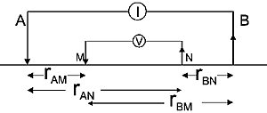
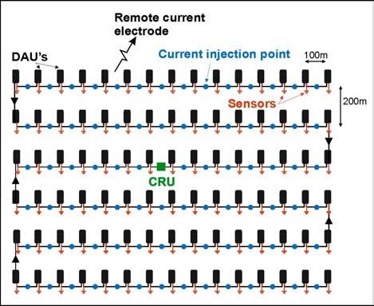
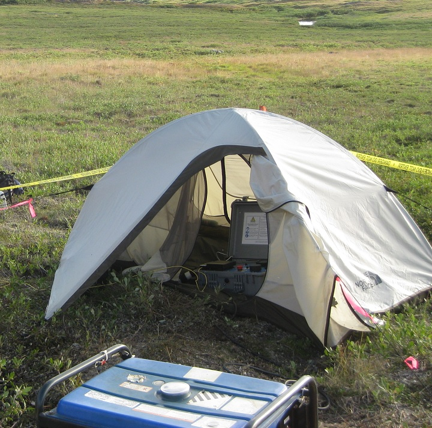
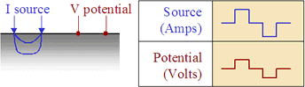
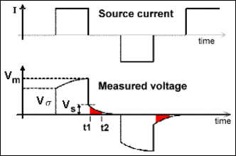
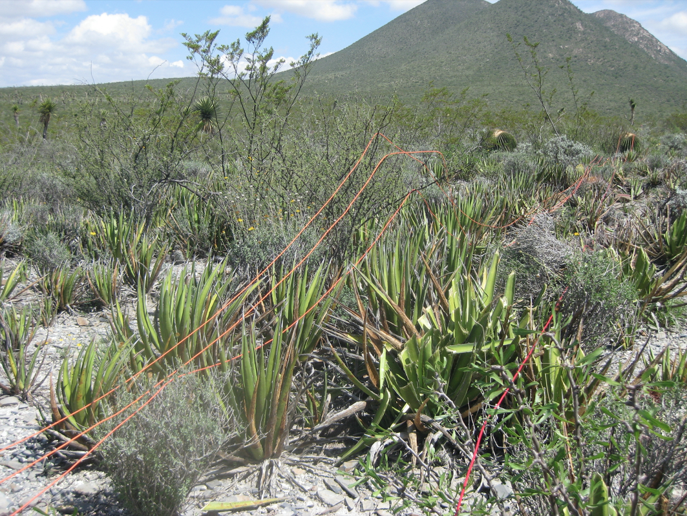

.. _dcr_survey:

Survey
======

.. topic:: Purpose

   To provide an overview of common survey set-ups and instrumentation used in DC resistivity surveys.

Basic Survey Setup
------------------

        The basic DC resistivity array using 4 electrodes. A and B are the current electrodes while M and N are the potential electrodes. Distances between the electrodes are used to calculate the geometry factor and apparent resistivity.

       
The basic DC resistivity (DCR) survey requires a generator that inputs electrical current into the ground and a voltmeter to measure the potential difference between two locations. Some key areas to pay attention to with DC surveys are the various configuarions, each of which delivers a particular focus on different subsurface information. The basic 4-electrode array is shown in Figure :numref:`dcr_surv_5`.

The current waveform provided by the generator can be harmonic (for a frequency-domain survey) or it can have a duty cycle composed of an "on-time" and "off-time".

Survey configurations
---------------------

   Overview of the `MIMDAS layout <http://www.austhaigeophysics.com/A%20Comparison%20of%202D%20and%203D%20IP%20from%20Copper%20Hill%20NSW%20-%20Extended%20Abstract.pdf>`_

There are many geometries of electrodes that can be used in the field. The electrodes can be co-linear or they can be in an arbitrary configuration. Current and potential electrodes can be on the surface or in boreholes. The choice of which survey geometry to use is governed by (1) what conductivity structure is sought, (2) field constraints for laying out electrodes, and (3) which equipment is used.

Modern acquisition systems will populate an area with electrodes and use different pairs as currents and potential electrodes. Figure :numref:`MIMDAS_layout` shows a general schematic showing electrode positions on a grid. This type of survey allows for a large set of current electrodes and potential electrodes by cycling through the different locations.

Traditionally, however, data have been collected using co-linear electrodes. Depending upon the relative placement, the geometries have been given specific names. The interactive figure below shows how electrodes are placed for various named arrays. Electrodes placed on lines imply that the array is usually used for profiling. A circle at the array's center implies that the array is generally expanded symmetrically about its center for acquiring sounding data.

- Profiling provides information about lateral variations, usually with some information about vertical variations. Most profiles involve placing all electrodes on survey lines so that 2D models of the earth's electrical structure can be found. All seven types shown in the interactive Figure 7 can be used for profiling.

- Soundings provide 1D solutions, or vertical structure under one surface location. Electrode geometry is varied summetrically about a single measurement lcoation. The most common configurations for soundings are the Wenner and Schlumberger arrays.

- Combination surveys can provide information from both profiling and soundings.

.. raw:: html
   :file: images/survey_radio_buttons.html

**Three dimensional configurations** of several types exist, in which electrodes are not in line. Example include:

- Equatorial dipole-dipole array, which is used primarily for very shallow work such as archaeological investigations.

- Twin Probe configuration (basically a Wenner Gamma in Figure ?? but with spacing more like dipole-dipole) is also used mainly for very shallow investigations such as archaeological work.

- The so-called E-Scan technique is a pole-pole configuration. However, it is organized by planting a largen number of electrodes all over the area of interest, without trying to stay on grid or on lines. Potentials are recorded at all electrodes and one is used as a current electrode. The survey cycles through each electrode to become a current electrode. This large data set must be inverted in order to obtain interpretable information. The E-Scan technique is expensive and it has been used in the exploration for geothermal energy and minerals.

- Off-line profiling involves moving the current electrodes along one survey line and recording potentials using electrodes planted along a different (usually parallel) line.

- There are also numerous other proprietary or experimental electrode configurations designed for 3D interpretation.

**Azimuthal arrays** are used to investigate the horizontal electrocal anisotropy near the surface. Electrode configurations are usually one of the linear arrays (Wenner, dipole-dipole, etc). However, instead of moving the array along a line (profiling), or expanding it about a central point (sounding), the array is rotated about a central point so that resistivity as function of azimuthal direction can be plotted.

**Borehole work** often involves conceptually similar arrays with sources and receivers in various combinations of surface and down-hole locations.

**Distributed arrays** are composed of receiver electrodes that are deployed and
connected in conventional 2D lines or as a 3D grid network. For any current
electrode position, data is acquired simultaneusly at all receiver locations,
commonly as a time-series. With post-processing and use of the super-position
principle, voltage potentials can be calculated between any of the connected
receiver electrodes. This can create a vast amount of useful data for an
ensuing 3D inversion. An example of a distributed array is the MIMDAS system
shown in :numref:`MIMDAS_layout`.

.. _dcr_instrumentation:

Instrumentation
---------------

   A typical generator hooked up to a transmitter in the field. (Photo: Mike McMillan)

The following section provides some information about the instrumentation used in DC resistivity surveys and what's required for successful data collection. The instrumentation consists of transmitters, receivers, electrodes, and cables.

.. _dcr_transmitters:

**Transmitters:** A generator or battery provides a source of power for the transmitter in
geophysical surveys. A typical example of a generator used for a DC survey would have a power limit of 7500W or
greater. 
For larger scale work, it is possible to obtain transmitters that can source up to 30,000 watts. 
The transmitter sends out a desired current waveform through the
current wire. The electric current and voltage are measured and regulated by
the transmitter controller, and either quantity can be set to a particular
amount within the power limit. An example of a generator hooked up to a
transmitter in the field is shown in :numref:`generator_DC` below.

A typical time-domain waveform for DC resistivity is a two second on, two second off,
half-duty waveform as shown in :numref:`dcr_txwave`. The name comes from the
fact that the current is only running for half of the time. The figure shows
that the current waveform has a two second positive on-time followed by a two-
second off-time, followed by a two-second negative on-time before a final two
second off-time. 

When no chargeable material is present in the ground, the
corresponding voltage curve will mirror that of the current curve. The
positive and negative on-times are done so that any self-potential in the
ground due to natural telluric currents, or currents induced by changing
mangetic fields in the atmosphere, will be cancelled out.  Generally many
cycles of the current waveform are transmitted into the ground in order to
stack many receiver voltage curves to reduce noise in the data. 

        A typical transmitter waveform with a 50% duty cycle. When no chargeable material is present (i.e., no IP effects), the voltage curve mimics the shape of the current waveform.

.. When chargeable material is present the voltage curve will slowly ramp up during the positive on-time and will discharge during the corresponding off-time. The mirror image will happen during the negative on-time and off-time. Once again these curves are stacked to reduce the noise.

.. .. figure:: images/IP_waveform.jpg
   :figwidth: 40%
   :align: right
   :name: IP_waveform

..   A typical transmitter `waveform <http://gpg.geosci.xyz/en/latest/content/induced_polarization/induced_polarization_measurements_data.html>`_

.. The primary voltage, or DC component of the measured voltage is taken before any IP effect has taken place, as noted by :math:`\mathrm{V}_{\sigma}` in :numref:`IP_waveform2`, whereas the IP measurement is taken as an integral beneath the voltage curve between two user defined time points (t1 and t2). The Newmont standard is to take t1 = 450 ms and t2 = 1100 ms.

   `Location of DC and IP measurements along the receiver voltage curve <http://gpg.geosci.xyz/en/latest/content/induced_polarization/induced_polarization_measurements_data.html>`_

.. _dcr_receivers:

**Receivers:** Two receiver electrodes are used to measure the voltage difference in a DC
survey. For DC resisitivity sounding, a simple digital volt meter can be adequate. A more complex system may involve amplifiers, filters, transmitter synchronizing circuits, display, storage, many inputs for simultaneous recording of many potentials, and other features. 

.. Synchronization with the transmitter is essential if IP data are to be gathered, but it is not critical if resistivity information only is to be obtained. IP receivers also must be capable of recording several signal strengths covering several orders of magnitude because signals while the transmitter is on may be several volts, while decay voltages during the transmitter's "off" time may be only a few micro or millivolts. 

   Red current wire (12-gauge) with multiple receiver wires (16-gauge) in orange. (Photo: Mike McMillan)

The voltage potential can be measured between any combination of
receiver electrodes due to super-position theory, as long as the data was
collected simultaneously.

**Electrodes:** In general, current injection and potential measurement electrodes are not interchangeable. However, automated acquisition systems using smaller source currents do employ the same stainless steel electrodes, both for sourcing current and measuring potentials. This becomes more and more difficult as source curretns increase because the ground can become altered by high current densities.

Current electrodes transmit electricity into the ground, and as such they need
good contact with the ground, i.e., low impedance or good contact resistance. 
Stainless steel stakes, shets of foil, wetted (and perhaps salted) ground are all possible approaches to improving contact resistance.  Pouring salty water on the electrodes can help
to improve the contact with the ground, or wrapping the electrode with a
soaked cloth. 

For measuring potentials, low noise, non-polarizing (not necessarily low impedance) electrodes are sought after. Small lead plates buried in the soil will often help achieve this. In more difficult situations, wet electrodes made from porous ceramic jars containing salt solutions are required. It is also common to use lead wire in a lead-
chloride mix or copper wire in a copper-sulphate solution. This eliminates
self potential between the wire and the ground and improves the quality of
the data. An example of a porous pot receiver electrode for a
DC survey with a copper sulphate solution is shown in
:numref:`porous_pot_receiver`.

.. figure:: images/receiver_electrode_porous_pots_receiver.jpg
   :figwidth: 40%
   :align: right
   :name: porous_pot_receiver

   A single porous pot electrode in the ground connected to a receiver. (Photo: Mike McMillan)

**Cables:** For small scale work, some systems are available that use multi-conductor cable, and possible "smart" electrodes that can be switched between input and measurement functions by computer. For large scale work, this is not practical because of the large currents involved (up to a hundred Amps or so in some cases). Multi-conductor cables with individual wires capable of carrying that current would be prohibitively heavy for mineral exploration surveys, wich commonly involve profile lines several kilometers long. However, there are some systems that use mult-conductor seismic cables for the potentials while requiring the normal single, heavy gauge wire for the current source. A typical 12-gauge current wire (red) used for a DC survey is shown in :numref:`current_receiver_wire_DC` along with 16-gauge receiver wires (orange).

