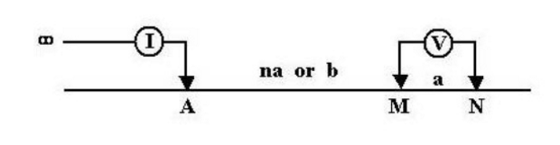

.. _dcr_survey_design:

Survey Design
=============

.. todo::

    Common DC resistivity survey designs
    - pole-dipole
    - Schlumberger array
    - Wenner array
    - Gradient array

    Factors that are important / should be considered
    - ie. Depth of investigation

Common survey layouts
---------------------

**Pole-dipole**: A DC/IP survey using a single current electrode (the second current electrode
is at "infinity" or many kilometers away from the nearest receiver electrode)
and two potential electrodes. Conventionally, for a 2D survey the receiver
electrodes are placed in a linear fashion away from the transmitter electrode
as shown in the figure below.

   `A pole-dipole survey <http://en.openei.org/wiki/DC_Resistivity_Survey_(Pole-Dipole_Array)>`_

**Dipole-dipole**: Similar to a pole-dipole survey except that both current electrodes are
located close to the receiver area. An example of a typical 2D dipole-dipole
survey layout with the plotting convention for a pseudo-section is shown
below.  A pseudo-section is a method for plotting the data using the geometry
of the survey to place the data points. The plotting point is located half-way
between the nearest current electrode and the receiver electrode at a depth of
one-half the horizontal transmitter-receiver separation.

.. figure:: images/pole-dipole_pseudo.jpg
   :scale: 100%
   :align: center

   `A dipole-dipole survey and psuedo-section <http://gpg.geosci.xyz/en/latest/content/DC_resistivity/DC_measurements_and_data.html>`_

**Distributed array** : A distributed array is composed of receiver electrodes that are deployed and
connected in conventional 2D lines or as a 3D grid network. For any current
electrode position, data is acquired simultaneusly at all receiver locations,
commonly as a time-series. With post-processing and use of the super-position
principle, voltage potentials can be calculated between any of the connected
receiver electrodes. This can create a vast amount of useful data for an
ensuing 3D inversion. An example of a distributed array is the MIMDAS system
shown in :numref:`MIMDAS_layout`.

**MIMDAS** :

.. figure:: images/MIMDASlayout.jpg
   :scale: 90%
   :align: center
   :name: MIMDAS_layout

   Overview of the `MIMDAS layout <http://www.austhaigeophysics.com/A%20Comparison%20of%202D%20and%203D%20IP%20from%20Copper%20Hill%20NSW%20-%20Extended%20Abstract.pdf>`_

