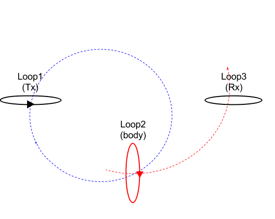

.. _induced_currents_body:

Induced currents in the body
============================

Consider a simple equivalent circuit as shown in :numref:`Concepts_3loops_only`.

Let :math:`\Phi^{p}` be the primary magnetic flux from the transmitter. The body treats like and R-L circuilt.

.. figure:: ./figures/RLcircuit.png
   :align: center
   :scale: 60%
   :name: RLcircuit

   Conceptual diagram of RL circuit.

Electrical impedance of the RL circuit can be written as

.. math::
	Z(\omega) = R + \imath \omega L,

where R and L indicate resistance and inductance, respecitvely.
Using Ohm's law we obtain

.. math::
	V(\omega) = I(\omega) Z(\omega).

Voltage, can be expressed using :math:`\Phi^{p}` as

.. math::
	V = \mathcal{E} = -\frac{\partial \Phi^p}{\partial t} = -\imath \omega \Phi^p

So,

.. math::
	I(\omega) = \frac{V(\omega)}{Z(\omega)} = \frac{-\imath\omega \Phi^p}{R+\imath \omega L}

We can redefine this using time constant, :math:`\tau = \frac{L}{R}`:

.. math::
	I(\omega) = \frac{-\imath\omega \Phi^p}{R+\imath \omega L}

or effectively,

.. math::
	I(\omega) = \frac{-\imath\omega \tau}{1+\imath \omega \tau} \frac{\Phi^p}{L}

The quantity of :math:`\alpha = \omega \tau` is dimensionless, and

.. math::
	I(\omega) = \frac{-\imath \alpha}{1+\imath\alpha}\frac{\Phi^p}{L}.

For small :math:`\alpha`, :math:`I(\omega) \simeq -\imath \alpha = -\imath \omega \tau`, so the current (and magnetic field) increases with frequency.

Consider complex response function, :math:`Q` as

.. math::
	Q = \frac{\imath \alpha}{1+\imath\alpha}
	= \frac{\imath \alpha(1-\imath\alpha)}{1+\alpha^2}
	= \frac{\imath \alpha +\alpha^2}{1+\alpha^2}

- for :math:`\alpha \ll 1\rightarrow` :math:`Q\simeq\imath\alpha` so :math:`I(\omega) \approx -\imath \alpha` (in the resitive limit)
- for :math:`\alpha \gg 1\rightarrow` :math:`Q\simeq\imath\alpha` so :math:`I(\omega) \approx -1` (in the inductive limit)

.. todo::

	Above is not quite right about resistive limit. Let's clarify this.

.. note::
	For low frequencies the response is in the imaginary part, for high frequencies it will be in the real part.

.. todo::

	Add plot for response function (real and imaginary)...

	Make interative phasor diagram ...

Phase of the complex response function can be written as

.. math::
	Phase \ Q = tan^{-1}\Big(\frac{\alpha}{\alpha^2}\Big)
	= tan^{-1}\Big(\frac{1}{\alpha}\Big)
	= tan^{-1}\Big(\frac{1}{\omega\tau}\Big)
	= tan^{-1}\Big(\frac{R}{\omega L}\Big)

We consider Faraday's law :math:`\nabla \times \vec{E} = -\imath\omega\vec{B}`, then recoginze factor of :math:`-\imath\omega`, which makes a lag of phase (:math:`-\frac{\pi}{2}`) in the induced current:

.. math::
	\psi = -\frac{\pi}{2} - tan^{-1}\Big(\frac{R}{\omega L}\Big)

So the phase of the current vary with frequency. At low frequencies the information aboutthe conductor is in the quadarature (imaginary part) portion, at high freuquencies it is in out-of-phase (real part) portion.

- Question: If we replace the loop by a body

.. todo::
	Add box figure with finite length

