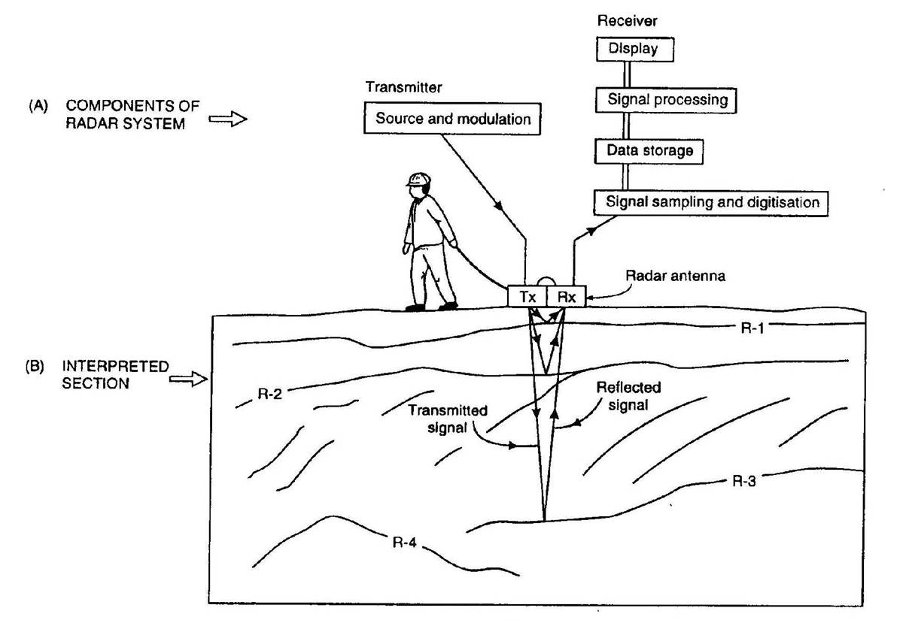
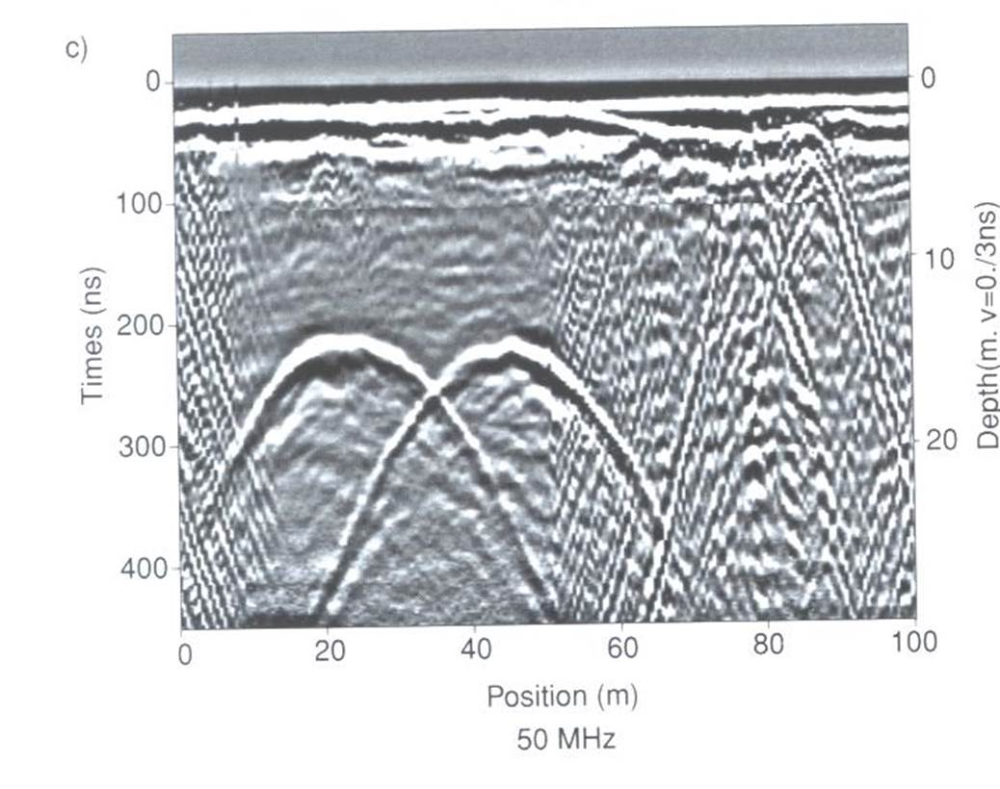
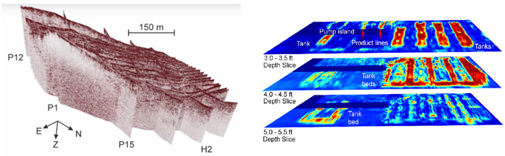
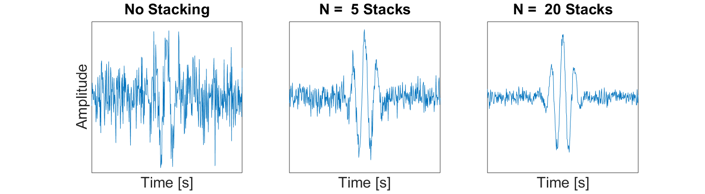
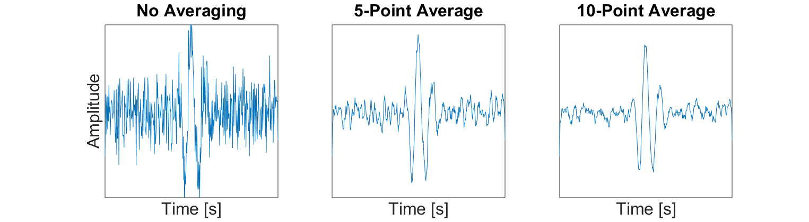
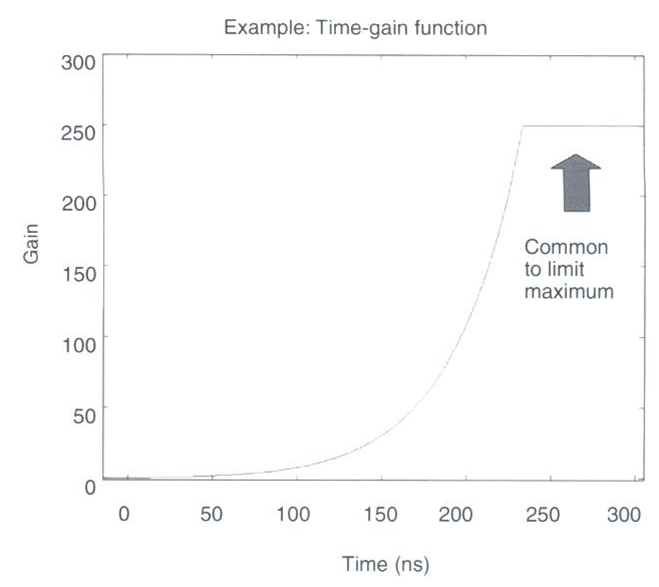
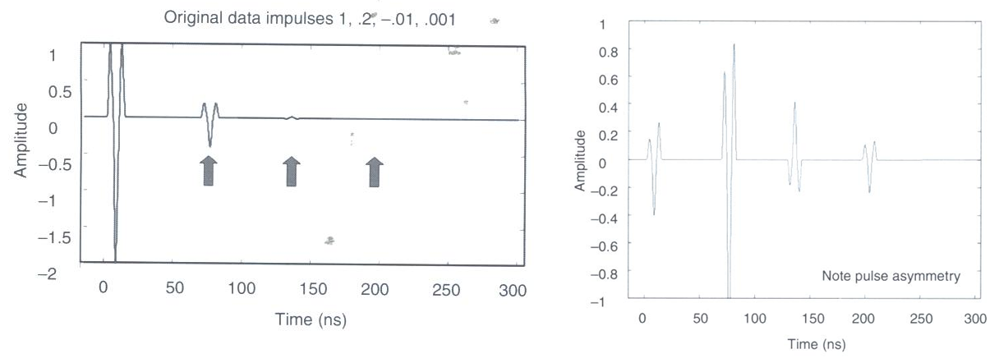

.. _gpr_csem_data:

Data
====

    Schematic of a zero-offset GPR setup.

During GPR surveys, a source antenna (Tx) is used to send a pulse of radiowaves (10 MHz to 2.6 GHz) into the ground. As the radiowave signal propagates through the Earth, it is distorted as a result of the Earth’s electromagnetic properties. At boundaries where the subsurface electromagnetic properties change abruptly, radiowave signals undergo transmission, reflection and/or refraction. Distorted radiowave signals are then measured by the receiver antenna (Rx).

**What is measured:** Receiver antennas are sensitive to the electric fields carried by radiowave signals and act as transducers, converting incoming GPR signals into electrical current. The induced current produces a corresponding voltage which is then recorded. Ultimately GPR receivers measure the amplitude and polarization of incoming radiowave signals as a function of time. The change in amplitude and polarization of radiowave signals occurs as they are distorted by propagating through the Earth. Because the raw data are eventually normalized, the units are not particularly important.

**Measurement duration:** Radiowave signals for GPR propagate through the Earth at velocities comparable to the speed of light (c :math:`\approx 3.0 \times 10^8` m/s) and travel relatively short distances (metres to 10s of metres). As a result, the total travel times for GPR signals as they propagate from the transmitter antenna to the receiver antenna are very short. The time series collected for a single GPR shot typically lasts up to a few hundred nanoseconds after the signal is generated. However for GPR surveys meant to image very near to the surface (resulting in shorter travel times), data are collected for a shorter period after the transmitter emits the GPR signal.

Because GPR measurements for a single shot are so short, they can be repeated many times for the same trasmitter-receiver pair at the same location (sounding). This allows the quality of GPR data to be improved by stacking (link).

Visualization
-------------

2D Visualization: Radargram
***************************

    Radargram showing hyperbolic signatures from two buried pipes.

To gain insight regarding buried structures, GPR measurements are performed at multiple locations using a particular survey configuration; notable survey configurations were discussed here (link). For common offset and common midpoint surveys, data are typically collected along one or more 2D profiles. By amalgamating the data, we can generate a radargram for each profile.

The horizontal axis (distance) is used to represent the location of the receiver relative to the transmitter for a particular sounding. The vertical axis shows the total travel times of measured signals. By assuming some a-priori knowledge of the radiowave velocity, the vertical axis is sometimes represented by an approximate depth. The gray-scale denotes the amplitude of the returning signal at each time and location.

3D Visualization
****************

GPR data can be visualized in 3D if it is collected along multiple profile lines. Below we see two examples. On the bottom left, we see an example from the Furggwanghorn (link) case history. Here, each 2D profile is plotted separately. On the bottom right, we see GPR data collected over several buried storage tanks. These data were interpolated. The image shown is of several horizontal slices.

    (Left) Multiple radargrams collected over a glacier. (Right) Interpolated radargram data over a set of buried storage tanks.

Processing
----------

Before raw data can be represented as a final radargram image, several processing steps are usually required. These are summarized below:

Stacking
********

Stacking describes the process of averaging a set of repeated GPR shots in order to reduce noise and improve interpretation.
Essentially, stacking acts as a way of improving the signal to noise ratio for GPR data collected at a certain location.
An example of this is demonstrated below.
As we can see, the more readings we stack, the clearer we see coherent GPR signals.

	
	Example of how averaging multiple traces from the same Tx-Rx pair can improve the signal to noise ratio. This results in an improved image of the returning signal.

Smoothing
*********

Smoothing is another technique used to improve the interpretation of field collected GPR data.
In GPR systems, the data sampling rate is such that the returning wavelet signals should be reasonably smooth and visible.
Random noise on the other hand is completely incoherent.
When smoothing is applied to the data, it has the effect of reducing the amplitude of incoherent noise while retaining naturally smooth signals in the data.
One example of smoothing techniques is the moving average (shown below).
We can see that as more data points in time are used for the average, the more easily recognizable the wavelet signal is.

	
	Example of smoothing a trace by using a moving average.

Gain Correction
***************

	
	Example gain function which corrects for a loss in signal strength at later times.

Signals measured at earlier times are much stronger than signals which are measured at later times.
This may be due to scattering, attenuation, geometric spreading or reflection/transmission events.
As a result, it may not be easy to distinguish important features in the data at later times.
To account for this, the raw data :math:`d_{raw}(t)` for each reading is multiplied by a gain function :math:`g(t)` as follows:

.. math::
	d(t) = g(t) \times d_{raw}(t)

where :math:`d(t)` is the data represented in the radargram.
The gain function itself is a positive function which increases in magnitude as a function of time.
Thus a larger gain is applied to raw data at later times.
An example of the gain function is shown on the right.
As we can see, the gain function increases in value exponentially to account for the exponential loss in return signal strength over time.
However, the gain function is generally bounded by a maximum value.

	
	(Left) Single trace before gain correction. (Right) Single trace after gain correction.

The strength of returning signals is also much weaker at distances further away from the source.
Because of this, gain corrections may be applied based on Tx-Rx distance.
This is not necessary for common offset surveys, but may be important in common midpoint or transillumination surveys.

