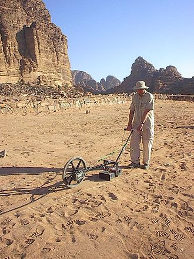

.. _gpr_csem_index:

Ground Penetrating Radar
========================

.. raw:: html
    :file: ../../../underconstruction.html

Motivation
----------

    Archaeological GPR survey in Jordan. `Image source <https://commons.wikimedia.org/wiki/File:Radarsurvey.jpg>`__ .

Ground penetrating radar (GPR) is an electromagnetic method used for very near surface applications; metres through 10s of metres. It is sometimes referred to as echo-sounding. GPR exploits contrasts in electromagnetic properties (dielectric permittivity, electrical conductivity and magnetic permeability) in order to define the physical boundaries of shallow structures (both natural and man-made). GPR is ideal for near-surface applications because it provides higher resolution images than methods such as FDEM, TDEM and magnetotellurics. Depending on the application, various transmitter-receiver configurations can be used. GPR systems can also be mounted to helicopters or placed in boreholes.

Basic Idea
----------

During GPR surveys, a source antenna (Tx) is used to send a pulse of radiowaves (10 MHz to 2.6 GHz) into the ground. As the radiowaves propagate through the Earth, they are distorted as a result of the Earth’s electromagnetic properties. At boundaries where the subsurface electromagnetic properties change abruptly, radiowave signals undergo transmission, reflection and/or refraction. Sensors (Rx) at the Earth’s surface measure the amplitudes and travel times of distorted signals returning to the surface. This information is then used to image discrete targets and physical boundaries.

.. figure:: images/GPR_schematic_example.jpg
    :align: center
    :figwidth: 75%

    Schematic of a zero-offset GPR setup.

Applications
------------

As mentionned previously, GPR is used for very near-surface applications. Because of this, GPR is generally used to perform very localized surveys. Some applications of GPR include:

    - Investigating concrete structures and roads
    - Mapping the layered structures of peat-bogs, sedimentary sequences and glacial environments
    - Obtaining the depth to groundwater or permafrost
    - Locating buried infrastructure such as irrigation pipes, tunnels and electrical wires
    - Finding land mines and unexploded ordnance

**Contents**

.. toctree::
    :maxdepth: 1

    physics
    survey
    data
    interpretation
    survey_design
    practical_considerations

**Related Case Histories**

	- :ref:`Furggwanghorn: 3D helicopter GPR surveying of a rock glacier <furggwanghorn_index>`

