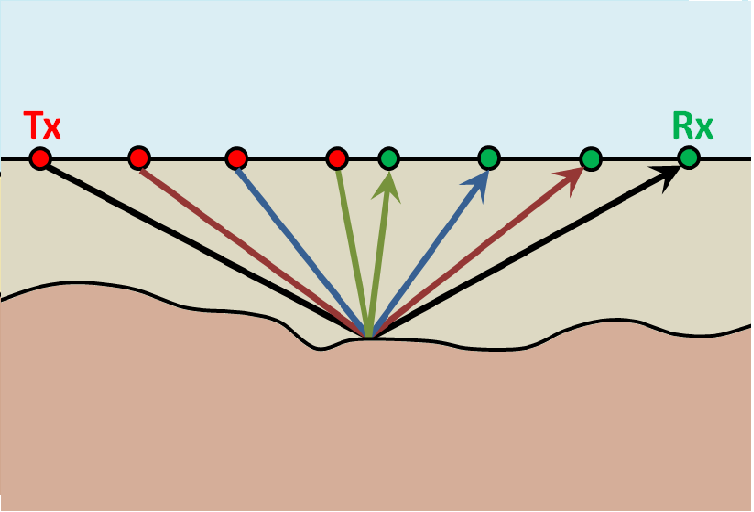
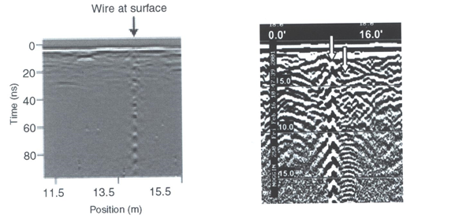

.. _gpr_interpretation:

.. purpose::
	
	Here, some basic interpretation techniques for GPR data are discussed. As we will show, the responses from particular structures result in diagnostic signatures within radargram data.

Interpretation
==============

Hyperbolic Signatures
---------------------

In radargram data, hyperbolic signatures are important indicators of subsurface features. For zero-offset surveys, hyperbolic signatures indicate discrete reflectors. For common midpoint surveys, hyperbolic signatures indicate horizontal interfaces.

Zero-Offset Surveys: Buried Compact Objects
*******************************************

Below we see the geometry for a zero-offset survey and the corresponding radargram.
We will show how the geometry of the problem and the radargram can be used to resolve the locations of pipes and blocky objects.

.. figure:: images/GPR_compact_objects.png
	:align: center
	:figwidth: 100%

        (Left) Problem geometry showing a buried pipe and a block. (Right) Corresponding radargram for the problem geometry.

**Defining the Travel Time**

In GPR, a **thin pipe** will act as a point reflector.
According to the geometry of the problem, the total travel time of the GPR signal as it reflects off the pipe is given by:

.. math::
	t_p = \frac{2 L_2}{V} = \frac{2 \sqrt{ (x - x_p)^2 + d^2}}{V}

where :math:`V` is the propagation velocity (light gray region) and :math:`d` is the depth to the pipe.
As we can see in the radargram, the arrival times for a compact object form a hyperbola.
When we are directly above the pipe (:math:`x = x_p`), the total travel time is smallest and equal to:

.. math::
	t_p (x_p) = \frac{2 d}{V}

For the **block**, things are a little more complicated.
Above the face of the block (:math:`x_L` = 6 m to :math:`x_R` = 16 m), the signal measured by the receiver reflects directly.
However, the return signal at locations outside the margins of the block occur on the points.
As a result, the total travel time for reflected signals off the block are given by:

.. math::
	t_b = \begin{cases} \dfrac{2 \sqrt{(x-x_L)^2 + h^2}}{V} \;\;\; &\textrm{for} \;\;\; x < x_L \\
	\dfrac{2h}{V} \;\;\; &\textrm{for} \;\;\; x_L \leq x \leq x_R \\
	\dfrac{2 \sqrt{(x-x_R)^2 + h^2}}{V} \;\;\; &\textrm{for} \;\;\; x > x_R \end{cases}

where :math:`h` is the depth to the top of the block.
As we can see from the previous equation, we expect to see a flat feature the block's radargram signature.
Then on either size of the block, the radargram signature resembles one-half of a hyperbola.

**Resolving Buried Objects**

In order to locate buried objects, we first need to use the radargram to obtain a velocity for the medium.
Let us first consider the **pipe**.
The total travel time for the reflected GPR signal is given by:

.. math::
	t_p = \frac{2 L_2}{V} = \frac{2 \sqrt{ (x - x_p)^2 + d^2}}{V}

When we are directly over the pipe, we will have a minimum travel time equal to (blue dashed line):

.. math::
	t_0 = \frac{2d}{V}

By combining the previous two equations, we see that:

.. math::
	V = 2 \sqrt{\dfrac{(x - x_p )^2}{t^2 - t_0^2}}

where (:math:`x`, :math:`t`) represents are arbitrary point on the hyperbolic signature within the radargram.
Given that :math:`t_0` and :math:`x_p` can be obtained directly from the radargram, **any other point** on the hyperbola can be used to determine the propagation velocity of the medium.
Once :math:`V` is determined, the definition of :math:`t_0` can be used to determine the depth of the object.

Notice that at large offset distances from the horizontal location of the pipe (i.e. when :math:`x - x_p \gg d`), the travel time for the pipe becomes:

.. math::
	t_p = \frac{2 L_2}{V} \approx \frac{2 }{V} \Bigg ( (x - x_p) + \frac{1}{2} d \Bigg ) \;\;\; \textrm{for} \;\;\; \Delta x_2 \gg d

Therefore, each end of the hyperbolic signature has a slope :math:`m = \pm 2/V` (red dashed lines).
The slope on the radargram can ultimately be used as a crude approximation for the medium velocity.

For the **block**, notice that for locations to the left and to the right of the block the total travel time behaves like a hyperbola.
Therefore, we can use the same approach as before.
The only difference is that :math:`x_p` is replaced by either :math:`x_L` or :math:`x_R`; which depends on the side of the block's signature you use.

Common Midpoint Survey: Horizontal Interface
********************************************

	
		Common midpoint survey configuration.

For a horizontal interface, the total travel time of the signal is given by:

.. math::
	t = \frac{2 \sqrt{ \Delta x^2 + d^2 }}{V}

where :math:`d` is the thickness of the top layer and :math:`\Delta x` is the distance between the mid-point and either the transmitter or the receiver.
Once again by defining :math:`t_0 = 2d/V`, the top-layer velocity is given by:

.. math::
	V = 2 \sqrt{ \dfrac{x^2}{t^2 - t_0^2} }

Thus, **any point** on the parabola can be used to determine the top-layer velocity from a common mid-point survey.
And once :math:`V` is determined, the definition of :math:`t_0` can be used to obtain the thickness of the top layer.
As we can see, the same method used to resolve discrete objects for zero-offset surveys can be used on horizontal interface for common midpoin surveys.

.. _gpr_interpretation_WARR:

WARR Surveys
------------

.. sidebar:: WARR Surveys

	.. figure:: images/GPR_wave_paths_diagram.png

	    Signal path

	.. figure:: images/GPR_radargram_2layer_example.png

		Radargram

As we can see on the right, there are many paths in which radiowave signals can take in order to reach a receiver (Rx) at offset distance :math:`x`.
Below this image is the corresponding radargram for a 2-layer Earth.

**Path 1: Direct Air Wave**

This wave travels through the air in a direct line from the transmitter to the receiver.
In the air, radiowaves propagate at roughly the speed of light (:math:`c = 3.00 \times 10^8` m/s).
The direct air wave is **always** the first signal to reach the receiver.
The time it takes the air wave to reach the receiver is given by:

.. math::
    t_{air} = \frac{x}{c}

The direct wave is shown in **red** on the radargram.
According to the above equation, the velocity of the air wave is 1 divided by the slope of this line.

**Path 2: Direct Ground Wave**

This wave travels along the surface interface at velocity :math:`V_1`.
Like the air wave, the ground wave also takes a direct path.
Because :math:`V_1 < c`, the ground wave arrives later than the air wave.
The time it takes for the ground wave to reach the receiver is given by:

.. math::
    t_{ground} = \frac{x}{V_1}

The direct ground wave is shown in **pink**.
Like the air wave, the direct ground wave velocity can also be obtained from the slope of the line.

**Path 3: Reflected Wave**

The reflected wave travels through medium 1 at velocity :math:`V_1`.
Because it takes a longer path than the direct ground wave, it arrives later.
The time it takes for the reflected wave to reach the receiver is given by:

.. math::
    t_{ref} = \frac{\sqrt{x^2 + 4h^2}}{V_1}

The reflected wave is shown in **green**.
Unlike direct waves, the arrival time for the reflected wave is hyperbolic, which makes it distinguishable from other signals.
After sufficient distances (:math:`h \ll x`), the previous equation becomes approximately linear.
This portion of the curve can be used to estimate the velocity of the top-most layer.
Notice how the slope of the direct ground wave and reflected wave are parallel.

**Path 4: Critically Refracted at Surface**

This ray path is denoted in **blue**.
Because :math:`V_1 < V_0`, reflected waves are critically refracted at the surface.
While this wave propagates along the surface interface, it will have a velocity of roughly the speed of light.
In general, the time it takes for this wave to reach the receiver is given by:

.. math::
    t_c = \frac{x}{c} + \textrm{Constant}

Notice that the arrival time for the critically refracted wave is linear.
In this radargram example, we cannot easily see the critically refracted wave.
However, it does not mean that the critically refracted wave does not exist.

Ringing
-------

Ringing is a form of noise which negatively impacts the interpretation of radargram data.
Ringing occurs when radiowave signals reverberate in regular fashion.
It is created when GPR signals repeatedly bounce within or between nearby objects.
If strong ringing occurs, the returning signal from a particular interface(s) will not be 'sharp' in the radargram. Instead it becomes present over all times. Two examples of ringing are shown below. As we can see, data for a particular offset is completely contaminated by the ringing signal.

		
	(Left) Radargram showing ringing from a small metal wire near the surface. (Right) Ringing from two nearby objects.

