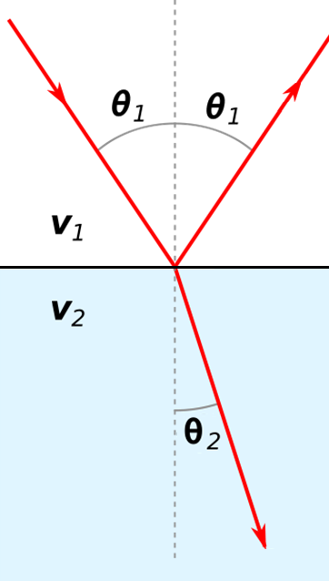
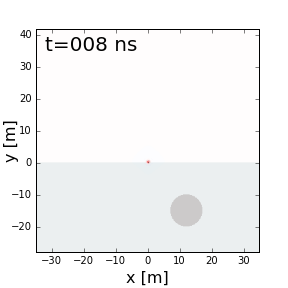
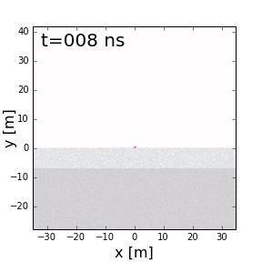

.. _gpr_physics:

.. purpose::
	
	Here we discuss the physical principles in which GPR is founded.

Physics
=======

.. figure:: images/GPR_schematic_example.jpg
    :align: right
    :figwidth: 55%
    :name: fig_physics_GPR_schematic

    Basic diagram for a GPR survey.

As explained on the previous page, the source transmitter (Tx) sends a pulse of radiowaves into the ground. For practical purposes, the source may be considered an electrical current dipole (link). As the radiowaves propagate through the Earth, they are distorted as a result of the Earth’s electromagnetic properties. At boundaries where the subsurface electromagnetic properties change abruptly, radiowave signals undergo transmission, reflection and/or refraction. The fundamentals of this were presented in (link). Sensors (Rx) measure the amplitudes and travel times of radiowave signals that have been distorted by the Earth. A 2D simulation can be seen `here <https://www.youtube.com/watch?v=eqfgP4qVK4s>`__ .

Properties of Radiowave Signals
-------------------------------

As we will show in :ref:`survey design <gpr_survey_design>`, knowning certain properties of the radiowave signal is beneficial. Several important properties of radiowaves are discussed below. More detail can be found `here <http://gpg.geosci.xyz/content/GPR/GPR_fundamental_principles.html>`__ .

Propagation Velocity
********************

Radiowaves propagate through different materials at different speeds.
The propagation velocity of the Earth directly effects the arrival times of GPR signals.
The velocity of the radiowaves depends on the physical properties of the medium.
In general, the velocity of radiowaves through a homogeneous material is given by:

.. math::
    V = \sqrt{\frac{2}{\mu \varepsilon}} \Bigg [ \Bigg ( 1 + \bigg ( \frac{\sigma}{\omega \varepsilon} \bigg )^2 \, \Bigg )^{1/2} \; + 1 \; \Bigg ]^{-1/2}

This equation can be used to show that the radiowave velocity is largest in free-space (i.e. when :math:`\sigma = 0`, :math:`\mu = \mu_0` and :math:`\varepsilon = \varepsilon_0`).
Therefore, electromagnetic waves in matter travel slower than the speed of light (c = 3.00 :math:`\times 10^8` m/s).

GPR signals are characterized as being high-frequency.
Thus in many cases (and for this course), it is safe to assume that :math:`\sigma \ll \omega \varepsilon`; especially if the Earth is resistive.
This is known as the **wave regime approximation**.
Using the approximation, and assuming the Earth is non-permeable (:math:`\mu = \mu_0`), the velocity of radiowaves can be simplified to:

.. math::
    V \approx \frac{1}{\sqrt{\mu_0 \varepsilon}} = \frac{c}{\sqrt{\varepsilon_r}}

where :math:`\mu_r` is the relative permeability and :math:`\varepsilon_r` is the relative permittivity.

Skin Depth
**********

Skin depth (:math:`\delta`) defines the propagation distance at which the amplitude of an electromagnetic wave is reduced by a factor of :math:`1/e`; i.e. reduced to 37\% of its original amplitude. Skin depth determines the penetration depth for GPR systems. The skin depth is given by:

.. math::
    \delta = \sqrt{\frac{2}{\omega^2 \mu \varepsilon}} \Bigg [ \Bigg ( 1 + \bigg ( \frac{\sigma}{\omega \varepsilon} \bigg )^2 \Bigg )^{-1/2} - \; 1 \; \Bigg ]^{1/2} 

If we assume the Earth is non-permeable (:math:`\mu = \mu_0`), then two convenient approximations exist for the skin depth:

.. math::
	\delta \approx \begin{cases} 503 \sqrt{\dfrac{1}{\sigma f}} \; \; &\textrm{for} \; \; \omega \varepsilon \ll \sigma \\ 0.0053 \dfrac{\sqrt{\varepsilon_r}}{\sigma}  \; \; &\textrm{for} \; \; \sigma \ll \omega \varepsilon \end{cases}

Where :math:`f` is the transmitter's operating frequency in Hz.

Transmission, Reflection and Refraction
***************************************

**Transmission and Reflection**

.. figure:: images/normal_incidence_reflection.gif
    :align: right
    :figwidth: 35%
    
    Reflection of an incident wave with a reverse in polarity (:math:`\varepsilon_1 <\varepsilon_2`). `Link to source image <https://commons.wikimedia.org/wiki/File:Partial_transmittance.gif>`__ .

The transmission, reflection and refraction of radiowave signals is most easily understood by considering plane-waves; which were discussed :ref:`here <fresnel_equations>`. The behaviour of GPR signals at interfaces is strongly dependent on the dielectric properties accross the boundary. For GPR signals arriving at normal incidence, the transmission and reflection coefficients are simplified to:

.. math::
    R = \frac{\textrm{Reflected Amplitude}}{\textrm{Incident Amplitude}} = \frac{\sqrt{\varepsilon_1} - \sqrt{\varepsilon_2}}{\sqrt{\varepsilon_1} + \sqrt{\varepsilon_2}}

and

    Reflection and refraction of an incoming radiowave.

.. math::
    T = \frac{\textrm{Transmitted Amplitude}}{\textrm{Incident Amplitude}} = \frac{2 \sqrt{\varepsilon_2}}{\sqrt{\varepsilon_1} + \sqrt{\varepsilon_2}}

**Refraction**

The refraction of GPR signals can be understood using :ref:`Snell's law <snells_law>`: 

.. math::
    \frac{\textrm{sin}\theta_1}{V_1} = \frac{\textrm{sin}\theta_2}{V_2}

For radiowaves in resistive and non-magnetic media, the propagation velocity is equal to :math:`V = c/ \! \sqrt{\varepsilon_r}` (shown earlier).
In this case, Snell's law can be expressed as:

.. math::
    \sqrt{\varepsilon_1} \, \textrm{sin}\theta_1 = \sqrt{\varepsilon_2} \, \textrm{sin}\theta_2

where :math:`\varepsilon_1` and :math:`\varepsilon_2` are relative permittivities.

Example: Layered Earth
----------------------

.. figure:: images/LayeredEarth.gif
    :align: right
    :figwidth: 40%

    GPR signal as it propagates through a 2-layer Earth.

GPR can be used to resolve layered structures within the Earth. On the right, we show radiowave signals undergoing reflections and transmissions due to differences in dielectric permittivity (:math:`\varepsilon_{r,0} = 1`, :math:`\varepsilon_{r,1} = 4` and :math:`\varepsilon_{r,2} = 8`). From this example we can see several things:

    - GPR signals propagate faster in mediums where the dielectric permittivity is lower.
    - The wavelength of GPR signals is larger in mediums where the dielectric permittivity is lower.
    - As a portion of the signal is transmitted from a more dielectric material to a less dielectric material (ground to air), refraction causes the signal to spread out.

Example: Buried Conductor
-------------------------

    GPR signal as it reflects off a highly conductive object.

Many target objects relevant to GPR (buried pipes, landmines, etc...) are highly conductive. When radiowaves reach highly conductive objects, the radiowave signal experiences a near-perfect reflection. This results in a strong reflected signal which can be measured by one or more receivers. Returning signals from buried conductors result in distinct geophysical signatures which can be interpreted from GPR data.

The reflection of a GPR signal as it reaches a highly conductive body is shown on the right. Notice that because there is a perfect reflection, none of the signal propagates through the conductive body.

Scattering
----------

    Scattering of GPR signals due to non-uniform physical properties in each layer.

Scattering is used to describe deviations in the paths of electromagnetic waves due to localized non-uniformities; which are less than 1/4 the wavelength of the radiowave signal. Scattering is problematic for GPR because it reduces the amplitudes of useful signals while increasing extraneous noise. It also make the interpretation of GPR data more challenging. Several sources of scattering are:

    - Irregular surface shape of larger buried objects.
    - Rocky soils, which are a large contributor to the scattering of GPR signals.
    - Gas bubbles trapped in ice.
    - Clutter made up of small buried objects

|
|

