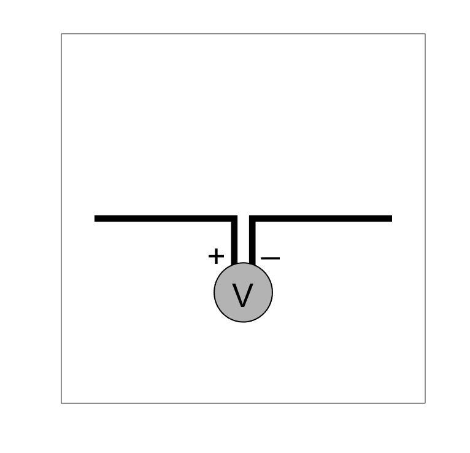
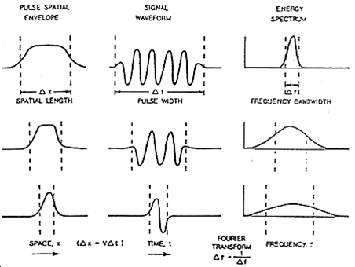

.. _gpr_survey:

.. purpose::
	
	Here, we provide an overview of the instruments used to conduct GPR surveys. The transmitter and receiver are described. The source signal generated by the transmitter is also discussed. We then describe the most common transmitter-receiver configurations used in practical surveys.

Survey
======

GPR surveys use radar antennas to transmit and receive radiowave signals. GPR systems are usually comprised of a single transmitter-receiver pair. However, configurations with multiple transmitters and receivers do exist. The orientation and spacing of the transmitter and receiver depend on the application, as does the primary signal generated by the transmitter. These aspects, as they pertain to instrumentation, are discussed here. Aspects involving survey design are discuss here (link).

	- **Add image of transmitter antenna for broadband dipole and bow-tie**

The Source and Receiver
+++++++++++++++++++++++

Transmitter Antennas
--------------------

		Basic open circuit.

GPR transmitter antennas generally consist of an open circuit which carries an oscillating current of short duration, otherwise known as a wavelet. The current carried within the antenna is responsible for generating a pulse of radiowaves; which is also a wavelet signal. If the transmitter antenna is sufficiently small, then it may be treated as an electrical current dipole (link). GPR transmitter antennas generate signals with very high frequency content (10 :math:`\!^5` - 10 :math:`\!^9` Hz). Ultimately the characteristics of the GPR signal depends on the wavelet, its frequency content and the shape of the transmitter antenna.

Receiver Antennas
-----------------

For GPR, measurements are made by a receiver antenna. Whereas transmitter antennas are transducers which convert electrical current into radiowave signals, receiver antennas are transducers which convert radiowave signals into electrical current. Because GPR receiver antennas are designed to effectively measure radiowave signals generated by the transmitter antenna, GPR systems are designed to use near-identical antennas for the transmitter and receiver. For some systems, the same antenna is used to transmit and receiver radiowave signals.

.. sidebar:: Source Wavelet Signals

	.. figure:: images/GPR_wavelet_example.png
		:align: center
		:figwidth: 100%
		
		Tx Current Wavelet
	
	.. figure:: images/GPR_wavelet_frequencies_example.png
		:align: center
		:figwidth: 100%
			
		Wavelet Bandwidth

Transmitter Source Signal
+++++++++++++++++++++++++

The current which flows through the transmitter antenna can be described as a wavelet. The duration and frequency content of the current wavelet also characterizes the duration and frequency content of the radiowave signal emitted by the transmitter. Some important properties of wavelets are defined as follows:

	- **Wavelet**: A wave-like oscillation of short duration.
	- **Pulse Width**: The time duration of the wavelet.
	- **Bandwidth**: The range of frequencies present in the source wavelet.
	- **Central Frequency**: The central frequency corresponding to the bandwidth. Sometimes called the operating frequency.
	- **Spatial Length (wavelength)**: The physical length of the wavelet signal while it propagates through a medium.

Although GPR transmitters emit a time-dependent pulse of radiowaves, transmitter antennas are defined by their operating frequency. In general, the pulse width (:math:`\Delta t`) and operating frequency (:math:`f_c`) are related by the following equation:

.. math::
	\Delta t \approx \frac{1}{f_c}

Thus higher frequency radiowave signals are contained within shorter wavelets. We also expect shorter wavelet signals to have shorter spatial lengths. In order to make shorter pulse lengths however, a larger band of frequencies is required. The previous points are summarized in the image below. As we will discuss in survey design (link), the choice in pulse width (or operating frequency) is very important.

			
		Pulse length, frequency content and bandwidth for wavelet signals.

.. sidebar:: GPR Antennas

	**Dipole Antenna**

	.. figure:: ./images/AntennaDipole.png
		:align: center

	**Broadband Dipole Antenna**

	.. figure:: ./images/AntennaBroadband.png
		:align: center

	**Bow-Tie Antenna**

	.. figure:: ./images/AntennaBowTie.png
		:align: center

Antenna Types
-------------

There are a variety of transmitter antennas used for GPR. Below are several commonly used varieties:

**Dipole Antenna:** Dipole antennas are the most straightforward transmitter used for GPR. Dipole antennas generally consist of two bilateral conductive rods. The efficiency of dipole antennas is strongly dependent on their length. Dipole antennas are most efficient when their total length :math:`L` is a multiple of the operating frequency's corresponding half-wavelength, i.e.:

.. math::
	L \approx \frac{n}{2 f_c} = \frac{n \lambda}{2}

In these cases, the electrical current creates standing waves in the transmitter antenna. Dipole antennas for GPR are designed to have a length which works well for a particular operating frequency. Dipole antennas for GPR typically have lengths of 10s of centimetres up to a few metres.

**Broadband Dipole Antenna:** Dipole antennas can be made more broadband by increasing the width of the conductive rods or by using elongated conductive plates. By making the antennas sufficiently broadband, we can more effectively transmit the entire frequency content contained within the source wavelet signal. This antenna type is best used for operating frequencies below 250 MHz. 

**Bow-Tie Dipole Antenna**: Bow-tie antennas consist of two symmetrically oriented flat conductors. Bow-tie dipole antennas were designed to operate at freqencies between 100 MHz and 1 GHz. Bow-tie transmitters are a form of wide-band antenna; which is able to more effectively transmit signals with larger bandwidths compared to dipole antennas. As a result, bow-tie antennas are superior when transmitting short wavelength high frequency radiowave signals. This antenna type tends to have dimensions on the order of 10s of centimetres; making them more compact than broadband dipole antennas used for GPR.

Survey Configurations
+++++++++++++++++++++

The transmitter-receiver configuration used for a GPR survey is strongly dependent on the application. This will be discussed in detail in survey design (link). Below are the most commonly used transmitter-receiver configurations for GPR.

Common-Offset and Zero-Offset
-----------------------------

	.. figure:: images/GPR_common_offset.png
		:align: right
		:figwidth: 40%

        	Common offset survey configuration.

Common offset surveys are the most frequently used configuration for GPR surveys.
In common offset survey, the distance between the transmitter and a single receiver is fixed.
Data are collected each time the transmitter-receiver pair are moved to a new position.
In some cases, the transmitter and receiver are placed at a zero-offset; otherwise known as a coincident source and receiver.

Common-offset surveys are effective for locating the depths of horizontal interfaces.
In addition, zero-offset surveys are very affective a locating pipes, tunnels and compact buried objects; as they generate hyperbolic signatures in radargram data.

    .. figure:: images/GPR_common_midpoint.png
		:align: right
		:figwidth: 40%
	
		Common midpoint survey configuration.
		

Common Midpoint
---------------

For this configuration, the distance between the transmitter and receiver are changed for every reading.
However, the halfway point between the transmitter and the receiver is kept the same.
From the survey schematic, we see that if the interface is approximately flat, the point of reflection is the same for all readings.
Common midpoint surveys are useful for determining the velocity and thickness of horizontal sedimentary layers.

Transillumination Survey
------------------------

	.. figure:: images/GPR_survey_transillumination.jpg
		:align: right
		:figwidth: 40%
	
		Transillumination surveys. (A) Mine-shaft structural integrity (B) Borehole survey. (C) Concrete pillar testing.

When performing a transillumination GPR survey, multiple transmitters and receivers are placed on either side of an region of interest.
There are many applications for transillumination surveys, some of which are mentioned here.

In panel (A), a transillumination survey is being used to assess the structural integrity between two mine shafts.
By using GPR, we can determine if there are void spaces between the mine shafts or any potential planes of weakness.
The information collected can be used to assure the mine shaft is safe.

In panel (B), we see a transillumination borehole survey.
In some cases, a surface survey may not supply sufficient information about a particular region of interest.
Although it is more expensive and time-consuming, this type of survey may be required.

In panel (C), a GPR transmitter and receiver are placed on opposing sides of an object; in this case, a concrete pillar.
This represents a non-invasive approach for determining internal structures.

Commonly Used GPR Systems
+++++++++++++++++++++++++

