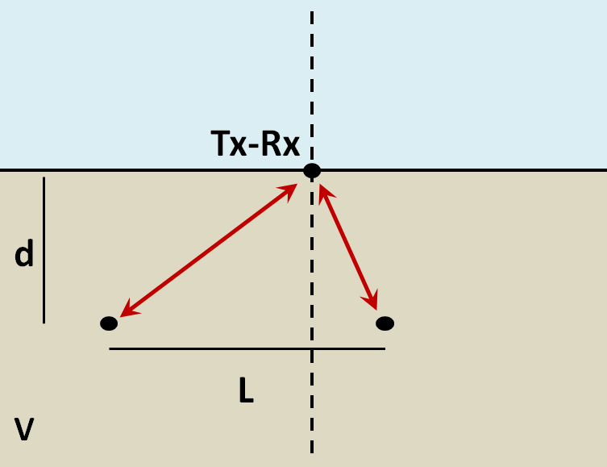
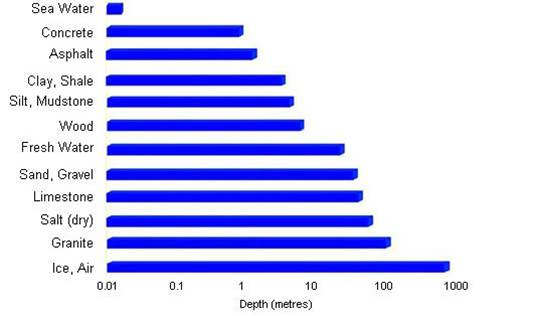
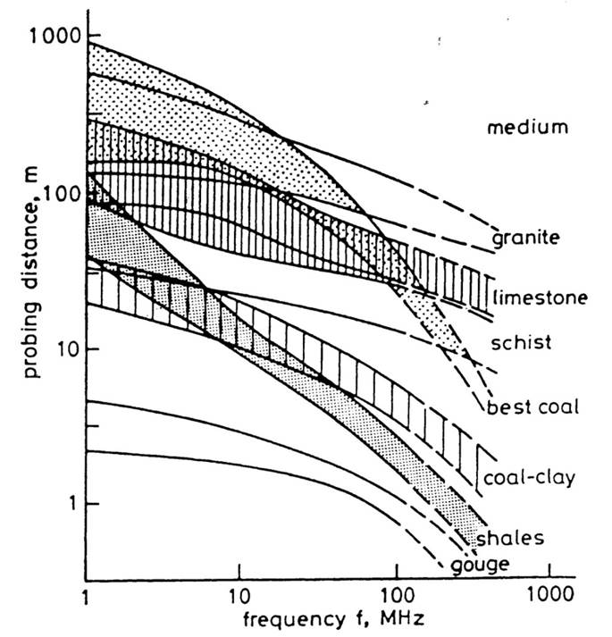

.. _gpr_survey_design:

Survey Design
=============

.. raw:: html
    :file: ../../../underconstruction.html

Transmitter and Receiver Orientation
------------------------------------

Resolution and Probing Distance
-------------------------------

The choice in operating frequency is a very important aspect of GPR survey design. When designing a survey, we must ensure that GPR signals can penetrate to sufficient depth in order to image the target. However, we must also ensure that frequencies contained within the GPR signal provide sufficient resolution. We will show that although higher operating frequencies can be used to obtain higher resolution images of the subsurface, higher frequency GPR signals cannot penetrate very deeply.

Vertical Resolution for Layers
******************************

In order for a layer to be detected using a GPR survey, it must be sufficiently thick compared to the wavelength of the incoming wavelet.
As a general rule, the layer must be at least 1/4 the wavelength of the incoming wavelet to be detectable.
Thus:

.. math::
	L >  \frac{\lambda}{4} = \frac{c}{4 f_c \sqrt{\varepsilon_r}} = \frac{c \Delta t}{4 \sqrt{\varepsilon_r}}

where :math:`L` is the layer thickness, :math:`c/\!\sqrt{\varepsilon_r}` is the propagation velocity for radiowaves, :math:`\Delta t` is the pulse width and :math:`f_c` is the central frequency. As we can see from this expression, higher frequencies/shorter pulse widths are required to observe smaller features.
This means higher frequencies/shorter pulse widths are used for higher resolution surveys.

Horizontal Resolution for Objects
*********************************

		
		
When the resolution of the survey is sufficient, returning signals from separate buried objects are distinguishable.
However, if buried objects are too close to one another, their respective returning GPR signals can be hard to differentiate.
In general, we can distinguish the signals from two nearby objects so long as:

.. math::
	L > \sqrt{\dfrac{V \, d}{2 f_c}}

where :math:`V` is the propagation velocity, :math:`f_c` is the central frequency for the wavelet, :math:`d` is the depth to the objects and :math:`L` is the horizontal separation distance of both objects. We can see from this equation, that by reducing the pulse length, we can image objects that are closer together. Additionally, it is harder to distinguish objects which are further away from the transmitters and receivers.

Probing Distance
****************

	Proving distances for GPR signals for various materials.

Probing distance characterizes the maximum depth in which GPR signals can be used to obtain information about subsurface structures.
For materials which have larger skin depths, radiowaves can penetrate deeper into the ground and still provide a sufficiently strong returning signal.

As a general rule, the probing distance (:math:`D`) is approximated 3 skin depths.
If we assume the Earth is non-magnetic (:math:`\mu_r = 1`):

.. math::
	D = 3 \delta \approx
	\begin{cases} 1510 \sqrt{\dfrac{1}{\sigma f}} \; \; &\textrm{for} \;\; \omega \varepsilon \ll \sigma \\ 
	0.0159 \dfrac{\sqrt{\varepsilon_r}}{\sigma}  \; \; &\textrm{for} \;\; \omega \varepsilon \gg \sigma \end{cases}
	

		
	Probing distance for various materials from 1 MHz through 1 GHz.
		
		
On the right we see figures which show probing distances for various materials.
Using these figures, we can see that:

	- In general, as the frequency increases, the skin depth decreases and the probing distance decreases.
	- Frequencies used for GPR are :math:`\sim` 1 GHz. Therefore, the probing distances for GPR signals are generally quite shallow.
	- It is very difficult for GPR signals to penetrate concrete and asphalt, as the probing distance is only about 1 m for GPR.
	- Water saturated sedimentary rocks, such as clays and sandstones, have much lower probing distances than dry sedimentary rocks.
	- Rocks saturated with sea water have much smaller probing distances than rocks saturated with fresh water.
	- The probing distances for hard rocks (granites, limestones, schists...) is quite large.

