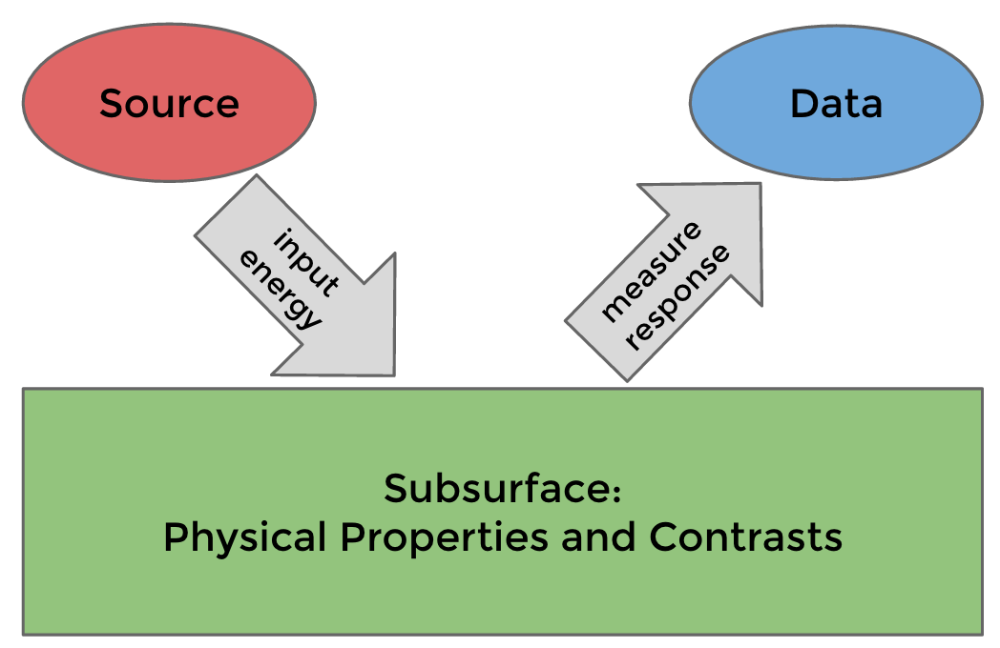

.. _geophysical_surveys_index:

Geophysical Surveys
===================

.. purpose::

    In this section, we cover the basic principals of using electromagnetic
    geophysical surveys to address geologic, environmental or geotechnical
    questions.

In the :ref:`fundamentals <geophysical_surveys_fundamentals_index>`, we
discuss a :ref:`seven step <seven_steps>` process for selecting, performing
and interpreting results from electromagnetic geophysical surveys to address
the question at hand.

Experiments can be classified by the type of source and source-waveform used
to excite responses in the subsurface. :ref:`Direct Current Resistivity
<dcr_index>` experiments use steady-state currents, :ref:`Airborne Frequency
Domain <airborne_fdem_index>` experiments use time-harmonic signals, and
:ref:`Airborne Time Domain<airborne_fdem_index>` experiments use transient
waveform. The primary physical property targeted for each of these experiments
is the same: :ref:`electrical conductivity <electrical_conductivity_index>`.
However, each type of survey excites the responses in the subsurface
differently, and depending on the target, the data collected in one survey may
be more suitable for detecting and characterizing that target.

In the :ref:`Direct Current Resistivity <dcr_index>`, :ref:`Airborne FDEM
<airborne_fdem_index>`, and :ref:`Airborne TDEM <airborne_fdem_index>`
sections, we discuss:

- the physical responses expected in each experiment,
- the setup of a typical survey,
- the type of data collected,
- how those data are interpreted,
- strategies for designing a survey to characterize a target
- practical considerations and commonly encountered challenges

**Contents:**

.. toctree::
    :maxdepth: 1

    fundamentals/index
    dcr/index
    airborne_fdem/index
    airborne_tdem/index
