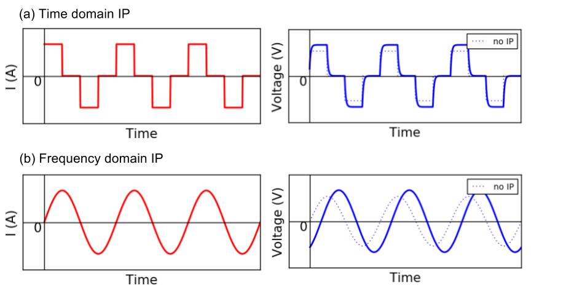
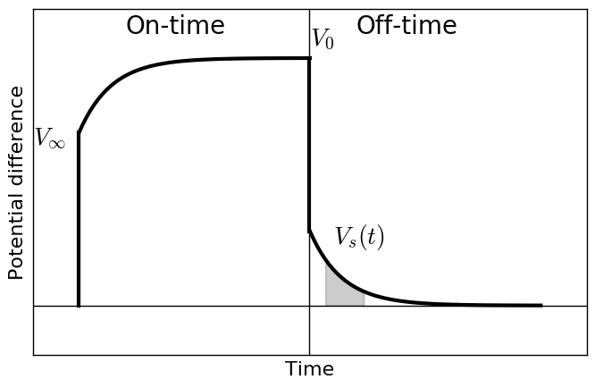
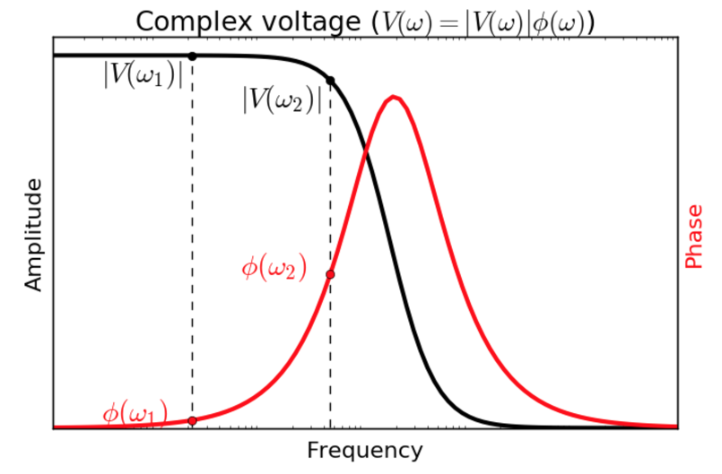

.. _ip_data:

Data
====

.. purpose::

   Understand different types of IP data in both time and frequency domain.

Same as :ref:`DC survey <dcr_survey>`, currents are injected through current electrodes, and potential differences are measured at potential for an induced polarization (IP) survey. There are several definitions about IP data, and this can be mainly classified as time domain and frequency domain data. For the time domain measurment, currents abruptly turned off and seconday voltage due to IP effects is measured in the off-time as shown in :numref:`IPresponses` a. Sinusoidal current is injected for the frequency domain measurement, and amplitude and phase of the voltage is measured. By injecting different frequency of sinusoidal currents, amplitude and phase of voltages at multiple frequencies are obtained (:numref:`IPresponses` b).

.. question::
    See blue dahsed lines in :numref:`IPresponses`. Those voltages without IP effects is smaller than those with IP effects (solid blue lines). How do you explain this?

    Schematic diagram of injected currents and measured voltage when earth medium is chargeable. (a) Time doamin and (b) Frequency domain caes. Blue dashed lines show voltages without induced polarization (IP) effects.

Time domain IP data
-------------------

    Time domain IP data.

We first introduce time domain IP data. :numref:`Overvoltage_single_data` shows schematic diagram of measured voltage when the medium is chargeable. In the on-time the voltage reflecting resistivity at infinite frequency, :math:`\rho_{\infty}(x, y, z)` is immediately generated. Then, the measured voltage increases, and reaches to the steady state. This time when the voltage reaches to the steady state is often considered as DC datum: :math:`V_0`, and this reflects resistivity at zero frequency :math:`\rho_0`. Here impact of IP effects are minor compared to DC effects, whereas polarization charge buildup is at maxium. In the off-time, DC effects are disappeared hence only secondary voltage, :math:`V_s (t)` due to IP can be measured; :math:`V(t)` decays in time.

The most common definitions of IP data, :math:`d^{IP}` are

.. math::
    d^{IP} = \frac{10^3}{t_2-t_1}\int_{t_1}^{t_2} \frac{V_s(t)}{V_0} dt  \ \text{[mV/V]}
    :label: charg_intmVperV

and

.. math::
    d^{IP} = 10^3 \int_{t_1}^{t_2} \frac{V_s(t)}{V_0} dt  \ \text{[msec]}
    :label: charg_intms

Here :math:`t_1` and :math:`t_2` are start and end of time gate for integration.

.. note::
    Eqs. :eq:`charg_intmVperV` and :eq:`charg_intms` often called apparent chargeability. For mineral applications often certain time window (e.g. Newmont standard: :math:`t_1` = 150 ms and :math:`t_2` = 1100 ms) is used for time integration based upon knowledge that mineralized rock could have higher voltage in this off-time window.

Note that for above two cases, we only have one datum in time due to the integration. However, for spectral IP analysis, each time channel of secondary voltage is often  considered as :math:`d^{IP}`:

.. math::
    d^{IP}(t) = 10^3 \frac{V_s(t)}{V_0}  \ \text{[mV/V]}
    :label: charg_mVperV

or

.. math::
    d^{IP}(t) = 10^3 V_s(t)  \ \text{[mV]}
    :label: charg_mV

Frequency domain IP data
------------------------

    Frequency domain IP data.

.. phase lag?

Sinusoidal current is injected and amplitude and phase of voltage is measured. Often voltages at two frequencies: :math:`\omega_1` and :math:`\omega_2` are measured (:math:`\omega_1 < \omega_2`) as shown in :numref:`Complexvoltage`. Obtained voltage here can be written as

.. math::
    V(\omega) = |V(\omega)| e^{i \ \phi}

where :math:`V(\omega)` is complex voltage and :math:`\phi` (rad) is the phase.

There are two types of IP data related to the amplitude of voltage: a) Pecentage frequency effects (PFE) and b) and frequency effects (FE). PFE is defined as

.. math::
    \text{PFE} \ (\%) = 100 \Big(\frac{V(\omega_1)-V(\omega_2)}{V(\omega_1)}\Big)

And similarly FE is defined as

.. math::
    \text{FE} = \Big(\frac{V(\omega_1)-V(\omega_2)}{V(\omega_1)}\Big)

Phase of the voltage in mrad itself is often considered as IP data:

.. math::
    d^{IP}(\omega) = 10^{3}\phi(\omega) \ \text{[mrad]}

Or the phase difference between two frequencies is considered as IP data

.. math::
    d^{IP} = 10^{3}(\phi(\omega_2) - \phi(\omega_1)) \ \text{[mrad]}

