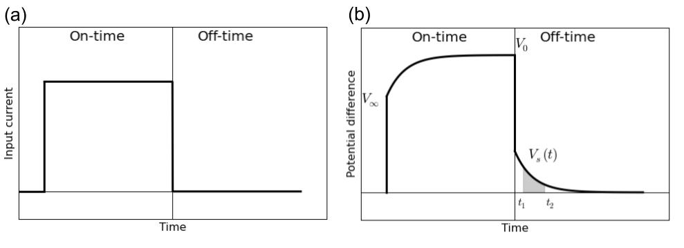
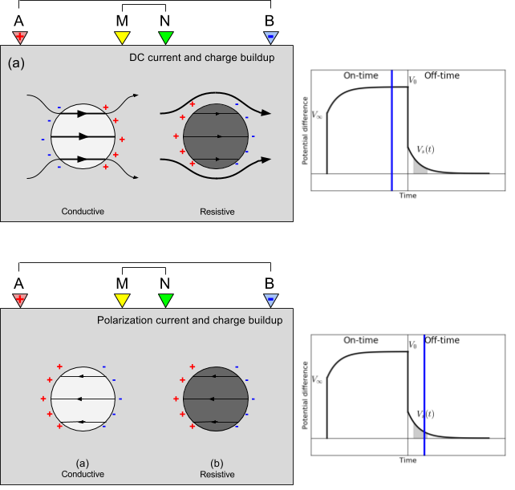

.. _ip_index:

Induced Polarization
====================

.. purpose::

    To illustrate the fundamentals of a IP survey, provide a vision for how it is applied in the field, and demonstrate potential uses.

.. image:: http://gpg.geosci.xyz/_images/icon_ip1.gif
    :align: right

Variations in :ref:`chargeability <electrical_conductivity_lab_setup_measurements>` can be
diagnostic, for example, when aiming to characterize a mineral deposit (e.g.
:ref:`Mt. Isa <mt_isa_index>`), where the chargeability of the mineralized zone
is often higher than the host rock. Often an induced polarization (IP) experiment is performed with the Direct Current Resistivity (DCR) hence they are often called DC-IP survey. Both conductivity and chargeability distribution can be recovered from a DC-IP survey.

A setup for an IP experiment is almost same as the Direct Current Resistivity (DCR) of which a generator is used to inject current into the earth. Depending upon the used current waveform, time domain and frequency domain measurments can be defined:

- Time domain system: half-duty cycle current
- Frequency domain system: sinusoidal current

We use a time domain system to illustrate an IP experiment.

    Half-duty cycle current waveform (a) and meausred overvoltage (b).

:numref:`Overvoltage` a shows a half-duty cycle current, which is injected to the earth by a generator. If earth is chargeable, then measured voltage will look like :numref:`Overvoltage` b. The measured voltage increases in on-time, and after the current switch-off, it decays. In the on-time currents will due to potential difference made by a generator, and distorted by conductivity constrasts in the earth (DC). In addition, polarization charge start to builds, and reaches to the steady state in late on-time. After the current switch-off, all DC currents are immediately gone, although polarization charge will start to discharge generating secondary voltage decay (IP). Often late on-time voltage (:math:`V_0`) is considered as DC datum, and off-time voltage (:math:`V_s`) is considered as IP datum.

    DC and IP experiment showing current path and charge built up near a conductive and resistive anomaly (both chargeable). (a) DC (late on-time) and (b) IP (off-time).

As shown in :numref:`DCIP` a, in the on-time, mainly the current path depends upon the variation of DC resistivity (:math:`\rho_0`). Currents are channeled into good conductors and flow around resistors. Electrical charges are :ref:`built
up<charge_buildup_at_boundaries>` on interfaces that separate units of
different conductivity and these charges generate an electric potential. Although polarization charges have been built because both amomalies are chargeable, impact of the polarization charge buildup is minor in the on-time. However, in the off-time charge build-up due to DC currents is gone hence what we measure on the surface electrodes are only due to polarizatoin charges. Direction of the polarization currents are always in the opposite direction of DC currents in a chargeable body. Hence, chargeable body acts like a resistor (see polarization charge buildup in :numref:`DCIP` b).

**Contents**

.. toctree::
    :maxdepth: 1

    physics

**Related Case Histories**

- :ref:`mt_isa_index`

