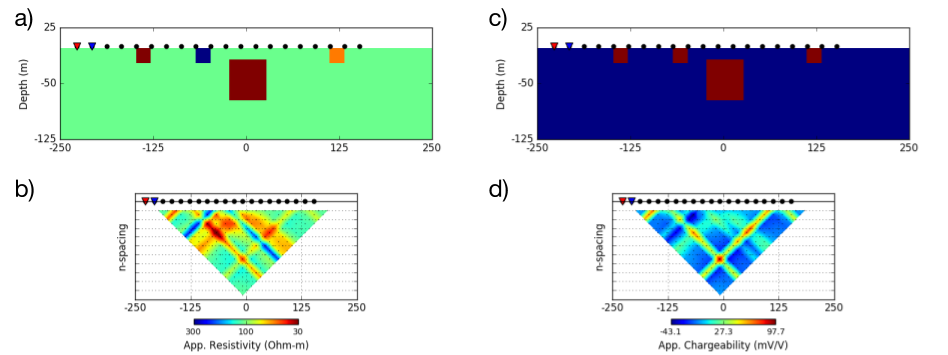
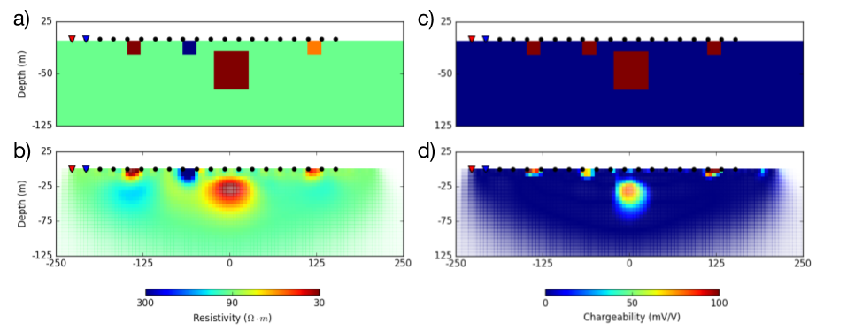

.. _ip_interpretation:

Interpretation
==============

.. purpose::

  To show how DC-IP data are processed and inverted to reveal meaningful information about the earth structure (conductivity and chargeability).

.. _ip_interpretation_appRes:

Linearization
-------------

For the inversion of IP data, often linearzed approach is used :cite:`seigel1959` :cite:`doug1994`. The measured voltage, :math:`V` will be a function of conductivity. We consider two end members of conductivity at inifinte and zero frequency: :math:`\sigma_{\infty}` and :math:`\sigma_0`. Here conductivity at zero frequency can be expressed as

.. math::
    \sigma_0 = \sigma_{\infty} (1-\eta)

Considering measured voltage at zero frequency or late on-time, the voltage will be a function of :math:`\sigma_0 \ (x, y, z)` :

.. math::
    V_0 = V[\sigma_0] = V[\sigma_{\infty}(1-\eta)]

By expanding this in terms of :math:`\sigma_{\infty}`, we obtain

.. math::
    V_0 = V[\sigma_{\infty}(1-\eta)] = V[\sigma_{\infty}] - \frac{\partial V}{\partial \sigma_{\infty}} \sigma_{\infty} \eta + O \Big( (\sigma_{\infty} \eta)^2 \Big)

IP datum is considered as a small perturbation (:math:`\eta \ll 1`), and can be written as

.. math::
    d^{IP} = V_0 - V_{\infty} = - \frac{\partial V}{\partial \sigma_{\infty}} \sigma_{\infty} \eta + O \Big( (\sigma_{\infty} \eta)^2 \Big)

Ignoring second order term yields

.. math::
    d^{IP} = - \frac{\partial V}{\partial \sigma_{\infty}} \sigma_{\infty} \eta
           = - \frac{\partial V}{\partial \ log (\sigma_{\infty})}  \eta \\
           =  \frac{\partial V}{\partial \ log (\rho_{\infty})}  \eta

Considering apparent chargeability, :math:`\eta_a`, we obtain

.. math::
    d^{IP} = \eta_a = \frac{V_0 - V_{\infty} }{V_0} =  \frac{\partial log \ (V)}{\partial \ log (\rho_{\infty})}  \eta
    :label: linear_appchg

Finally, IP data can be expressed as a linear equation

.. math::
    \mathbf{d}^{IP} = \mathbf{J} \boldsymbol{\eta}
    :label: linearIP

where :math:`\mathbf{J}` is a sensitivity matrix.

Two stage method
----------------

.. figure:: images/Overvoltage_single.png
    :align: right
    :figwidth: 40%
    :name: Overvoltage_data

    Overvoltage curve in time domain.

For the inversion of time domain IP data, two-stage method is often used :cite:`doug1994`. The first step is DC inversion, and here we consider a voltage at at late on-time (:math:`V_0`) as DC datum. By inverting DC data, we recover conductivity model, :math:`\sigma_{est}`.  Second step is IP inversion. Voltages at late off-times (:math:`V_s`) are considered as IP data, and often voltages in specific time window is integrated. The recovered conductivity is used to form sensitivity matrix, and using the linear equation (Eq. :eq:`linearIP`) we invert IP data, and recover chargeability.

.. note::

    Note that in practice there are signficant electromagnetic (EM) induction effects right after current is turend on, hence obtaining :math:`V_{\infty}` is challenging. Similarly, right after the current is turned off, significant EM induction effects exists, and this is the reason why we only consider late off-time voltages as IP data.

Example
-------

We illustrate a synthetic two stage inversion (DC-IP inversion) example. Voltages at zero and infinite freqencies are computed: :math:`V_0` and :math:`V_{\infty}` using :math:`\sigma_0` and :math:`\sigma_{\infty}`, respectively. DC datum is considered as :math:`V_0`, and apparent chargeabiility is calculated using Eq. :eq:`linear_appchg`. Conductivity and chargeability models are presented in :numref:`DCIP_Grad_fwd` (a) and (c), respectively.

DC-IP data
^^^^^^^^^^

A :ref:`gradient array survey<dcr_survradiobuttons>` is used to obtain both DC and IP data. A plan view of the resistivity
model and electrode geometry is shown in :numref:`DCR_Grad_Simple` (a). The
survey consists of a grid of 13 x 13 receivers located between a 450 meter
dipole current source. Each receiver is a 20 meter dipole. The corresponding
apparent resistivity map is shown in :numref:`DCR_Grad_Simple` (b). Due to the multiple prisms having different resistivity values from the background, the obtained apparent resistivity map is fairly complicated. In constrast, only the center prism is chargeable, hence a single apparent chargeability anomaly is obtained. From these apparent resistivity and chargeability maps, we can recognize conductive and chargeable unit, and its hoizontal location and extent, whereas depth information the unit is lacked.

.. figure:: images/DCIP_Grad_fwd.png
    :align: center
    :figwidth: 100%
    :name: DCIP_Grad_fwd

    : (a) Bird-eye view of gradient array survey over a DC resistivity model (:math:`\sigma_0`) and
    (b) corresponding apparent resistivity map.
    (c) Plan map of chargeability model (:math:`\eta`) and
    (b) corresponding apparent chargeability map.

A :ref:`dipole-dipole survey<dcr_survradiobuttons>` is carried out along a line that passes directly above the conductive prism. Different from the gradient array case, we assumed all prisms are chargeable. :numref:`DCIP_DpDp_fwd` (a) and (c) show conductivity and chargeability sections, respectively. The resulting pseudosections are shown in :numref:`DCIP_DpDp_fwd` (b) and (d). Due to the near surface prisms both DC and IP pseudosections are complicated, and hard to be interpreted just by looking at them. For following DC-IP inversions, we use these DC and IP data obtained with the dipole-dipole array.

    : (a) Vertical section through a conductivity model with near-surface inhomogeneities.  Source and receiver locations for a dipole-dipole survey are shown for reference.
    (b) Pseudosection of apparent resistivity calculated from the synthetic DCR survey.
    (c) Vertical section through a chargeability model with near-surface inhomogeneities and (d) resulting pseudosection of apparent chargeability.

.. _ip_interp_inversion:

2D Inversion of DC-IP data
^^^^^^^^^^^^^^^^^^^^^^^^^^

Following the two stage inversion method we first invert DC data, and obtain conductivity model. Then by using the recovered conductivity, we form a sensitivity matrix for an IP inversion, invert IP data, and recover chargeability model.

The DC and IP data are inverted using a standard Gauss-Newton framework. This is
outlined in :ref:`Inversion<inversion>`. The DC data are the measured voltages (:math:`V_0`) and the goal is to find an electrical conductivity that satisfactorily
reproduces these data and agrees with a priori geologic structure and
petrophysical constraints.  Although the geology is 3D, we invert the data using a 2D inversion algorithm. Parameters used for the inversion of the dipole-dipole data (:numref:`DCIP_Grad_fwd` (b)) are provided in :numref:`DCIP_inv_table`.

.. list-table:: : 2D DC inversion parameters
   :header-rows: 0
   :widths: 5 5
   :stub-columns: 1
   :name: DCIP_inv_table

   *  - Number of sources
      - 20
   *  - Number of data
      - 195
   *  - Data uncertainties
      - :math:`2\%|d| (percentage) + 2 \times 10^{-4} V` (floor)
   *  - Mesh Size
      - :math:`10 \times 10 \times 10` meters
   *  - Reference conductivity
      - :math:`0.01` S/m
   *  - Regularization Scales ( :math:`\alpha_s, \alpha_x,\alpha_y,\alpha_z` )
      - :math:`0.01, 1, 1, 1`

:numref:`DCIP_DpDp_inversion` (b) presents the recovered 2D conductivity model after convergence of the algorithm. Multiple conductors and a resistor are well imaged in 2D section.

For the IP inversion, the same inversion parameters are used except for uncertainty and reference model. Percentage and floor for the uncertainty are set to 0 :math:`\%` and 0.3 mV/V. The reference chargeability used here is zero. :numref:`DCIP_DpDp_inversion` (d) shows the reocovered 2D chargeability model, and all chargealbe prisms either on the surface and at depth are imaged well.

    : Vertical sections of resitivity and chargeability models. (a) True and (b) recovered conductivity models. (c) True and (d) recovered chargeability model.

.. note::

    Considering time domain IP data in practice, we cannot measure neither :math:`V_0` and :math:`V_{\infty}`. Hence, often an IP datum is considered as an integration of late off-time voltages (named apparent chargeability): :math:`\eta_a = \frac{1}{V_0}\int V_s \ (t)  \ dt`. Therefore, a recovered chargeability model by inverting the apparent chargeability will not correspond to the chargeability, :math:`\eta=\frac{\rho_{0}-\rho_{\infty}}{\rho_0}`.

    Rather, the recovered charegeability model from the inversion should be considered as "pseudo-chargeability" reflecting some chargeability information captured in a chosen window.
