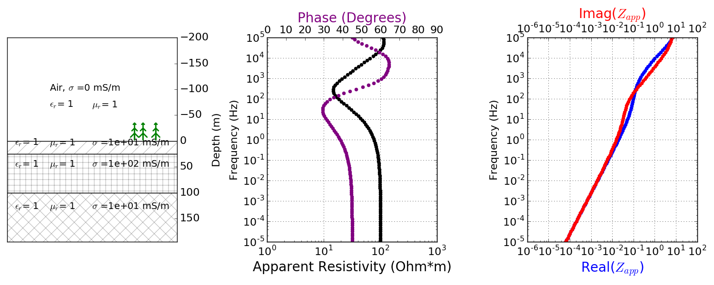

.. _mt_data:

Data
====

.. raw:: html
    :file: ../../../underconstruction.html

Processing
**********

From time-domain measurements to frequency-domain data
------------------------------------------------------

The MT instrumentation measures the electric and magnetic fields over time but the data of interest are impedances, which is the ratio of the electric and magnetic field. A few steps are requried to calculate the impedances from the measured time series. The time series are amplified, filtered, and converted from analog to digial format by the data collection system :cite:`rosenkjar2011`.

Then, to process the data, the series are split into segments (time windows) and Fourier transformed from the time domain to the frequency domain. This is commonly done using the Fast Fourier Transform (FFT). This is done for each station:

.. math:: \mathbf{e}_x (t) \rightarrow \mathbf{E}_x (\omega)
.. math:: \mathbf{e}_y (t) \rightarrow \mathbf{E}_y (\omega)
.. math:: \mathbf{h}_x (t) \rightarrow \mathbf{H}_x (\omega)
.. math:: \mathbf{h}_y (t) \rightarrow \mathbf{H}_y (\omega)
.. math:: \mathbf{h}_z (t) \rightarrow \mathbf{H}_z (\omega)

The measurements at the remote reference are also transformed using the FFT:

.. math:: \mathbf{h}_x^R (t) \rightarrow \mathbf{H}_x^R (\omega)
.. math:: \mathbf{h}_y^R (t) \rightarrow \mathbf{H}_y^R (\omega)

Transforming to the frequency domain also reduced the data set as the final data set contains much less frequencies than time samples. The data are then further reduced by stacking data that are in the same spectral bands :cite:`simpsonbahr2005`.

For example, suppose an MT time series was collected using a sampling rate of 2 seconds and a time window of 30 minutes. That means 900 measurements were made for 5 different field components. In comparions, the data are usually only evaluated at 30-50 frequencies, thus significantly reducing the number of data :cite:`simpsonbahr2005`.

:cite:`simpsonbahr2005` describe two ways this data reduction is done: (1) stacking the data from discretized time windows and (2) using information from nearby frequencies as Weidelt's dispersion relations states that similar information is provided by neighbouring frequencies.

.. todo:: Add data image + time windowing (like DISC MT slide... using Unsworth figure).

From frequency-domain data to impedance using a remote station
--------------------------------------------------------------

Once the data are in the frequency domain, the impedance tensor can be formed for each frequency. The :ref:`impedance <mt_physics>` :math:`Z` is a matrix that relates the electric and magnetic fields.

Magnetic field data from a remote reference station is used to eliminate bias due in the measurements due to noise. In order for the sources of noise to be incoherent between the reference station and survey region, the remote reference should be 10-100 km away from the survey region :cite:`rosenkjar2011`. The impedance is then calculated as follows:

.. math:: Z_{xy} = \frac{<\mathbf{E}_x(\omega)\mathbf{H}_y^{R*}(\omega)>}{<\mathbf{H}_y(\omega)\mathbf{H}_y^{R*}(\omega)>}

The notation (*) indicates the complex conjugate and <> averages over multiple samples. The same thing can be done using the electric fields measured at a remote reference station but common practice is to use the magnetic fields.

TE and TM modes
***************

The :ref:`complex impendance tensor <mt_physics>` consists of 4 components that provide information about the subsurface. Considerin a 2D-Earth model, when the impedance tensor is rotated such that the x-direction is parallel to the geological strike and the y-direction is perpendicular to it, the :math:`Z_{xx}` and :math:`Z_{yy}` components are zero. This gives rise to 2 different modes:

- Transverse electric (TE) or E-polarization: when the electric field is parallel to the geolocgical strike, :math:`Z_{TE} = Z_{xy}`

- Transverse magnetic (TM) or H-polarization: when the magnetic field is parallel to the geological strike, :math:`Z_{TM} = Z_{yx}`

Using the impedance, we can :ref:`calculate the apparent resistivity and phase<mt_physics>` and plot it for the different frequencies.

Examples
********

**Layered earth**: The first example has 3 layers (:numref:`mt_3layer`). The overburden is 25 m thick and has a resistivity of 100 :math:`\Omega` m. The second layer is 75 m thick with a resistivity of 10 :math:`\Omega` m. And the bottom layer extends to depth and has a resistivity of 100 :math:`\Omega` m. The equations to calculate the electric and magnetic fields for this example are given :ref:`here <MT_N_layered_Earth>`, which also includes an interactive app to remove layers and/or change the resistivity of each layer.

.. todo:: add in images for sphere problem

**Sphere**: The second example contains a sphere with 50 m radius and 10 :math:`\Omega` m in a background of 100 :math:`\Omega` m.

.. todo:: tie back to electrostatic sphere problem (charges)
