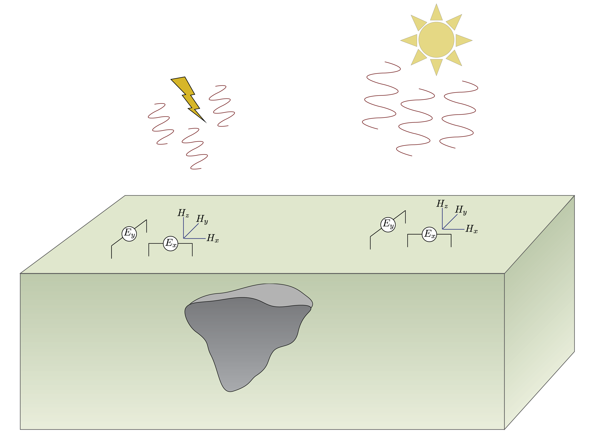
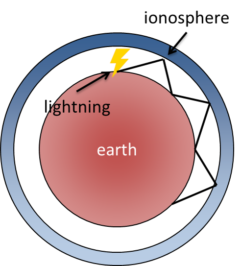

.. _mt_index:

Magnetotellurics
================

.. raw:: html
    :file: ../../../underconstruction.html

.. purpose:: To explain the fundamentals of a magnetotelluric survey, show how it is applied in the field, and explain how it is useful for geophysical problems.

 
The magnetotelluric (MT) method is a passive electromagnetic (EM) exploration method that measures orthogonal components of the electric and magnetic fields on the Earth's surface. The source field is naturally generated by variations in Earth's magnetic field, which provide a wide and continuous spectrum of EM field waves. These fields induce currents into the Earth, which are measured at the surface and contain information about subsurface resistivity structures.

.. figure:: images\mt_magn.png
        :name: mt_magn
        :align: right
        :figwidth: 30%  
        
        Interaction between the solar wind and Earth's magnetic field creates the magnetosphere, which is a natural source of EM fields below 1 Hz.

        EM waves, generated by lightning, bounce between the Earth's surface and the highly conductive ionosphere, and travel as plane waves.

.. figure:: images/lightning.jpg
        :name: mt_lightning
        :align: right
        :figwidth: 25%

        Lighting is one of the natural EM sources that allows MT to be used.
      
Unlike controlled-source EM methods which may use an inductive loop as a source, the MT method relies on naturally-occurring electromagnetic fields. The type of natural source depends on the frequency of the EM field. At frequencies higher than 1 Hz, the most significant source is lightning discharges near the equatorial region of the earth (:numref:`mt_lightning`). The EM fields generated by lightning events (otherwise known as sferics), propagate in a waveguide between the Earth's surface and the ionosphere (which is highly conductive). They fields travel far distances as :ref:`plane waves <plane_waves_in_homogeneous_media_index>` (:numref:`mt_waveguide`). 

The magnetosphere (:numref:`mt_magn`), which is caused by interactions between the Earth's magnetic field and solar wind, generates EM fields at frequencies less than 1 Hz. Variations in the density, velocity, and intensity of the solar wind produce time-varying EM fields. Together, these natural sources provide the primary EM fields to excite the earth.

**Contents**

.. toctree::
    :maxdepth: 1

    physics
    survey
    data
    interpretation
    survey_design
    practical_considerations

**Related Case Histories**

