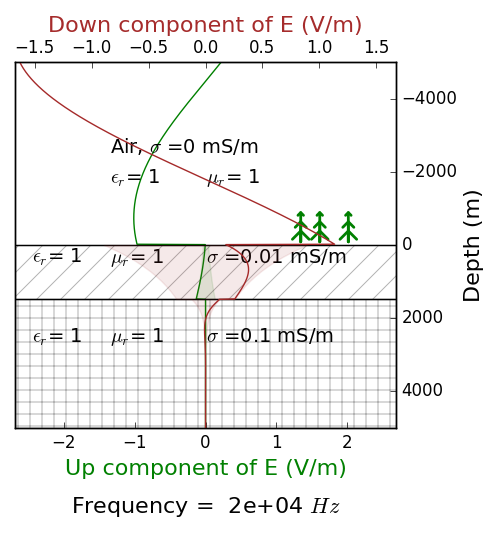
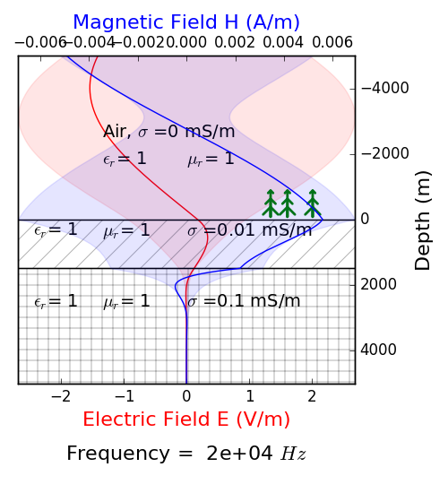

.. _mt_physics:

Physics
=======

.. raw:: html
    :file: ../../../underconstruction.html
 
The natural source fields travel as plane waves. At the surface of the Earth, the fields are :ref:`transmitted <reflection_and_refraction_index>` vertically into the subsurface, creating vertically propagating plane waves that generate sheet currents.

.. todo:: step-by-step from plane source to apparent resistivity (radio button widghet): (1) plane waves, (2) skin depth), (3) phase difference between E and H (tie back to 1D stuff Thibaut already did)

.. figure:: images\SkinDepth.png
        :name: mt_sd
        :figwidth: 100%
        :align: center

**Impedance**

Because the source fields are not known, we calculate a ratio based on the measured electric (:math:`\mathbf{E}`) and magnetic (:math:`\mathbf{H}`) fields. This ratio is referred to as the impedance :math:`Z`:

.. math:: 
        \mathbf{E} = Z \mathbf{H},

where the impedance is a matrix defined as:

.. math:: 
        Z = \left( \begin{matrix} Z_{xx} && Z_{xy}\\ Z_{yx} && Z_{yy}\end{matrix} \right)

and :math:`\mathbf{E} = \left( \begin{matrix} \mathbf{H}_{x}\\ \mathbf{H}_{y} \end{matrix} \right)` and :math:`\mathbf{H} = \left( \begin{matrix} \mathbf{H}_{x}\\ \mathbf{H}_{y} \end{matrix} \right)`. The electric and magnetic fields are perpendicular to each other.

For a halfspace earth, the impedance simplifies to a single component of the matrix: :math:`Z_{xy} = \frac{\mathbf{E}_x}{\mathbf{H}_y}`. From the impedance, we can calculate the apparent resistivity :math:`\rho_a` and the phase :math:`\Phi`:

.. math:: \rho_a = \frac{1}{\omega \mu} \left| Z_{xy} \right| ^2

.. math:: \Phi = \tan^{-1} (\frac{Im(Z_{xy})}{Re(Z_{xy})}) = -\frac{\pi}{4}

For a one-dimensional Earth, the off-diagonal components of the impedance are zero and the on-diagonal components are equal to each other:

.. math:: 
        Z_{1D} = \left( \begin{matrix} 0 && Z_{xy}\\ Z_{yx} && 0\end{matrix} \right)

.. math:: Z_{xy} = Z_{yx}

.. todo:: insert 1D figures

For a two-dimensional Earth, the on-diagonal components are no longer identical but the off-diagonal parts remain zero:

.. math:: 
        Z_{2D} = \left( \begin{matrix} 0 && Z_{xy}\\ Z_{yx} && 0\end{matrix} \right)

.. math:: Z_{xy} \neq Z_{yx}

.. todo:: insert 2D figures: TE mode and TM mode

There is no symmetry for a 3D Earth and all components of the impedance are non-zero.

**Tipper**

A ratio can be also be calculated using just the magnetic fields. This is referred to as the tipper and is defined as following:

.. math:: 
        \mathbf{H}_z = T \mathbf{H} = \left( \begin{matrix} T_{zx} && T_{zy} \end{matrix} \right) \left( \begin{matrix} \mathbf{H}_x \\ \mathbf{H}_y \end{matrix} \right).

For a 1D Earth, :math:`T_{zx} = T_{zy} = 0`.

.. todo:: 2D te and tm?

In 3D, all components of the tipper are non-zero. A special case of a tipper survey is when the horizontal components of the magnetic field are measured at a single reference station and the vertical component is measured using an airborne system. This is known as a :ref:`ZTEM survey <ztem_index>`.

Examples
********

**Layered earth**: The first example has 3 layers (:numref:`mt_3layer`). The overburden is 25 m thick and has a resistivity of 100 :math:`\Omega` m. The second layer is 75 m thick with a resistivity of 10 :math:`\Omega` m. And the bottom layer extends to depth and has a resistivity of 100 :math:`\Omega` m. The equations to calculate the electric and magnetic fields for this example are given :ref:`here <MT_N_layered_Earth>`, which also includes an interactive app to remove layers and/or change the resistivity of each layer.

.. figure:: images/3_layeredEarth_data.png
        :name: mt_3layer
        :figwidth: 100%
        :align: center

**Sphere**: The second example contains a sphere with 50 m radius and 10 :math:`\Omega` m in a background of 100 :math:`\Omega` m.

.. todo:: tie back to electrostatic sphere problem (charges)

.. todo:: add in images for sphere problem
