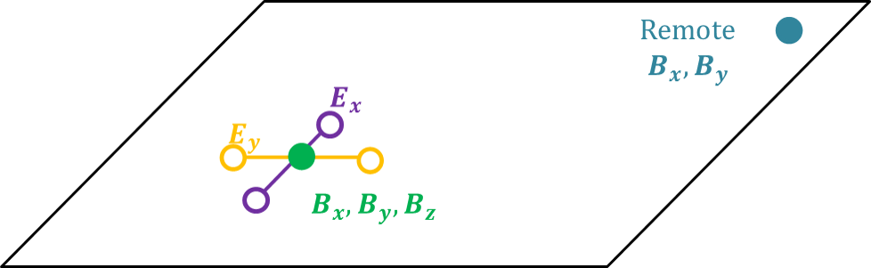

.. _mt_survey:

Survey
======

.. raw:: html
    :file: ../../../underconstruction.html

        The MT survey measures the horizontal electric field components and the three magnetic components at the surface of the Earth. A remote station measures the magnetic field and is used to remove correlated noise from the data.

**Sources**: At frequencies higher than 1 Hz, the source fields are generated by world-wide lightning storms while at frequencies less than 1 Hz, the fields are generated by solar wind. Little energy is emitted between 0.1 and 10 Hz, creating a dead-band in the frequency spectrum for MT methods.

**Receivers**: A typical MT station measures the electric and magnetic fields (:numref:`mt_rxs`). Coils, which are buried to minimize noise from the sun and wind, measure the three components of the magnetic field. Sometimes magnetometers are used to measure at lower frequencies. To measure the electric field, eletrodes connected by wires are trenched in, again to minimize noise in the data.

**Remote reference**: Generally, a remote reference is used so correlated noise can be removed from the data during processing. Only the horizontal magnetic field components are measured at the reference station.
