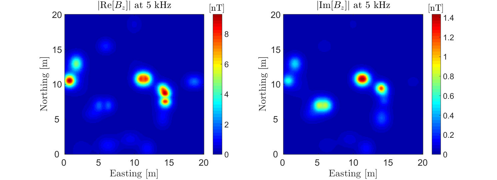
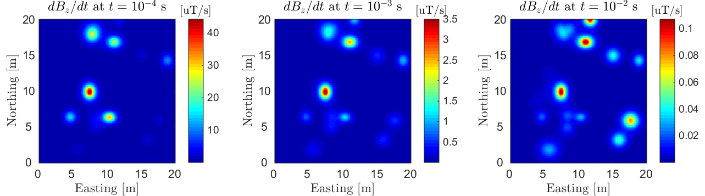
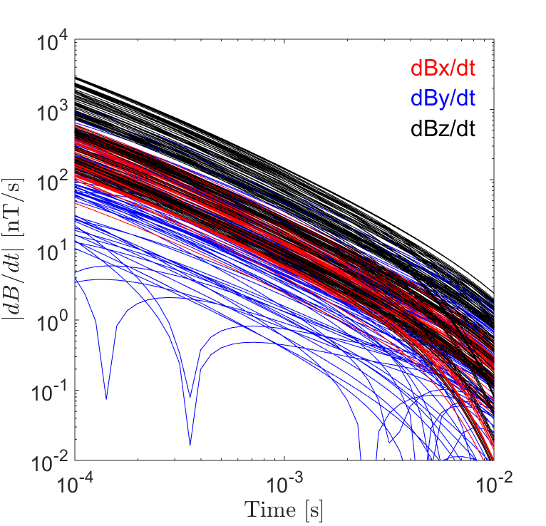

.. _uxo_data:

.. purpose::

	Here, we describe the raw data which are collected during a UXO survey. We then discuss the manner in which raw data can be used to recover the EM response at each data location. Examples of frequency domain and time domain data collected over a set of conductive and magnetically permeable objects are then presented. This is used to demonstrate how UXO data are visualized.

Data
====

During a UXO survey, an inductive loop source generates a primary field. The primary field induces eddy currents within ordnance casings and other buried metallic objects (known as clutter). Induced eddy currents generate secondary electromagnetic fields which are measured by one or more receiver coils. The change in magnetic flux through each receiver loop, due to the target's response, induces an electromotive force (EMF) within the loop. Ultimately, the receiver measures the voltage which results from the induced EMF. For both frequency domain and time domain systems, the induced EMF within a receiver loop is illustrated below.

.. figure:: images/receiver_loops.png
	:align: center
	:figwidth: 60%
	:name: fig_uxo_receiver_loops_data

	EMF induced within a receiver loop. A) FEM receiver loop. B) TEM receiver loop.

**What are the raw data:** The voltage induced within the receiver coil represents the raw data for UXO surveys. However if information about the receiver is known (dimensions, number of turns, gain factor), raw voltages can be used to recover the secondary field or its time-derivative at each data location.

**Units:** Data are frequently given in units of :math:`mV` or :math:`\mu V`. It should be noted that a gain factor may have been applied to the voltages measured by the receiver(s). If the data are being represented in terms of the field, :math:`\mu T` or :math:`nT` may be used. When representing the time-derivative, data are usually given in :math:`\mu T/s` or :math:`nT/s`.

Frequency Domain Data
---------------------

In the frequency domain, FEM responses have both real and imaginary components; also known as in-phase and quadrature components, respectively. It is important to note that the EMF is proportional to :math:`-i \omega B_s`. That is, real components of the response result in imaginary voltages and visa-versa. Therefore, it is important to understand how the data are being represented and the significance of the real and imaginary components.

Vertical FEM anomalies over a host a conductive (:math:`\sigma > 10^6` S/m) and magnetically permeable (:math:`\mu_r > 1`) objects are shown below. The objects were excited with vertical dipole source (small loop) using a frequency of 5 kHz. This is meant to demonstrate the type of data one would observe when using a frequency domain coincident loop system.

	Vertical FEM anomalies observed using a coincident loop system at f = 5 kHz. Data shows prominent anomalies in both the in-phase and quadrature components.

Time Domain Data
----------------

When operating in the time domain, we are generally interested in the UXO's transient response; that is, the response to step-off excitation. For some systems (EM-61), the off-time response may only be measured for a few time channels. For newer systems, 10s of time channels are used to accurately characterize the decays of potential targets. Off-time data are typically collected between 100 :math:`\mu s` and 25 :math:`ms` after the transmitter is shut off. A representation of the transmitter's current waveform and measured time channels is illustrated below.

.. figure:: images/time_channels.png
	:align: center
	:figwidth: 60%
	:name: fig_uxo_time_channels

	Bi-modal boxcar waveform for TEM systems. Data are measured during the off-time.

TEM Anomalies
*************

Anomalies associated with the transient response decay over time. The rate of decay (:math:`dB/dt`) at early, mid and late-times depends significantly on the dimensions and physical properties of each target.

Vertical TEM anomalies over a host a conductive (:math:`\sigma > 10^6` S/m) and magnetically permeable (:math:`\mu_r > 1`) objects are shown below. The objects were excited with a step-off excitation using a vertical dipole source (small loop). This is meant to demonstrate the type of data one would observe when using a domain coincident loop system (EM-61).

	TEM anomalies observed using a coincident loop system at early time (left), intermediate time (middle) and late time (right).

TEM Decays
**********

	3-component TEM decays observed using MPV instrument.

In the :ref:`physics section <uxo_physics>`, we learned that UXOs display particular decays over early, mid and late times. As a result, significant information about a potential target can be obtained by plotting the TEM response over all time channels. For instrument arrays containing multiple transmitters and receivers, this may result in many plotted decays. 

On the right, we show decaying :math:`dB/dt` responses over a conductive (:math:`\sigma = 10^6` S/m) and magnetically permeable (:math:`\mu_r = 30`) object using an MPV instrument. Here, 3-component data were collected within a 2 m :math:`\times` 2 m grid over the target.

From Laurens
------------

Time-domain data acquired with a modern EM sensor can be visualized as a gridded image for target detection, or as individual decays over a range of time channels. Dynamic detection data typically extends over a shorter time range (typically out to 2 ms) to allow for faster data collection. Demedian filtering is often applied to dynamic data to remove instrument response.

Stationary cued data can extend as late as 25 ms to support target characterization. Background measurements acquired close to target locations are used to correct for instrument response in cued data.

