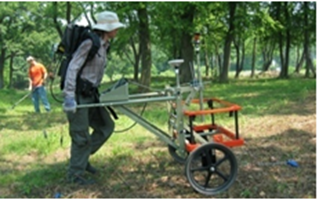

.. _uxo_index:

Unexploded Ordnance
===================

    UXO survey performed using an EM-61 instrument.

An unexploded ordnance (UXO) is a munition that was armed, fired and remains unexploded through malfunction. The United Nations estimates that 15,000-25,000 people globally are killed or maimed each year from land mines and UXOs. UXO surveys therefore represent an important subset of electromagnetic methods. UXO surveys have a shallow depth of investigation, as UXOs are generally buried at depths up to a few meters. 

Compared to the host medium, UXO casings are both highly conductive (:math:`\sigma > 10^5` S/m) and highly permeable (:math:`\mu_r \gg 1`). Although magnetic and FEM methods for UXO detection have been used for decades, recent technological advances in geophysics have lead to the development of TEM methods. During a UXO survey, an inductive loop source generates a primary field. The primary field induces eddy currents within ordnance casings and other buried metallic objects (known as clutter). Induced eddy currents generate secondary electromagnetic fields which are measured by one or more receiver coils. When employing TEM methods, discrimination and classification algorithms can be used to differentiate UXOs from clutter after raw data are processed. The development of discrimination and classification algorithms represents a distinct advantage that TEM methods have over magnetic and FEM methods. As a result, we will focus primarily on TEM UXO survey methods with a lesser focus on FEM methods.

.. figure:: images/UXOschematic.png
	:align: center
	:figwidth: 80%
	:name: fig_UXO_index_schematic

	Electromagnetic induction (EMI) survey for UXO discrimination.

**Contents**

.. toctree::
    :maxdepth: 1

    physics
    survey
    data
    interpretation
    survey_design
    practical_considerations

