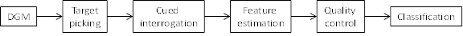
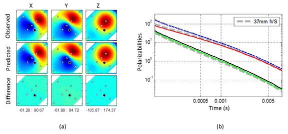
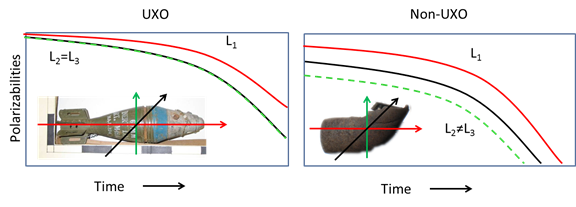

.. _uxo_interpretation:

Interpretation
==============

.. raw:: html
    :file: ../../../underconstruction.html

Geological Noise
----------------

Typically, the EM responses from UXOs are significantly stronger than the EM responses from the host medium. In these cases, it is acceptable to neglect the response from the host medium. However, there are certain geological environments in which this assumption is invalid. As an approximation, it is common to neglect coupling and consider the UXO and geological responses as separable, thus:

.. math::
	B_{tot} = B_{s} + B_{geo}

Conductive Backgrounds
**********************

**Needs image as example**

In regions where the local geology is very conductive (:math:`\sigma > 0.1` S/m), the Earth's inductive response becomes significant. As a result, processing steps are required in order to remove the Earth's inductive response. The transient response from conductive geologies is generally recognized as having a :math:`B(t)` response which decays as :math:`t^{-3/2}` and a :math:`dB/dt` response which decays as :math:`t^{-5/2}`. The decay of the Earth's inductive response is comparatively faster than the decays of typical UXOs. As a result, inductive responses from the Earth are more likely to impact UXO data at earlier times.

Magnetic Backgrounds
********************

**Needs image as example**

TEM methods become less effective in regions where lateritic topsoils are prominent. Lateritic soils are highly weathered, rich in iron-oxide minerals and found within tropical and sub-tropical climates. Lateritic soils exhibit viscous remanent magnetization (VRM) (link). Responses attributed to VRM have been known to mask the TEM anomalies from UXOs. The VRM response is characterized as having a B(t) decay poportional to :math:`ln(t)` and a :math:`dB/dt` decay proportional to :math:`t^{-1}`.

From Laurens
------------

Given a digital geophysical map (DGM) acquired with a ground-based sensor, a number of processing steps are required to produce a prioritized dig list of targets for excavation. Figure 3 shows the typical processing involved in advanced classification.

	Processing steps for UXO classification

Target picking identifies anomalies in the digital geophysical map down to a pre-defined amplitude threshold for further processing.  The threshold is usually set based upon the minimum expected data amplitude for the smallest target of interest (i.e. UXO) at a site. We then revisit all picked targets and acquire cued interrogation data over each one.

Each picked anomaly is characterized by estimating features from the cued data which will subsequently allow us to discern UXO from non-hazardous clutter. These features may be directly related to the observed data (e.g. anomaly amplitude at the first time channel), or they may be the parameters of a physical model. The former approach is appealing in its simplicity but is generally not an effective classification strategy. An ordnance item at depth will produce a small anomaly amplitude and might be left in the ground with a diglist based solely upon anomaly amplitude. Most classification strategies therefore use physical modeling to resolve such ambiguities.

Detailed descriptions of the physical modeling used for processing electromagnetic data are given in Bell et al. (2001), Pasion and Oldenburg (2001) and Zhang et al. (2003).  In the feature estimation stage, these models are fit to the observed EM data for each target anomaly. The model is parameterized by target location, orientation and polarizabilities. The polarizabilities are intrinsic to each target and so can be used to make classification decisions based on the match of the estimated values to those of known UXO types.  Figure 4 shows an example of this fitting procedure and the recovered polarizabilities for MetalMapper data acquired over a 37 mm projectile.

	Fitting MetalMapper data. (a) Observed data (top row), and data predicted by fitting a physical model to the observed data (middle row). Bottom row shows the (negligible) difference between observed and predicted data. Each column shows the X,Y, and Z components of the measured data, with MetalMapper receiver locations indicated by white circles. Black circle is the estimated location of the target.  Numbers at the bottom of each column indicate the range of data values, arbitrary values. Colored images map blue and red to low and high data values, respectively. (b) Estimated polarizabilities (colored lines) recovered via fitting, overlain on known polarizabilities for 37 mm projectiles. The excellent correspondence between recovered and reference polarizabilities indicates – with high confidence – that the detected target is a 37 mm item.

In figure 5 we compare typical polarizabilities for UXO and non-UXO items. The primary polarizability (L1) aligns with the long axis of the target. UXO generally have larger amplitude, slower decaying polarizabilities relative to small clutter. Shape information is encoded in the secondary polarizabilities (L2 and L3). Most UXO have a circular cross-section and will have L2 ≈ L3. In contrast, for irregularly-shaped clutter these parameters are significantly different. These differences in the polarizabilities allow us to distinguish between buried UXO and clutter.

	Comparison of representative polarizabilities for UXO and non-UXO items.

