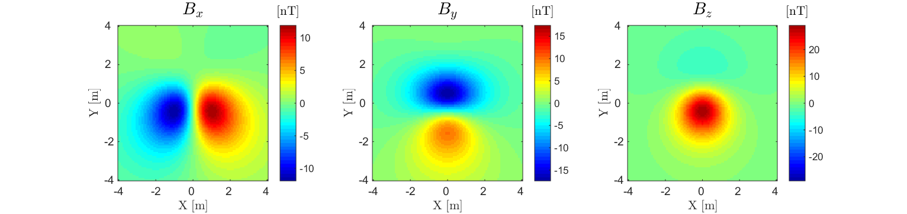
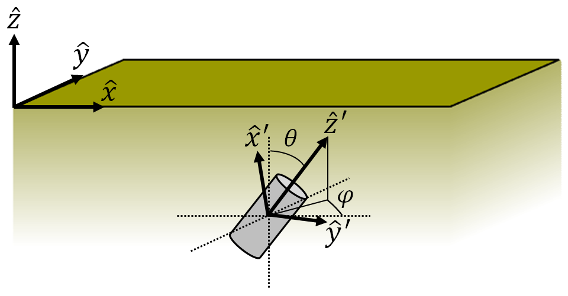
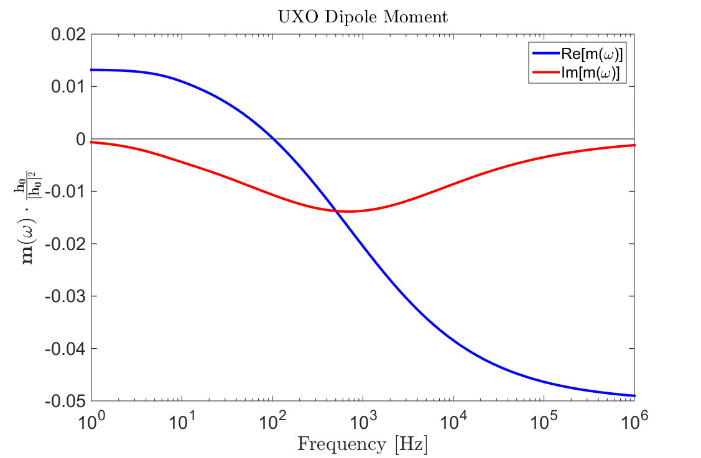
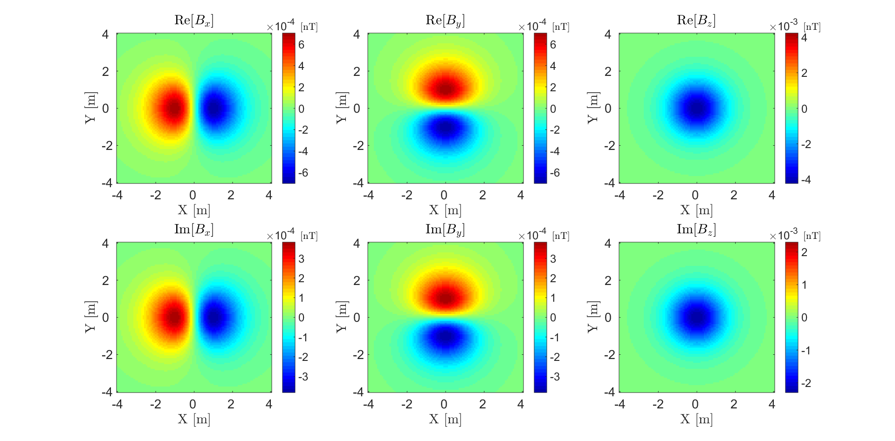
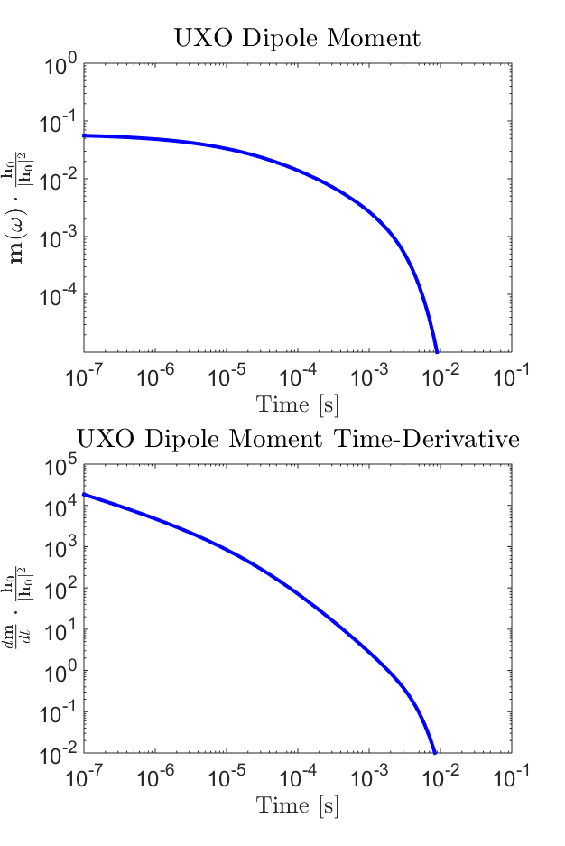
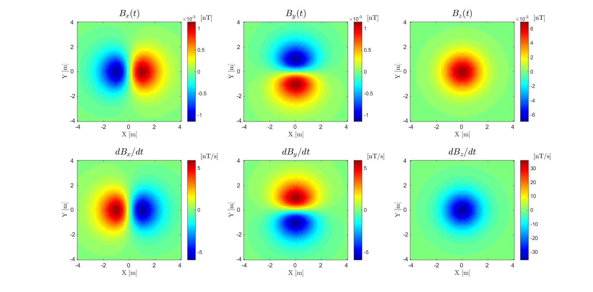

.. _uxo_physics:

.. purpose::

	Here, the nature of UXO responses is described in both the frequency and time domain. A commonly used model for characterizing UXO responses is also presented. 

Physics
=======

As explained on the previous page, EM UXO surveys operate on the principles of electromagnetic induction (:numref:`fig_UXO_index_schematic`). Compared to the host medium, UXO casings are both highly conductive (:math:`\sigma > 10^5` S/m) and highly permeable (:math:`\mu_r \gg 1`). During a UXO survey, an inductive loop source generates a primary field. The primary field induces eddy currents within ordnance casings and other buried metallic objects (known as clutter). Induced eddy currents generate secondary electromagnetic fields which are measured by one or more receiver coils.

.. figure:: images/UXOschematic.png
	:align: center
	:figwidth: 100%
	:name: fig_UXO_physics_schematic

	Electromagnetic induction (EMI) survey for UXO discrimination.

Dipole Model for UXO Responses
------------------------------

Research has shown that in general, the secondary field generated by a UXO (:math:`\mathbf{B}_{s}`) can be approximated by its dipole response (:cite:`Pasion1999,Belletal2001a,Belletal2001b,Zhangetal2003` and others). As a result, the excitation of the ordnance item is characterized by an induced magnetic dipole moment (:math:`\mathbf{m}`). Thus:

.. math::
	\mathbf{B}_{s} = \frac{\mu_0}{4 \pi} \Bigg [ \frac{3 \hat r \big ( \hat r \cdot \mathbf{m} \big ) - \mathbf{m}}{r^3} \Bigg ]

where :math:`\hat r = (r_x,r_y,r_z)` is the unit vector distance from the UXO to a particular observation location. For practical purposes, the dipole response is generally formulated in terms of a linear operator:

.. math::
	\begin{bmatrix} B_x \\ B_y \\ B_z \end{bmatrix} = \begin{bmatrix} G_{xx} & G_{xy} & G_{xz} \\ G_{yx} & G_{yy} & G_{yz} \\ G_{zx} & G_{zy} & G_{zz} \end{bmatrix} \begin{bmatrix} m_x \\ m_y \\ m_z \end{bmatrix}

where the entries within the geometric forward modeling operator (:math:`\mathbf{G}`) are given by:

.. math::
	G_{ij} = \frac{\mu_0}{4 \pi r^3} \big (3 r_i r_j - \delta{ij} \big ) \;\;\; \textrm{for} \;\;\; i,j = x,y,z

and :math:`\delta_{ij}` is the Kronecker delta. The linear formulation allows for rapid computation of the EM response and can be adapted to accommodate multiple receiver coils.

	Dipole anomaly 2 m above a magnetic dipole :math:`\mathbf{m} = [0,1,1]` Am :math:`\!^2`.

Unlike a conductive and magnetically permeable sphere, the excitation of a UXO is not the same in all directions. As a result, its corresponding polarization cannot be characterized by a single :ref:`excitation factor <sphereFEM_dipole_response>`. This is overcome by treating the UXO as an orthogonal tri-axial object which experiences a polarization along each axis. Ultimately, the UXO's dipole moment can be expressed as: 

	Geometry of the UXO problem. Fields are defined in :math:`( \hat x, \hat y,\hat z)` whereas the polarization of the UXO is defined in :math:`( \hat x', \hat y', \hat z')`.

.. math::
	\mathbf{m}(\omega) = \mathbf{A^T L A h_p}

where :math:`A (\theta ,\phi )` is a 3D rotation matrix from the coordinate system of the fields (:math:`\hat x,\hat y,\hat z`) to the coordinate system of the UXO (:math:`\hat x',\hat y',\hat z'`), :math:`\mathbf{h_p} = [h_x, h_y, h_z]^T` is a vector representing the transmitter's primary field and :math:`\mathbf{L}` is called the polarization tensor. Assuming there is no anisotropy, :math:`\mathbf{L}` is a diagonal matrix of the form:

.. math::
	\mathbf{L} = \begin{bmatrix} L_{x'} & 0 & 0 \\ 0 & L_{y'} & 0 \\ 0 & 0 & L_{z'} \end{bmatrix}

where :math:`L_{ii}` characterizes the polarization along each each axial direction :math:`\hat x'`, :math:`\hat y'` and :math:`\hat z'`. It should be noted that this model assumes the inducing field is spatially invariant about the target. For most ordnance items this assumption is acceptable because the items are small and the fields are sufficiently smooth.

Frequency-Domain Responses
**************************

The physics which governs the UXO's FEM response can be best understood by considering a :ref:`conductive and magnetically permeable sphere in free-space <sphereFEM_freespace_index>`. Using the dipole model, the UXO's FEM response can be expressed as:

	Induced dipole moment normalized by the inducing field for a sphere (:math:`R` = 10 cm, :math:`\sigma=10^6` S/m, :math:`\mu_r` = 30) 2 m below an inductive source.

.. math::
	\mathbf{B_s}(\omega) = \mathbf{G A^T L}(\omega) \mathbf{A h_p}

where :math:`\mathbf{h_p} = [h_x, h_y, h_z]^T` is a vector representing the transmitter's primary field and :math:`\mathbf{L}(\omega)` is the polarization tensor. In this case, the polarization of the UXO is frequency-dependent. Assuming there is no anisotropy, :math:`\mathbf{L}(\omega)` is a diagonal matrix of the form:

.. math::
	\mathbf{L}(\omega) = \begin{bmatrix} L_{x'} (\omega) & 0 & 0 \\ 0 & L_{y'} (\omega) & 0 \\ 0 & 0 & L_{z'} (\omega) \end{bmatrix}

where :math:`L_{ii}(\omega)` characterizes the polarization along each axis of the UXO. From this model, we ultimately see that the UXO's FEM response depends on its orientation relative to the transmitter, its polarization along each axis and the operating frequency of the transmitter.

In the case that the object is a sphere, :math:`L_{ii}(\omega) = \frac{4 \pi R^3}{3} \chi (\omega)` for :math:`ii=x',y',z'` where :math:`\chi (\omega)` is the :ref:`excitation factor for a sphere <sphereFEM_excitation_factor>`. The dipole moment for a spherical object (normalized by the inducing field) is shown in :numref:`uxo_physics_FEM_moment`. The FEM anomaly from the sphere at f = 10 kHz is shown in :numref:`uxo_physics_FEM_anomaly`.

	FEM anomaly at f = 10 kHz for a coincident loop system which measures 3-component data 2 m above a conductive and magnetically permeable sphere (:math:`R` = 10 cm, :math:`\sigma=10^6` S/m, :math:`\mu_r` = 30).

Transient Responses
*******************

The transient response characterizes the secondary fields which are generated after a long-standing static field is removed. The physics which governs the UXO's transient response can be best understood by considering a :ref:`conductive and magnetically permeable sphere in free-space <SphereTEM_index>`. TEM UXO instruments primarily measure :math:`dB_s/dt` as opposed to :math:`B_s(t)`. In any case, the transient response can be expressed as:

	Transient dipole moment normalized by the inducing field for a sphere (:math:`R` = 15 cm, :math:`\sigma=10^6` S/m, :math:`\mu_r` = 30) 2 m below an inductive source. (a) Dipole moment. (b) Time-derivative.

.. math::
	\mathbf{d}(t) = \mathbf{G p}(t) 

where :math:`\mathbf{d}(t)` is used to represent :math:`dB/dt` or :math:`B(t)` and :math:`\mathbf{p}(t)` represents :math:`\mathbf{m}(t)` or :math:`d\mathbf{m}/dt`, respectively, after the primary field has been removed. The UXO's transient dipole moment is given by:

.. math::
	\mathbf{p}(t) = \mathbf{A^T L}(t) \mathbf{A h_p}

where :math:`A` is a 3D rotation matrix from the coordinate system of the transmitter (:math:`x,y,z`) to the coordinate system of the UXO (:math:`x',y',z'`), :math:`\mathbf{h_p} = [h_x, h_y, h_z]^T` is a vector denoting transmitter's primary field before shut-off and :math:`\mathbf{L}(t)` defines the polarization of the UXO. Assuming there is no anisotropy, :math:`\mathbf{L}(t)` is a diagonal matrix of the form:

.. math::
	\mathbf{L}(t) = \begin{bmatrix} L_{x'} (t) & 0 & 0 \\ 0 & L_{y'} (t) & 0 \\ 0 & 0 & L_{z'} (t) \end{bmatrix}

where :math:`L_{ii}(t)` characterizes the polarization along each axis of the UXO. 

In the case that our object is a sphere, analytic expressions can be found :ref:`here <SphereTEM_transient_response>`. The transient moment of the UXO (normalized by the inducing field) and its time-derivative are shown in :numref:`uxo_physics_TEM_moment`. The TEM anomaly from the sphere at t = 10 :math:`\!^{-4}` s is shown in :numref:`uxo_physics_TEM_anomaly`.

For particular ordnance items, the polarization along each axis may be obtained through experimentation and stored in a library. Parameterizations also exist for describing the polarization of UXOs such that :math:`\mathbf{m}(t) = L(t) \mathbf{h_p}`. In this case, :math:`L(t)` is a scalar function which assumes that polarization of the UXO is parallel to the inducing field. One such parameterization for the decay of :math:`B (t)` is given by (:cite:`Smithetal2003`):

.. math::
	L(t) = k \Bigg ( 1 + \sqrt{\frac{t}{\alpha}} \, \Bigg )^{-\beta} e^{-t/\gamma}

which depends on parameters :math:`k, \alpha, \beta` and :math:`\gamma`. At early times, we can see that the decay of :math:`B(t)` is very flat and that :math:`dB/dt` decays proportional to :math:`t^{-1/2}`. At intermediate times, the decay of :math:`B(t)` is proportional to :math:`t^{-\beta/2}`; which only occurs for objects that sufficiently permeable. At late times, the responses exhibits exponential decay which is dependent on :math:`e^{-t/\gamma}`. Early, mid and late-time decays can all be see in :numref:`uxo_physics_TEM_moment`.

	TEM anomaly at t = :math:`10^{-4}` s for a coincident loop system which measures 3-component data 2 m above a conductive and magnetically permeable sphere (:math:`R` = 15 cm, :math:`\sigma=10^6` S/m, :math:`\mu_r` = 30).

