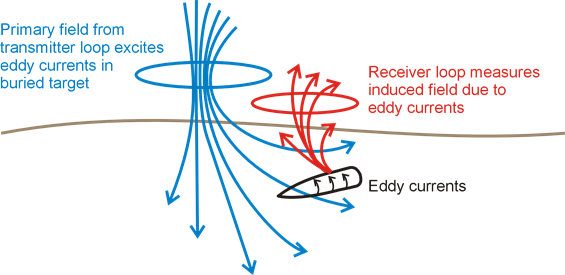

.. _uxo_physics:

Physics
=======

.. raw:: html
    :file: ../../../underconstruction.html

As explained on the previous page, EM UXO surveys operate on the principles of electromagnetic induction (:numref:`fig_UXO_index_schematic`). Compared to the host medium, UXO casings are both highly conductive (:math:`\sigma > 10^5` S/m) and highly permeable (:math:`\mu_r \gg 1`). During a UXO survey, an inductive loop source generates a primary field. The primary field induces eddy currents within ordnance casings and other buried metallic objects (known as clutter). Induced eddy currents generate secondary electromagnetic fields which are measured by one or more receiver coils.

	Electromagnetic induction (EMI) survey for UXO discrimination.

Dipole Model for UXO Responses
------------------------------

**maybe show a nice dipole response over an object**

Research has shown that in general, the EM response from a UXO (:math:`\mathbf{B}_{uxo}`) can be approximated by its dipole response (reference). As a result, the excitation of the ordnance item is characterized by an induced magnetic dipole moment (:math:`\mathbf{m}`). Thus:

.. math::
	\mathbf{B}_{uxo} = \frac{\mu_0}{4 \pi} \Bigg [ \frac{\hat r \big ( \hat r \cdot \mathbf{m} \big ) - \mathbf{m}}{r^3} \Bigg ]

where :math:`\hat r = (r_x,r_y,r_z)` is the unit vector distance from the UXO to a particular location. For practical purposes, the dipole response is formulated in terms of a linear operator:

.. math::
	\begin{bmatrix} B_x \\ B_y \\ B_z \end{bmatrix} = \begin{bmatrix} G_{xx} & G_{xy} & G_{xz} \\ G_{yx} & G_{yy} & G_{yz} \\ G_{zx} & G_{zy} & G_{zz} \end{bmatrix} \begin{bmatrix} m_x \\ m_y \\ m_z \end{bmatrix}

where

.. math::
	G_{ij} = \frac{\mu_0}{4 \pi r^3} \big (r_i r_j - \delta{ij} \big ) \;\;\; \textrm{for} \;\;\; i,j = x,y,z

and :math:`\delta_{ij}` is the Kronecker delta. The linear formulation allows for rapid computation of the response for multiple receiver coils at one or more separate orientations.

Frequency-Domain Response
-------------------------

The physics of the FEM response can be best understood by considering a conductive and magnetically permeable sphere in free-space (link). Unlike the sphere however, the excitation of the UXO is not the same in all directions.

.. math::
	\mathbf{m = A^T L A h_p}

where :math:`A` is a 3 :math:`\times` 3 is a 3D rotatation matrix from the coordinate system of the transmitter to the coordinate system of the UXO, :math:`L` characterizes the excitation of the UXO and :math:`h_p` is the transmitter's primary field.

Transient Responses
-------------------

The transient response characterizes the secondary fields which are generated after a long-standing static field is removed. 

.. math::
	\mathbf{d}(t) = 

Parameterization of the Decay
*****************************

Geological Noise
----------------

Typically, the EM responses from UXOs are significantly stronger than the EM responses from the host medium. In these cases, it is acceptable to neglect the response from the host medium. However, there are certain geological environments in which this assumption is invalid. As an approximation, it is common to neglect coupling and consider the UxO and geological responses as separable, thus:

.. math::
	B_{tot} = B_{uxo} + B_{geo}

Conductive Backgrounds
**********************

In regions where proximal geological units are very conductive (:math:`\sigma > 0.1` S/m), the Earth's inductive response becomes significant.

	- The TEM decay of the inductive response

Magnetic Backgrounds
********************

**From Laurens**: Magnetic and electromagnetic (EM) data are the most common geophysical data types which are acquired for UXO detection and discrimination. Magnetic instruments are used to measure distortions in the Earth’s geomagnetic fields produced by magnetically susceptible materials (e.g. steel). Magnetic sensors deployed for UXO detection typically either measure the total magnetic field (scalar measurement) or the difference between two closely spaced magnetometers measuring the vertical component of the magnetic field (gradiometer measurement).Magnetic sensor arrays have been deployed for helicopter-borne surveys ("heli-mag") in wide area assessments. Multiple magnetometers can also be arranged in arrays for ground-based surveying, with the increased swath decreasing the number of passes required to cover a given area.  Data processing of magnetic data is often complicated by a significant background soil response, which can obscure identification of discrete targets in the measured signal. In addition, magnetic data can only provide limited information about intrinsic target properties (i.e. size and shape) and so are rarely used to classify detected targets as UXO and non-UXO (Billings, 2004).   Our emphasis here will therefore be on detection and classification with electromagnetic data.

As depicted in Figure 1, electromagnetic instruments actively transmit a time-varying primary magnetic field which illuminates the earth. The variation of the primary field induces currents in the ground and these currents in turn produce a secondary field which can be measured by a receiver at the surface. EM sensors measure the decay of these secondary fields after the primary field is switched off. These secondary fields provide information regarding electrically conductive items in the ground.

