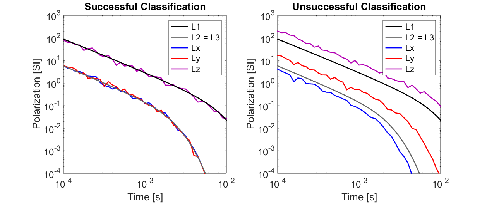

.. _uxo_pratical_considerations:

.. purpose::

	Here, we discuss important practices for ensuring successful UXO location and classification.

Practical Considerations
========================

Geological responses and clutter items make UXO classification difficult because they mask the responses from targets and distort anomalies. Before attempting to locate and classify UXOs within a new area, work must be done to ensure the survey will produce successful results. In practice this is accomplished by:

	- Accurately characterizing the background response due to local geology and clutter.
	- Performing test surveys over seeded items to validate location and classification algorithms.

Characterizing the Background Response
--------------------------------------

An important aspect of UXO surveys is accurate characterization of the background response. By measuring the local background response, we can determine the nature and amplitude of signals which may mask responses from UXOs. For geological responses, it may be possible to remove the background response and isolate the UXO's response. In the case of clutter items, characterization of the background response can be used to infer survey limitations; for example, the maximum depth at which a particular ordnance item can be classified with 100% certainty (detection assurance level).

Below, we show the background response due to clutter items and the responses over two identical UXOs a different depths. The shallow UXO produces a much higher amplitude anomaly than the deeply buried UXO. In the latter case, the amplitude of the background response is significant and distorts the TEM anomaly. 

.. figure:: images/data_practical_clutter.png
	:align: center
	:figwidth: 100%
	:name: fig_clutter_uxo

	Distortion of TEM anomalies due to clutter items at t = :math:`10^{-3}` s. (left) Background response. (center) Response over shallow UXO; z = -1 m. (right) Response over deep UXO; z = -2 m.

Test Survey over Seeded Items
-----------------------------

Seeded items are disarmed UXOs that are buried in order to test a proposed survey and classification procedure. Typically, seeded items are buried within a local test pit. Next, cued interrogation data are collected over the seeded items. Processing steps described in :ref:`interpretation <uxo_interpretation>` are then used to classify each item. Test surveys are used to determine whether:

	1) the line and station spacings are sufficient.
	2) the detection assurance level is acceptable.
	3) the current survey parameters can be used to accurately locate and classify ordnance items.

If seeded items are accurately located and classified, the approach can be used to find UXOs within the area. If the test survey is unsuccessful, a different approach is likely required. Below, we illustrate examples of successful and unsuccessful classification of a seeded item. On the left, recovered polarizations match the primary and secondary polarizations for a particular item. On the right, recovered polarization to not match. In this case, the test survey was unsuccessful in accurately classifying the seeded item.

	Successful (left) and unsuccessful (right) classification of seeded items. :math:`L1` is the true primary polarization, :math:`L2 = L3` are the true secondary polarizations and :math:`Lx, \; Ly` and :math:`Lz` are recovered polarizations.

