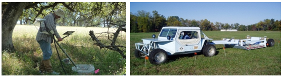
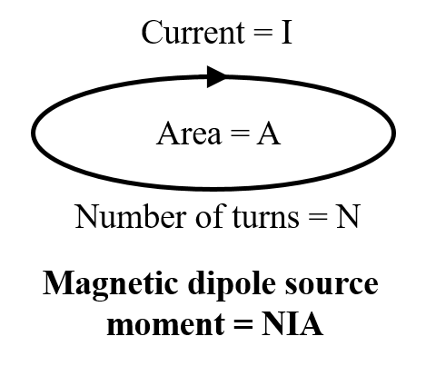
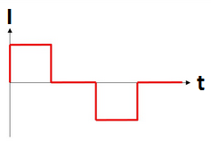

.. _uxo_survey:

Survey
======

.. raw:: html
    :file: ../../../underconstruction.html

Instruments designed for UXO applications come in a wide variety of geometries ranging from single loop, man-portable systems to cart systems with multiple transmitters and receivers. Each system has its advantages and disadvantages. As a result, it is important to choose a UXO system which works well for a particular setting. Frequency domain systems have been used for decades, however, modern time domain systems are currently a more popular choice. Aspects of UXO surveys as they relate to instrumentation are discussed here. Aspects of survey design are discussed :ref:`here <uxo_survey_design>`.

	Man-portable vector (MPV) system (left). TEMTADS system (right).

The Source and Receiver
-----------------------

Transmitter
***********

For UXO systems, inductive loop sources are used as transmitters. Each transmitter loop is comprised of a coil of wire which carries a time-varying electrical current; which produces a time-varying primary magnetic field.

Transmitter loops can be square or circular in shape. For single-loop systems (EM-61, TEMTADS, MPV), the transmitter loop is generally oriented horizontally. For multi-loop systems (Metal Mapper), the transmitter loops are oriented orthogonal to one another; which allows the transmitter to illuminate targets from multiple directions. Mobile systems (EM-61, MPV, TEMTADS, etc...) use transmitter loops with dimensions anywhere from 10s of centimeters to roughly a meter. Large loop systems use a stationary transmitter loop with dimensions up to 10s of meters (UltraTEM).

	Representation of the dipole moment for an inductive loop source.

The strength of the transmitter's primary field is dependent on its dipole moment. For a given transmitter loop, the dipole moment is given by:

.. math::

	m = NIA

where :math:`I` is the current within the loop, :math:`A` is the loop's cross-sectional area and :math:`N` is the number of turns for the coil. As we can see, the strength of the transmitter's primary field can be increased by increasing the current amplitude, the cross-sectional area or the number of turns. Increasing the transmitter's dipole moment allows us to improve the signal to noise ratio of UXO systems.

Receiver
********

For UXO systems, coils of wire (receiver loops) are used to measure the secondary fields generated by buried conductors. The change in magnetic flux through each receiver loop, due to the target's response, induces an electromotive force (EMF) within the loop. Ultimately, the receiver measures the voltage which results from the induced EMF. For both frequency domain and time domain systems, the induced EMF within a receiver loop is illustrated below.

.. figure:: images/receiver_loops.png
	:align: center
	:figwidth: 60%
	:name: fig_uxo_receiver_loops

	EMF induced within a receiver loop. A) FEM receiver loop. B) TEM receiver loop.

Frequency domain systems measured real and quadrature components of the secondary field. Time domain systems generally measure the target's :math:`dB/dt` response; although there are systems capable of measuring :math:`B(t)` directly. Receiver loops are only sensitive to components of the secondary field parallel to their normal vector. Thus in order to obtain 3-component data, multiple orthogonal receiver loops must be used.

As we can see from the illustration above, the EMF induced within the receiver loop is proportional to both the loop's cross-sectional area (:math:`A`) and the number of turns (:math:`N`). Because the EM anomalies from UXOs are so compact, receiver coils with smaller cross-sectional areas must be used in order to accurately quantify the target's response at a particular location. The corresponding decrease in signal to noise ratio from small receiver loops is overcome by using coils of wire with many turns.

Transmitter Source Signal
-------------------------

.. figure:: images/frequency_waveform.png
	:align: right
	:figwidth: 40%
	:name: fig_uxo_frequency_waveform

	High frequency (left) and low frequency (right) signals contained within transmitter waveform.

Frequency Domain
****************

FEM systems transmit harmonic signals at one or more frequencies. Lower frequency signals penetrate deeper into the Earth whereas higher frequency signals offer better resolution at shallow depths. Typically FEM systems operate using frequencies between 1 kHz and 20 kHz.

Time Domain
***********

	Bi-modal boxcar waveform with 50% duty cycle.

When operating in the time domain, we are generally interested in the UXO's transient response; that is, the response to step-off excitation. Most TEM systems use a bi-model boxcar current waveform with a specified duty cycle. The data are collected during the off-time. So long as the time-width of the boxcar is sufficiently long, it may be used to accurately approximate the transient response over the set of measured time channels. For most systems, the time-length of the boxcar waveform is on the order of 10s of milliseconds.

Survey Configurations
---------------------

Below are a set of electromagnetic sensors which have been applied to UXO detection and classification problems. This is not a comprehensive list of electromagnetic sensors, but is intended to illustrate the recent evolution towards configurations with multiple transmitters and receivers. Although FEM systems have been used for decades with varying levels of success, modern TEM systems are more commonly used for UXO detection. As a result, most of the instruments presented here will belong to the class of TEM systems. 

Frequency-Domain Systems
************************

**Coincident Loop Systems**

Coincident loop systems are by far the most common configuration for FEM UXO surveys. These systems generally consist of a circular transmitter loop and a circular receiver loop which lie on the same plane. This allows for easy removal of the transmitter's primary field from the data, thus isolating the target's response. The diameter of the transmitter and receiver loops are generally on the order of 10s of centimeters. Although this type of system is very portable, the data collected cannot be as easily used to discriminate and classify targets. As a result, these types of systems are becoming less common.

.. figure:: images/fig_coincident_uxo.png
	:align: center
	:figwidth: 80%
	:name: fig_coincident_uxo

Time-Domain Systems
*******************

**EM-61**

The Geonix EM-61 is a time-domain instrument with a single horizontal transmitter loop and a single receiver loop; thus it only measures a single vector component of the TEM response. Several versions of this instrument are available which use different loop sizes (MK2 A, MK2 HH and MK2 marine). Smaller transmitter and receiver loops are generally used to find smaller objects at shallower depths. The MK2 marine version can be used in underwater applications.

.. figure:: images/fig_EM61_uxo.png
	:align: center
	:figwidth: 100%
	:name: fig_EM61_uxo

**TEMTADS**

The TEMTADS system is comprised of a square horizontal transmitter loop and an array of 25 horizontal coplanar receiver loops; thus it measures the vertical TEM response. By mounting this system onto a cart, it may be used to survey large areas in a relatively short amount of time. The addition of multiple small receiver loops allows for better characterization of compact TEM anomalies.

.. figure:: images/fig_TEMTADS_uxo.png
	:align: center
	:figwidth: 100%
	:name: fig_TEMTADS_uxo

**MPV**

The man-portable vector (MPV) instrument is comprised of a 50 cm diameter transmitter loop and an array of 5 receivers. Each receiver measures 3-component data, resulting in 15 transmitter-receiver pairs. This instrument was designed to improve maneuverability in rugged terrain. The use of small receiver loops allows for accurate characterization of compact TEM anomalies.

.. figure:: images/fig_MPV_uxo.png
	:align: center
	:figwidth: 100%
	:name: fig_MPV_uxo

**Metal-Mapper**

The Geometrics Metal Mapper is a time-domain instrument with 3 orthogonal transmitter loops (1m :math:`\times` 1m) and a horizontal array with 7 receivers. Each receiver measures 3-component data, resulting in 63 transmitter-receiver pairs. Because the Metal Mapper illuminates targets from multiple orientations, it has an advantage over single transmitting loop systems. The use of small receiver loops allows for accurate characterization of compact TEM anomalies.

.. figure:: images/fig_MetalMapper_uxo.png
	:align: center
	:figwidth: 100%
	:name: fig_MetalMapper_uxo

From Laurens
------------

Electromagnetic sensors designed for UXO applications come in a wide variety of geometries ranging from cart systems with multiple transmitters and receivers to single loop, man-portable systems. A ubiquitous time-domain instrument in use today is the Geonics EM-61, which transmits from a single horizontal coil and receives with horizontal loops at four time channels. This instrument is robust and easy to use and so is popular for UXO detection and other environmental applications. However, the range of time-channels is fairly short and the paucity of receiver/transmitter combinations (relative to newer systems) limits the classification capability of this instrument.

