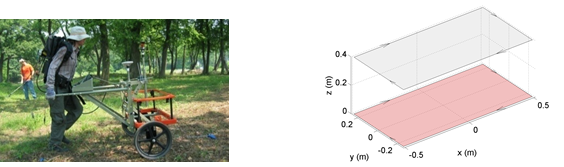
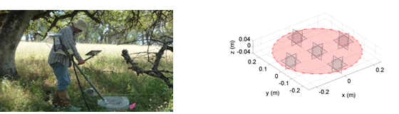

.. _uxo_survey:

Survey
======

.. raw:: html
    :file: ../../../underconstruction.html

Electromagnetic sensors designed for UXO applications come in a wide variety of geometries ranging from cart systems with multiple transmitters and receivers to single loop, man-portable systems. 

A ubiquitous time-domain instrument in use today is the Geonics EM-61, which transmits from a single horizontal coil and receives with horizontal loops at four time channels. This instrument is robust and easy to use and so is popular for UXO detection and other environmental applications. However, the range of time-channels is fairly short and the paucity of receiver/transmitter combinations (relative to newer systems) limits the classification capability of this instrument.

Survey Configurations
---------------------

Below are a set of electromagnetic sensors which have been applied to UXO detection and classification problems. This is not a comprehensive list of electromagnetic sensors, but is intended to illustrate the recent evolution towards configurations with multiple transmitters and receivers.

Frequency-Domain Systems
************************

Time-Domain Systems
*******************

**EM-61**

The Geonix EM-61 is a time-domain instrument with a single horizontal transmitter loop and a single horizontal receiver loop. Several versions of this instrument are available which use different loop sizes (MK2 A, MK2 HH and MK2 marine). Smaller transmitter and receiver loops are generally used to find smaller objects at shallower depths. The MK2 marine version can be used in underwater applications.

**TEMTADS**

The TEMTADS system is comprised of a square horizontal transmitter loop and an array of 25 horizontal coplanar receiver loops. By mounting this system onto a cart, it may be used to survey larger regions in a relatively short amount of time. The addition of multiple smaller receiver loops allows for better characterization of more compact TEM anomalies.

.. figure:: images/fig_TEMTADS_uxo.png
	:align: center
	:figwidth: 100%
	:name: fig_TEMTADS_uxo

**MPV**

The man-portable vector (MPV) instrument is comprised of a 50 cm diameter transmitter loop and an array of 5 receivers. Each receiver measures 3-component data, resulting in 15 transmitter-receiver pairs. This instrument was designed to improve maneuverability in more rugged terrain.

**Metal-Mapper**

The Geometrics Metal Mapper is a time-domain instrument with 3 orthogonal transmitter loops (1m :math:`\times` 1m) and a horizontal array with 7 receivers. Each receiver measures 3-component data, resulting in 63 transmitter-receiver pairs. Because the Metal Mapper illuminates targets from multiple orientations, it has an advantage over single transmitting loop systems.

.. figure:: images/fig_MetalMapper_uxo.png
	:align: center
	:figwidth: 100%
	:name: fig_MetalMapper_uxo

From Laurens
------------

Electromagnetic sensors designed for UXO applications come in a wide variety of geometries ranging from cart systems with multiple transmitters and receivers to single loop, man-portable systems. A ubiquitous time-domain instrument in use today is the Geonics EM-61, which transmits from a single horizontal coil and receives with horizontal loops at four time channels. This instrument is robust and easy to use and so is popular for UXO detection and other environmental applications. However, the range of time-channels is fairly short and the paucity of receiver/transmitter combinations (relative to newer systems) limits the classification capability of this instrument.

