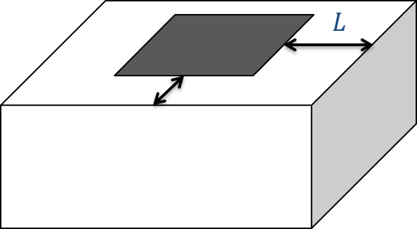

.. _ztem_interpretation:

Interpretation
==============

.. raw:: html
    :file: ../../../underconstruction.html

The tipper data show cross-over anomalies with both a positive and negative peak. These can be difficult to interpret, especially in geologically complex regions. A few tools have been developed to process the data and make interpretation slightly easier. The first is calculating the total divergence (DT), which generates peaks over the anomalies:

.. math:: DT = \frac{\partial T_{zx}}{\partial x} + \frac{\partial T_{zy}}{\partial y}

The DT is calculated for both the in-phase and quadrature components at each frequency. Higher frequencies would indicate shallow structures while lower frequencies show deeper structures. Over a conductive anomaly, the DT shows a minimum.

Total phase rotation (TPR) is another tool, where the data are rotated by 90 degrees to generate a single peak over an anomaly instead of the cross-over signature. In this case, the method creates a maxima over conductive bodies and also preserves long wavelength information that can be lost by taking the derivative in the DT method. The phase rotated (PR) data are added together to provide the final TPR map:

.. math:: TPR = PR(T_{zx}) + PR(T_{zy})

        To invert natural source data, such as ZTEM, the mesh should extend a few skindepths (:math:`L`) past the data region.

These tools help to identify areas of higher and lower resistivity but they still don't provide an estimate of the resistivity values or the true depth to particular structures. To obtain that, we need to invert the tipper data for a resistivity model, either in 2D or 3D. The fundamentals for inversion of EM data are outlined :ref:`here <inversion>`. An important aspect of inverting ZTEM data are the boundary conditions for modelling the fields. In order to account for the sources, an extended grid is used to model the data (Figure :numref:`ztem_mesh`). In general, the mesh extends a few skin depths (:math:`L`) away from the data area. In addition, the topography of the survey region needs to be adequately represented to minimize discretization errors.

The tipper functions are zero over a halfspace or 1D earth. Thus, care must be taken to determine the background conductivity to start an inversion. A few options have been explored to determine the best starting halfspace model, including testing a range of values and observing which inversion converges the best. Other options include using a priori information, whether from another geophysical method or from ground truth data.

.. todo:: insert synthetic example? maybe from elliot's thesis?

