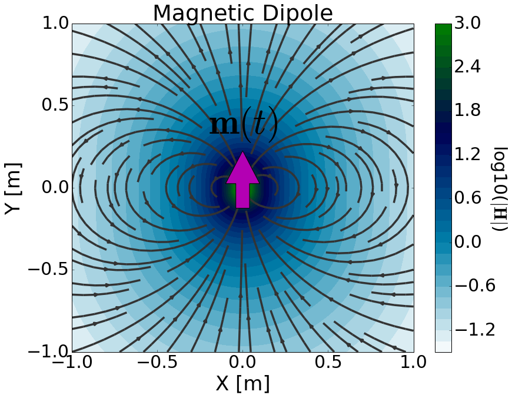

.. _time_domain_magnetic_dipole_index:

Transient Magnetic Dipole
=========================

.. Purpose::

    Here, we provide a physical description of the time-dependent magetic dipole.
    This is used to develop a mathematical expression which can be used to replace the magnetic source term in Maxwell's equations. 
    We then consider a transient magnetic dipole; which represents a more commonly used geophysical source.

**General Definition**

        	Physical representation of the time-dependent magnetic dipole source.

The time-dependent magnetic dipole can be thought of as an infinitesimally small loop which carries a time-dependent current.
The strength of the source is therefore defined by a time-dependent dipole moment :math:`\mathbf{m}(t)`.
For a time-dependent magnetic dipole defined by surface area vector :math:`\mathbf{S}` and current :math:`I (t)`, the dipole moment is given by:

.. math::
	\mathbf{m}(t) = I(t)\mathbf{S}

As a result, the source term for the time-depedent magnetic dipole is given by:

.. math::
	\mathbf{j_m (r)} = - \dfrac{\partial I}{\partial t} \mathbf{S} \, \delta (x) \delta (y) \delta (z)

where :math:`\delta (x)` is the Dirac delta function.
Notice how the source term contains a time-derivative of the loop's current.
By including the source term, Maxwell's equations in the time domain are given by:

.. math::
	\begin{split}
	\nabla \times \mathbf{e_m} + \mu \dfrac{ \mathbf{h_m} }{\partial t} &= - \dfrac{\partial I(t)}{\partial t} \mathbf{S} \, \delta (x) \delta (y) \delta (z)  \\
	\nabla \times \mathbf{_m} - & \sigma \mathbf{e_m}  - \varepsilon \dfrac{\partial  \mathbf{e_m} }{\partial t} = 0
	\end{split}

where subscripts :math:`_m` remind us that we are considering a magnetic source.
The source is responsible for generating a primary magnetic field in the surrounding region (:numref:`MagDipoleTime`).
According to :ref:`Faraday's law<faraday_differential_time>`, time-varying magnetic fields generate rotational electric fields.
In matter, this leads to an induced current density which produces secondary magnetic fields according to the :ref:`Ampere-Maxwell equation<ampere_maxwell_differential_time>`.

**Transient Electrical Current Dipole**

The transient response represents the response of a system to step-off excitation.
For a transient magnetic dipole with surface area vector :math:`\mathbf{S}`, the electromagnetic response results from a step-off current of the form :math:`I (t) = I u(-t)`.
Thus the dipole moment is given by:

.. math::
	\mathbf{m}(t) = I u(-t) \mathbf{S}

where :math:`u(t)` is the unit step function and :math:`I` is the amplitude of the current at :math:`t \leq 0`.
The source term for the corresponding magnetic dipole is given by:

.. math::
	\mathbf{j_m^s} = I \delta(t) \mathbf{S} \, \delta (x) \delta (y) \delta (z)

where :math:`\delta (x)` is the Dirac delta function.
By including the source term, Maxwell's equations in the time domain are given by:

.. math::
	\begin{align}
	\nabla \times \mathbf{e_m} + \mu \dfrac{\partial  \mathbf{h_m} }{\partial t} &= I \delta(t) \mathbf{S} \, \delta (x) \delta (y) \delta (z)  \\
	\nabla \times \mathbf{h_m} - &\sigma \mathbf{e_m}  - \varepsilon \dfrac{\partial \mathbf{e_m} }{\partial t} = 0
	\end{align}

It is possible to solve this system to obtain analytic solutions for the transient electric and magnetic fields.
However, we will apply a different approach which uses the inverse Laplace transform.

**Contents**

In the following section, we solve Maxwell's equations for a transient magnetic dipole source and provide analytic expressions for the electric and magnetic fields within a homogeneous medium.
Asymptotic expressions are then provided for several cases.
Numerical modeling tools are made available for investigating the dependency of the electric and magnetic fields on various parameters.

.. toctree::
    :maxdepth: 2

    analytic_solution
    asymptotics
    fields
