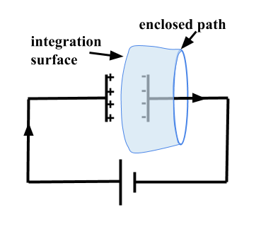

.. _ampere_maxwell:

Ampere-Maxwell
==============

The Ampere-Maxwell equation relates electric currents and magnetic flux. It
describes the magnetic fields that result from a transmitter wire or loop in
electromagnetic surveys. For steady currents, it is key for describing the
magnetometric resistivity experiment.

.. _ampere_maxwell_integral_time:

Integral Equation
-----------------

The Ampere-Maxwell equation in integral form is given below:

.. math::
    \int_S \boldsymbol{\nabla} \times \mathbf{b} \cdot \mathbf{da} =  \oint_C \mathbf{b} \cdot \mathbf{dl} = \mu_0 \left( I_{enc} + \varepsilon_0 \frac{d}{dt} \int_S \mathbf{e} \cdot \hat{\mathbf{n}} ~\text{da} \right),
    :label: ampere_maxwell_integral

where:

 - \\( \\mathbf{b} \\) is the magnetic flux
 - \\( \\mathbf{e} \\) is the electric field
 - \\( I_{enc} \\) is the enclosed current
 - \\( \\mu_0 \\) is the magnetic permeability of free space
 - \\( \\varepsilon_0 \\) is the electric permittivity of free space
 - \\( \\hat{\\mathbf{n}} \\) is the outward pointing unit-normal

 .. figure:: images/Ienc.png
    :align: right
    :scale: 20% 
    :name: Ienc

    Enclosed current. 

The first term of the right hand side of the equation was discovered by Ampere. It shows the relationship
between a current \\(I_{enc}\\) and the circulation of the magnetic field, \\(\\mathbf{b}\\),
around any closed contour line (See :numref:`Ienc`). \\(I_{enc}\\) refers to all currents
irrespective of their physical origin.

The second portion of the equation is Maxwell's contribution and shows that a
circulation of magnetic field is also caused by a time rate of change of
electric flux. This explains how current in a simple circuit involving a
battery and capacitor can flow. The term is pivotal in showing that
electromagnetic energy propagates as waves. 

    Integration over a capacitor

For example, imagine integrating over a surface associated with a closed path
such as the one showed in :numref:`Capacitor`. We can define the surface to be
the area of the circle, as in :numref:`Ienc`, or alternatively, as a
stretched surface, as shown in :numref:`Capacitor`. In the first case,
the enclosed current is the flow of charges in the wire. In the second case,
however, there are no charges flowing through the surface, yet the magnetic
field defined on the enclosing curve, \\(C\\), must be the same. This apparent
discrepancy is reconciled if we take into account the displacement current,
which is the time rate of change of the electric field, between the two
plates. This integration is the same as if we were integrating over a flat
surface with the current wire crossing it.

.. When the current is flowing, the magnetic field has to be related
.. to the electric field flowing between the two plates during the charge (more
.. precisely, its variation), as the result of this integration is the same as if
.. we were integrating over a flat surface, with the current wire crossing it
.. (see the first portion of the equation).

The integral formulations are physically insightful and closely relate to the
experiments that gave rise to them. They also play a formative role in
generating boundary conditions for waves that propagate through different
materials.

When dealing with the propagation of EM waves in matter the currents
\\(I_{enc}\\) are usually dealt with in terms of current densities. The
integral equation above is thus written as

.. math:: 
    \int_S \boldsymbol{\nabla} \times \mathbf{b} \cdot \mathbf{da} =  
    \oint_C \mathbf{b} \cdot \mathbf{dl} = 
    \mu_0 \left(\int_S \left(\mathbf{j_f}  
        + \frac{\partial \mathbf{p}}{\partial t} 
        + \boldsymbol{\nabla} \times \mathbf{m}\right)\cdot \mathbf{da} 
        +  \varepsilon_0 \frac{d}{dt}  \int_S \mathbf{e} \cdot \mathbf{\hat{n}} ~\text{da}\right),
    :label: ampere_maxwell_integral_p&m

where the current densities are:

- \\(\\mathbf{j_f}\\) is the free current caused by moving charges
- \\(\\mathbf{j_p} = \\frac{\\partial \\mathbf{p}}{\\partial t}\\) is the polarization or bound current, where \\(\\mathbf{p}\\) is the electric polarization resulting from bound charges in dielectrics 
- \\(\\mathbf{j_m} = \\nabla \\times \\mathbf{m}\\) is the magnetization current, that is, the currents needed to generate the magnetization \\( \\mathbf{m}\\)

The total current density is the sum of these three contributions and is described by

.. math::
    \mathbf{j} = \mathbf{j}_f + \mathbf{j}_p + \mathbf{j}_m.
    :label: current_contributions

.. A note on the total current 
.. ***************************

.. note:: 

    .. figure:: images/Currents.png
        :align: center
        :scale: 50%

    The total current involved in the Ampere-Maxwell equation consists of free
    current and bound current, although all currents are essentially the same from
    a microscopic perspective. Treating free current and bound current differently
    offers physical insights to the Ampere-Maxwell equation in different contexts.

    The free current is caused by moving charges which are not tied to atoms, often
    referred to as conduction current. In contrast, the bound current is induced by
    a magnetization or a polarization in bulk materials. When a magnetic material is
    placed in an external magnetic field, a magnetization current will be induced
    due to the motion of electrons in atoms. Likewise, when an external electric
    field is applied to a dielectric, the positive and negative bound charges within
    the dielectric can separate and induce a polarization current density internally.

.. Then the total current density can be described as

.. 
..     \mathbf{j} = \mathbf{j}_f + \mathbf{j}_m + \mathbf{j}_p

.. where

.. - \\(\\mathbf{j}_f = \\sigma \\mathbf{e} \\) is the free current density caused by
.. moving charges,
.. - \\(\\mathbf{j}_m = \\nabla \\times \\mathbf{m}\\) is the bound current due to
.. magnetization,
.. - \\(\\mathbf{j}_p = \\frac{\\partial \\mathbf{p}}{\\partial t} \\) is the polarization current density due to the time-dependent bound charges.

Continuing to treat the free current and bound current separately and using the 
constitutive equations: \\( \\mathbf{b} = \\mu_0(\\mathbf{h} + \\mathbf{m})\\) and \\(\\mathbf{d}= \\varepsilon_0 \\mathbf{e} + \\mathbf{p}\\), the integral form Ampere-Maxwell equation can be reformulated as:

.. math::
    \int_S \boldsymbol{\nabla} \times \mathbf{h} \cdot \mathbf{da} = \oint_C \mathbf{h} \cdot \mathbf{dl} = \int_S \left( \mathbf{j}_f + \frac{\partial \mathbf{d}}{\partial t} \right) \cdot \hat{\mathbf{n}} ~\text{da}.
    :label: ampere_maxwell_integral_h&d

.. and in differential form,

.. .. math::
..     \boldsymbol{\nabla} \times \mathbf{h} = \mathbf{j}_f + \frac{\partial \mathbf{d}}{\partial t}

Note that the bound charge due to magnetization is integrated into the magnetic
field \\(\\mathbf{h}\\), whereas the bound charge due to electric polarization is
integrated into the displacement field \\(\\mathbf{d}\\).

.. _ampere_maxwell_differential_time:

Differential equation in the time domain
----------------------------------------

There are a number of ways of writing the equation in differential form. Each
provides its own insight. We begin by considering the differential form of equation :eq:`ampere_maxwell_integral` in terms of the variables \\(\\mathbf{e, b, p} \\) and \\(\\mathbf{m} \\):

.. math::
    \boldsymbol{\nabla} \times \mathbf{b} 
        - \varepsilon_0 \mu_0 \frac{\partial \mathbf{e}}{\partial t} 
    = \mu_0\left( \mathbf{j_f} 
        + \frac {\partial \mathbf{p}}{\partial t} 
        + \boldsymbol{\nabla} \times \mathbf{m}\right) 
    :label: ampere_maxwell_differential_ebpm

and similar to :eq:`ampere_maxwell_integral_h&d`, we can use the constitutive relations \\(\\mathbf{d}= \\varepsilon_0 \\mathbf{e} + \\mathbf{p}\\) and \\( \\mathbf{b} = \\mu_0(\\mathbf{h} + \\mathbf{m})\\) to write the differential time-domain equation in terms of the variables \\(\\mathbf{h, j_f} \\) and \\(\\mathbf{d} \\):

.. math::
    \boldsymbol{\nabla} \times \mathbf{h} = \mathbf{j}_f + \frac{\partial \mathbf{d}}{\partial t}.
    :label: ampere_maxwell_differential_hjd

.. _ampere_maxwell_differential_frequency:

Differential equations in the frequency domain
---------------------------------------------- 

We use the \\(e^{i\\omega t}\\) :ref:`fourier_transform_convention` to transfer 
our equations from the time domain to the frequency domain.

The equation becomes 

.. math::
    \boldsymbol{\nabla} \times \mathbf{H}  - i \omega \mathbf{D} = \mathbf{J}_f.
    :label: ampere_maxwell_frequency

If we deal with linear isotropic media then we have

.. math::
    \mathbf{D}(\omega)=\epsilon \mathbf{E}(\omega)
.. math::
    \mathbf{J}_f(\omega)=\sigma \mathbf{E}(\omega)
    :label: current_density_electric_field

	

and the Ampere-Maxwell equations can be written as 

.. math::
    \boldsymbol{\nabla} \times \mathbf{H}  - \left(\sigma + i \omega \epsilon\right) \mathbf{E} = 0.
    :label: ampere_maxwell_frequency2 
	

Units
-----

.. +-------------------+-------------------+-----------------+--------------------------------------------------------------+----------------------------------------------------------------------------------+
..   |
.. +-------------------+-------------------+-----------------+--------------------------------------------------------------+----------------------------------------------------------------------------------+

..  |

+--------------------------+-------------------+---------------------------+---------------------------------------+
| Magnetic B-field         | \\(\\mathbf{b}\\) | T                         | tesla                                 |
+--------------------------+-------------------+---------------------------+---------------------------------------+
| Electric field intensity | \\(\\mathbf{e}\\) |\\(\\frac{\\text{V}}       |                                       |
|                          |                   |{\\text{m}}\\)             | volt per meter                        |
+--------------------------+-------------------+---------------------------+---------------------------------------+
| Electric current         | \\(\\text{I}\\)   | A                         | ampere                                |
+--------------------------+-------------------+---------------------------+---------------------------------------+
| Electric current density | \\(\\mathbf{j}\\) |\\(\\frac{\\text{A}}       |                                       |
|                          |                   |{\\text{m}^{2}}\\)         | ampere per square meter               | 
+--------------------------+-------------------+---------------------------+---------------------------------------+
| Magnetization            | \\(\\mathbf{m}\\) |\\(\\frac{\\text{A}}       |                                       |
|                          |                   |{\\text{m}}\\)             | ampere per meter                      |
+--------------------------+-------------------+---------------------------+---------------------------------------+
| Electric polarization    | \\(\\mathbf{p}\\) |\\(\\frac{\\text{A}\\cdot  |                                       |
|                          |                   |\\text{s}}{\\text{m}}\\)   | ampere times seconds per square meter | 
+--------------------------+-------------------+---------------------------+---------------------------------------+
| Magnetic H-field         | \\(\\mathbf{h}\\) |\\(\\frac{\\text{A}}       |                                       |
|                          |                   |{\\text{m}}\\)             | ampere per meter                      |
+--------------------------+-------------------+---------------------------+---------------------------------------+
| Electric displacement    | \\(\\mathbf{d}\\) |\\(\\frac{\\text{C}}       |                                       |
|                          |                   |{\\text{m}^{2}}\\)         | coulomb per square meter              |
+--------------------------+-------------------+---------------------------+---------------------------------------+

**Constants** 

+--------------------------+-------------------------------------------------------------------------------------------------------------------------------------------+
| Magnetic constant        | \\(\\mu_0 = 4\\pi ×10^{−7} \\frac{\\text{N}}{\\text{A}^2} \\approx 1.2566370614...×10^{-6} \\frac{\\text{T}\\cdot \\text{m}}{\\text{A}}\\)|
+--------------------------+-------------------------------------------------------------------------------------------------------------------------------------------+
| Vacuum permittivity      | \\(\\varepsilon_0  \\approx 8.854 187 817... × 10^{−12} \\frac{\\text{F}}{\\text{m}} \\) (farads per meter)                               |
+--------------------------+-------------------------------------------------------------------------------------------------------------------------------------------+

**Conversions**

 - One Tesla equals one weber (the SI unit of magnetic flux) per square meter:

    .. math:: 
        1 \text{T} = 1 \frac{\text{Wb}}{\text{m}^{2}} = 1 \frac{\text{V}\cdot \text{s}}{\text{m}^{2}}.

 - One ampere equals one coulomb (the SI unit of electric charge) per second: 
    .. math:: 
        1 \text{A} = 1 \frac{\text{C}}{\text{s}}.

.. Magnetization \\( \\mathbf{m} \\):  ampere per meter \\([\\frac{\\text{A}}{\\text{m}}]\\)

.. Electric polarization \\(\\mathbf{p}\\): ampere times seconds per square meter \\([\\frac{A\\cdot s}{m}]\\)

.. Magnetic H-field \\(\\mathbf{h}\\): ampere per meter \\([\\frac{A}{m}]\\)

.. Electric displacement \\(\\mathbf{d}\\): coulomb per square meter \\([\\frac{C}{m^{2}}]\\)

.. Magnetic constant \\(\\mu_0 = 4\\pi ×10^{−7} \\frac{N}{A^2} \\approx  1.2566370614...×10^{-6} \\frac{T\\cdot m}{A} \\). 

.. Vacuum permittivity \\(\\varepsilon_0  \\approx 8.854 187 817... × 10^{−12} \\frac{F}{m} \\) (farads per meter).

Discovers of the law
--------------------

The first observation that spurred researchers to look for the relationship linking magnetic field and current was made by Hans Christian Ørsted in 1820, who noticed that magnetic needles were deflected by electric currents. This led several physicists in Europe to study this phenomenon in parallel. While Jean-Baptiste Biot and Félix Savart were experimenting with a setup similar to Ørsted's experiment (that lead them to define in 1820 a relationship known now as the Biot-Savart's law), André-Marie Ampère's experiment focused on measuring the forces that two electric wires exert on each other. He formulated the Ampere’s circuital law in 1826 [1]_,
which relates the magnetic field associated with a closed loop to the electric
current passing through it. In its original form, the current enclosed by the
loop only refers to free current caused by moving charges, causing several issues
regarding the conservation of electric charge and the propagation of
electromagnetic energy.

In 1861 [2]_, James Clerk Maxwell extended Ampere’s law by introducing the
displacement current into the electric current term to satisfy
the continuity equation of electric charge. Based on the idea of displacement
current, in 1864 [3]_, Maxwell established the theory of electromagnetic
field, predicating the wave propagation of electromagnetic fields and the
equivalence of light propagation and electromagnetic wave propagation.

It was not until the late 1880s [4]_, Heinrich Hertz experimentally proved the existence
of electromagnetic waves as predicated by Maxwell’s electromagnetic theory, and
demonstrated the equivalence of electromagnetic waves and light.

These efforts have lain solid foundations for the development of modern electromagnetism.

**References**

.. [1] David J. Griffiths. Introduction to electrodynamics, 3rd Edition, Prentice Hall, 1999.
.. [2] James C. Maxwell. On physical lines of force, part III, the Philosophical Magazine and Journal of Science, 1861.
.. [3] James C. Maxwell. A dynamical theory of the electromagnetic field, 1864.
.. [4] Heinrich Hertz. Electric waves: being researches on the propagation of electric action with finite velocity through space, Dover publications, 1893.
