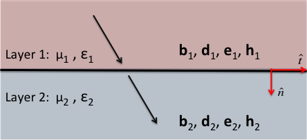
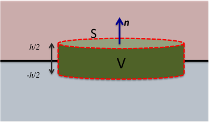
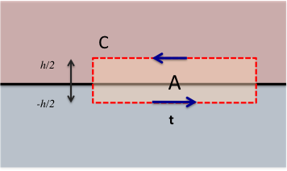

.. _boundary_conditions:

Boundary Conditions
===================

It's important to understand how the electromagnetic fields and fluxes change at boundaries between media of differing material properties. In this section, we derive these boundary, or interface, conditions from Maxwell's equations in time domain integral form. To recap, the equations are

.. math::
  \oint_S \mathbf{d}\cdot \hat{\mathbf{n}}\,da = Q_{\text{enc}},
  :label: GaussEint
  
.. math::
  \oint_S \mathbf{b}\cdot \hat{\mathbf{n}}\,da = 0,
  :label: GaussMint
  
.. include:: ../../equation_bank/faradays_law_int_time.rst

.. math::
   \oint_C \mathbf{h} \cdot \mathbf{dl} = I_{\text{enc}} + \int_S \frac{\partial\mathbf{d}}{\partial t} \cdot \hat{\mathbf{n}} ~\text{da}.
  :label: AmpMaxInt

Recall also that :math:`\mathbf{d}` and :math:`\mathbf{h}` are related to :math:`\mathbf{e}` and :math:`\mathbf{b}`, respectively, through constitutive relations. Assuming linear isotropic media, the constitutive relations are

.. math::
	\mathbf{d} = \varepsilon \mathbf{e},
	:label: DepsE

.. math::
	\mathbf{b} = \mu \mathbf{h},
	:label: BmuH

where :math:`\varepsilon` denotes the dielectric permittivity and :math:`\mu` denotes the magnetic permeability.

In the following derivations, we consider a two layer medium where each layer has its corresponding physical properties. The subindices 1 and 2 denote dependency on layer 1 and layer 2, respectively. This is illustrated in Figure 1. Our derivations follow those presented by Griffiths on pages xx-yy of [1]_.

    Two layered medium.

Normal Component of Electric Displacement
-----------------------------------------

    Gaussian pillbox. 

Consider an extremely small Gaussian pillbox of height h and cross-sectional area :math:`S_{\text{top}} = \pi r_{\text{top}}^2`. The pillbox is shown in figure 2. To derive the boundary condition on the normal component of electric displacement, denoted as :math:`d_{n}`, we apply Gauss's law formulated in terms of electric displacement (equation :eq:`GaussEint`) to the pillbox, giving

.. math::
  \int_0^{2\pi}\int_0^{r_{\text{top}}} d_{1n} \mathrm{d}r\mathrm{d}\theta - \int_0^{2\pi}\int_0^{r_{\text{top}}} d_{2n} \mathrm{d}r\mathrm{d}\theta + \int\limits_{-h/2}^{h/2}\int\limits_0^{2\pi} d_r~ \mathrm{d}\theta\mathrm{d}z = Q_{\text{enc}},

where :math:`d_{1n}` and :math:`d_{2n}` are the components of the electric displacement normal to the top and bottom of the pillbox, and :math:`d_r` is the radial component. Since the pillbox is extremely small, we can assume :math:`d_{1n}` to be constant over the top of the pillbox and :math:`d_{2n}` to be constant over the bottom of the pillbox. Thus, evaluating the first two integrals in the last equation yields

.. math::
  d_{1n} S_{\text{top}} - d_{2n} S_{\text{top}} + \int\limits_{-h/2}^{h/2}\int\limits_0^{2\pi} d_r~ \mathrm{d}\theta\mathrm{d}z = Q_{\text{enc}}.

In the limit, when :math:`h` approaches 0 while :math:`S_{\text{top}}` remains constant, the integral remaining on the left hand side vanishes and the charge enclosed can be represented by the free surface charge density :math:`\tau_f` (assumed constant over the pillbox) times the area of the top of the pillbox. This gives the expression

.. math::
  d_{1n} S_{\text{top}} - d_{2n} S_{\text{top}} = \tau_f S_{\text{top}},

which yields the interface condition on the normal component of :math:`\mathbf{d}`

.. math::
  d_{1n} - d_{2n} = \tau_f.
  
If the medium is linear and isotropic, the condition can be written in terms of the electric field as

.. math::
  \varepsilon_1 e_{1n} -\varepsilon_2 e_{2n} = \tau_f.

Normal Component of Magnetic Flux
-----------------------------------------

The interface condition on the normal component of the magnetic flux, denoted as :math:`\mathbf{b}_{n}`, is derived from the integral form of Gauss's law for the magnetic flux. We follow the exact argument as for the electric displacement, see previous section. However, since the right hand side of :ref:`Gauss's law<gauss_magnetic>` is always zero, we have the interface condition on the normal magnetic flux

.. math::
  \mathbf{b}_{1n} - \mathbf{b}_{2n} = \mathbf{0}.
  
Tangential Component of the Electric Field
------------------------------------------

    Gaussian rectangle. 

The boundary condition on the tangential component of the electric field, denoted as :math:`\mathbf{e}_{t}`, is derived from :ref:`Faraday's law<faraday>` in integral form. Consider Faraday's law applied to the rectangle of height :math:`h` and width :math:`l` shown in Figure 1, with surface normal parallel to the interface. As with the Gaussian pillbox in the electric displacement derivation, we assume the rectangle to be small enough that the tangential electric field is constant on both horizontal edges. Then, we take the limit as :math:`h` approaches 0 while holding :math:`l` constant, which means the contour integral in :ref:`Faraday's law<faraday>` becomes

.. math::
  \oint_C \mathbf{e}\cdot \mathbf {d}\mathbf{l} = \mathbf{e}_{1t}l - \mathbf{e}_{2t}l,

where :math:`\mathbf{e}_{1t}` and :math:`\mathbf{e}_{2t}` are the tangential components of the electric field on the top and bottom edges of the Gaussian rectangle, respectively. Taking :math:`h` to 0 also causes the surface integral on the right hand side of :ref:`Faraday's law<faraday>` to vanish, implying the interface condition

.. math::
  \mathbf{e}_{1t} - \mathbf{e}_{2t} = \mathbf{0}.

Tangential Component of the Magnetic Field
------------------------------------------

The interface condition on the tangential component of the magnetic field, denoted as :math:`\mathbf{h}_t`, is derived from the integral form of the :ref:`Ampere-Maxwell equation<ampere_maxwell>` applied to the same Gaussian rectangle as for the tangential electric field. Using the same reasoning as for the electric field (see previous section), we have

.. math::
  \oint_C \mathbf{h}\cdot \mathbf{d}\mathbf{l} = \mathbf{h}_{1t}l - \mathbf{h}_{2t}l.

In the limit that the height of the Gaussian rectangle approaches zero, the electric displacement integral term vanishes and the current enclosed by the rectangle can be represented as a surface current density on the interface :math:`j_{\text{surf}}` times the width of the rectangle :math:`l`. This gives

.. math::
  h_{1t}l - h_{2t}l = j_{\text{surf}} l

Cancelling the :math:`l` terms in the above expression, yields the interface condition on the tangential magnetic field

.. math::
  h_{1t}- h_{2t} = j_{\text{surf}}.
  
References
----------

.. [1] Griffiths, David J. Introduction to Electrodynamics, 3rd edition. Prentice Hall, Upper Saddle River, New Jersey. 1999.
