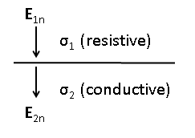
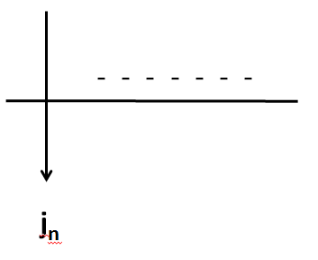
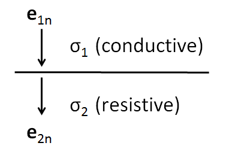
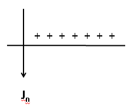

.. _boundary_conditions:

Boundary conditions
===================

There are a variety of ways to formulate the solution for the EM problem.  Relevant boundary conditions are needed for 

(a) Potentials
(b) Electric fields
(c) Current density

Consider the following basic homogeneous equations in the stady state form 

.. math::
	\boldsymbol{\nabla \times} \mathbf{E} = \mathbf{0},
	:label: cEe0

.. include:: ../equation_bank/gauss_electric_frequency.rst

.. math::
	\boldsymbol{\nabla \cdot} \mathbf{J} = \mathbf{0},
	:label: dJe0
	
and the constitutive relations for a linear isotropic medium given by

.. math::
	\mathbf{D} = \varepsilon \mathbf{E},
	:label: DepsE

.. math::
	\mathbf{J} = \sigma \mathbf{E},
	:label: JsigE

Now, let us consider a two layer media as illustrated in the figure below

% Figure 1  - describe a two layered media, a pill box and a volume

Boundary conditions for the electric field
------------------------------------------
To derive the boundary conditions for the electric field (:math:`\mathbf{E}`), we apply `Stokes theorem`_ to equation (1) which leads to

.. _Stokes theorem: https://en.wikipedia.org/wiki/Stokes%27_theorem

.. math::
		\int_{A} \boldsymbol{\nabla \times} \mathbf{E} \boldsymbol{\cdot} \mathbf{\hat{n}} \, da = \oint_{C} \mathbf{E} \boldsymbol{\cdot} \mathbf{\hat{n}} dl,
		:label: intpillbox	

where :math:`A` denotes the area enclosed by the rectangule in Figure 1 and :math:`C` denotes the curve enclosing such area (i.e. :math:`C=\partial A`).

Expression (5) implies that

.. math::
		(\mathbf{E}_2 - \mathbf{E}_1) \cdot \mathbf{\hat{t}} = 0.

That is, the tangential component of the electric field is continuous.  We denote this fact as

.. math::
		\mathbf{E}_{2t} = \mathbf{E}_{1t}.		 
		:label: Etcontinuous

Boundary conditions for the electric current displacement
---------------------------------------------------------

To derive boundary conditions for the electric current displacement (:math:`\mathbf{D}`), we apply the `Divergence theorem`_ to equation (2) which leads to

.. _Divergence theorem: https://en.wikipedia.org/wiki/Divergence_theorem

.. math::
		\int_V \boldsymbol{\nabla\cdot}\mathbf{D} \, dv &= \int_{\partial V} \rho_f(\mathbf{r}) \, dv,\\
		\int\mathbf{D}\cdot\hat{\mathbf{n}}\, da &= S (\mathbf{D}_2-\mathbf{D}_1)\cdot\hat{\mathbf{n}} = S\tau_f, \quad\quad \tau_f \text{ is a surface charge density},
		:label: DonPillBox

where :math:`\mathbf{r}` denotes (DO YOU GUYS KWNO WHO IS r ???), :math:`V` is the volume enclosed by the cylinder in Figure 1, and :math:`S` denotes the surface corresponding to the boundary of V (i.e. :math:`S=\partial V`).

The above expression implies that  

.. math::	
		 (\mathbf{D}_2-\mathbf{D}_1)\cdot\hat{\mathbf{n}} = \tau_f.
		 :label: Dndiscontinuous
		

That is, the normal component of the electric displacement can be discontinuous if there is a free charge on the surface. 

Observe that when the materials are not polarizable or if :math:`\varepsilon` is constant, from equation (4) we have that

.. math::
		\mathbf{D}_2 &= \varepsilon_0\mathbf{E}_2,\\
		\mathbf{D}_1 &= \varepsilon_0\mathbf{E}_1, 

Hence,	

.. math::
		(\mathbf{E}_2-\mathbf{E}_1)\cdot\hat{\mathbf{n}} = \frac{\tau_f}{\varepsilon_0}. 	
		:label: EnotCont

The above expression implies that the tangential component of the electric field is discontinuous.  In fact, 

.. math::
		\boldsymbol{\nabla\cdot}\mathbf{E} &= \frac{\rho_t}{\varepsilon_0}, \quad\quad \text{ (total charge)}\\
		\text{so } (\mathbf{E}_2-\mathbf{E}_1)\cdot\hat{\mathbf{n}} &= \frac{\rho_t}{\varepsilon_0}.
		:label: EnotCont2

Current Density
----------------

From the above, if 

.. math::
		\boldsymbol{\nabla\cdot}\mathbf{J} &= 0\\
		\text{then } (\mathbf{J}_2-\mathbf{J}_1)\cdot\hat{\mathbf{n}} &= 0\\
		\text{or } \mathbf{J}_{2n} &= \mathbf{J}_{1n} \quad\quad\text{normal component of current density is continuous}\\
		:label: JnCont

Boundary Conditions for potentials
----------------------------------

(1) Potential is continuous at a boundary  :math:`V_1 = V_2` 
(2) The relation for the normal derivative of the potential arizes from the continuity of the normal component of the current density

.. math::
		\mathbf{J}_{2n} &= \mathbf{J}_{1n}\\
		\mathbf{J} &= \sigma\mathbf{E}\\
		\sigma_2\mathbf{E}_2 &= \sigma_1\mathbf{E}_1\\
		\mathbf{E} &= - \boldsymbol{\nabla} V\\
		\sigma_2\frac{\partial V_2}{\partial n} &= \sigma_1\frac{\partial V_1}{\partial n}\\
		:label: potentialBC

Charge Buildup at a boundary
----------------------------------

.. image:: images/boundryChargeBuildup.PNG
   :scale: 75 %
   :align: center

we have

.. math::
		\mathbf{J}_{2n} &= \mathbf{J}_{1n}\\
		\implies \sigma_2\mathbf{E}_{2n} &= \sigma_1\mathbf{E}_{1n}\quad\text{(1) from Ohm's law}\\
		\text{and }  \mathbf{E}_{2n}-\mathbf{E}_{1n}\ &= \frac{\tau_f}{\varepsilon_0}\quad\text{(2)}
		:label: chargeBuildupSetup

Solving:

.. math::
		\mathbf{E}_{2n} &= \frac{\sigma_1}{\sigma_2}\mathbf{E}_{1n}\quad\text{from (1)}\\
		\text{into (2)}\quad \Big(\frac{\sigma_1}{\sigma_2}-1\Big)\mathbf{E}_{1n} &= \frac{\tau_f}{\varepsilon_0}\\
		\frac{\tau_f}{\varepsilon_0} &= \Big(\frac{\sigma_1}{\sigma_2}-1\Big)\mathbf{E}_{1n}\quad \text{quantifies the charge buildup on a boundary}
		:label: chargeBuildup

So in case 1 were the resistive layer is on top i.e. :math:`\sigma_1 < \sigma_2` 

.. math:: 
		\sigma_1 < \sigma_2 \implies \tau_f <0

and in case 2 were the resistive layer is on top i.e. :math:`\sigma_1 > \sigma_2` 

.. math:: 
		\sigma_1 > \sigma_2 \implies \tau_f >0

