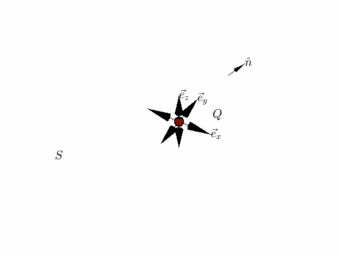

.. _gauss_electric:

Gauss's Law for Electric Fields
===============================

Gauss’s law for the electric field states that the electric flux through any closed surface is proportional to the total electric charge enclosed by the surface, with constant of proportionality :math:`\epsilon_0`. In integral equation form it reads

.. math::
	\oint_{A} \mathbf{e} \cdot \hat{\mathbf{n}} \; \mathrm{d}a = \frac{Q}{ \epsilon_{0} }\;,
	:label: Gauss_e_int
where the integral is over a closed surface :math:`A`, :math:`\mathbf{e}` is the electric field, :math:`\hat{\mathbf{n}}` is a unit vector normal to :math:`A` and :math:`Q` is the total charge enclosed by :math:`S`.  

Differential Form
-----------------

When considering a spatially extended charged body, we can think of its charge as being continously distributed throughout the body with density :math:`\rho`. The total charge is then given by the integral of the charge density over the volume of the body.

.. math::
	Q = \int_V \rho \; \mathrm{d}v\;.
	:label: charge_density
Using this definition and applying the divergence theorem to the left hand side of Gauss's law (:eq:`Gauss_e_int`), we can rewrite the law as:

.. math::
	\int_V \nabla \cdot \mathbf{e} \; \mathrm{d}V = \int_V \frac{\rho}{\epsilon_0} \; \mathrm{d}V \;.
	:label: 
Since this equation must hold for any volume :math:`V` , we can equate the integrands, giving the differential form of Gauss's law:

.. math::
	\nabla \cdot \mathbf{e} = \frac{\rho}{\epsilon_0}.
	:label: Gauss_e_diff

Equivalence to Coulomb's law
----------------------------

Coulomb's law is often one of the first quantitative laws encountered by students of electromagnetism. It describes the force between two point electric charges. It turns out that it is equivalent to Gauss's law. Coulomb's law states that the force between two point electric charges is proportional to the inverse square of the distance between them, acting in the direction of a line connecting them. If the charges are of opposite sign, the force is attractive and if the charges are of the same sign, the force is repulsive. Mathematically, Coulomb's law is written as

.. math::
  \mathbf{F} = \frac{q_0q}{4\pi \epsilon_0 |\mathbf{r}|^2}\hat{\mathbf{r}} \;,
  :label: Coulomb_q
where :math:`F` is the force between the two charges :math:`q_0` and :math:`q`, :math:`|\mathbf{r}|` is the distance between the charges and :math:`\hat{\mathbf{r}}` is a unit vector in the direction of the line separating the two charges.

Having defined Coulomb's law, one might next naturally ask the question how would a standard reference charge behave in the presence of any distribution of electric charge we might dream up? Answering this question brings us to the concept of the electric field. We follow the presentation of [2]_. We can define the electric field of an arbitrary charge :math:`q` as the force experienced by a unit charge :math:`q_0` due to :math:`q`

.. math::
       \mathbf{e} = \frac{\mathbf{F}}{q_0}.
       :label: Force_per_q
Dividing both sides of Coulomb's law by :math:`q_0` and substituting the definition of :math:`\mathbf{e}`, we get that the electric field of a point charge :math:`q` is

.. math::
      \mathbf{e}(\mathbf{r}) = \frac{q}{4\pi\epsilon_0 |\mathbf{r}|^2}\hat{\mathbf{r}}\;.
      :label: e_charge_q
It is important to note here that the electric field obeys the principle of superposition, meaning that the electric field of an arbitrary collection of point charges is equal to the sum of the electric fields due to each individual charge. 

.. math::
   \mathbf{e}(\sum_{k=1,n} q_i) = \sum_{k=1,n} \mathbf{e}(q_i)

If we consider the The electric field due to a spatially extended body with charge density :math:`\rho`, the sum becomes an integral over infinitesimal volume elements of the body

.. math::
  \mathbf{e} = \frac{1}{4\pi\epsilon_0}\int_V \frac{\rho}{|\mathbf{r}|^2}\mathrm{d}V,
  :label: e_charge_den
where :math:`|\mathbf{r}|` is now the distance from a point in the charged body to the point at which the electric field is to be evaluated. The integral is over the charged body. 

To show that :eq:`e_charge_den` is equivalent to Gauss's law, start by taking the divergence of both sides

.. math::
   \nabla \cdot \mathbf{e} = \frac{1}{4\pi\epsilon_0}\int_V \nabla \cdot\left(\frac{1}{r^2}\right)\rho\mathrm{d}V.
   :label: Gauss_diff
Note that the divergence is taken with respect to the spatial variation of :math:`\mathbf{e}`, with :math:`\rho` held constant. Regardless of the volume of integration, the integral on the right hand side of equation :eq:`Gauss_diff` has the value

.. math::
   \int_V \nabla \cdot\left(\frac{1}{r^2}\right)\rho\mathrm{d}V = 4\pi\rho.
   
This establishes the desired result

.. math::
   \nabla \cdot \mathbf{e} = \frac{\rho}{\epsilon_0}.
For a more detailed derivation and discussion, see pages 65-70 of [2]_.

Notes on Electric flux
----------------------

Flux is a measure of the strength of a field passing through a surface. Electric flux is defined in general as 

.. math::
	\boldsymbol{\Phi} = \int_A \mathbf{e} \cdot \hat{\mathbf{n}} \, \mathrm{d}a.
	:label: e_flux
We can think of electric field as flux density. Gauss’s law tells us that the net electric flux through any closed surface is zero unless the volume bounded by that surface contains a net charge. Additionally, the flux depends only on the amount of charge contained and not on the specific surface chosen. This is illustrated in the figure below, which illustrates the flux due to a point charge. Note that as the surface moves further away from the charge at the origin, the magnitude of the field decreases with :math:`\frac{1}{r^2}` spatial dependence but the volume of the surface increases with :math:`r^2` dependence. Thus, regardless of the surface chosen, the flux through that surface remains the same.

  
  Illustration of The electric flux through a Gaussian surface due to a point charge at the origin. The color of the surface shows the magnitude of the electric field (or flux density).

Units
-----

References
----------
.. [1] A student’s guide to Maxwell’s equations (PDF)

.. [2] Griffiths, David J. Introduction to Electrodynamics, 3rd edition. Prentice Hall, Upper Saddle River, New Jersey. 1999.
